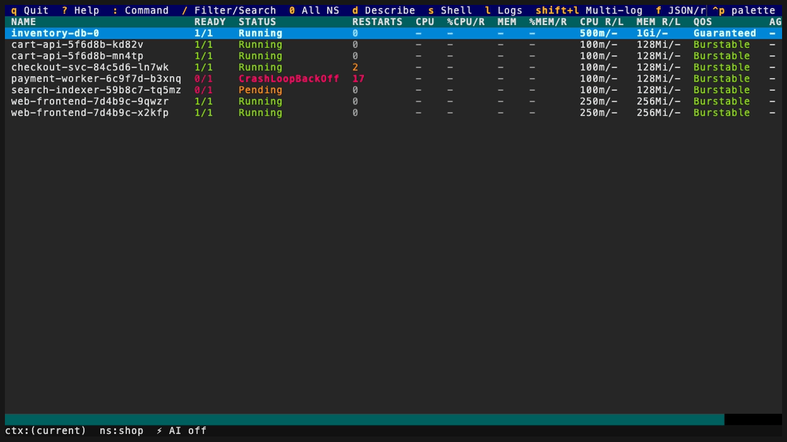

# korvid

> A tool-using bird for your cluster.

AI-native Kubernetes TUI — a keyboard-first cockpit with an
embedded LLM agent that sees your screen, drives the UI, diagnoses issues,
and proposes writes **you** approve.

*Corvids are the only birds known to use tools. So does this one.*



*Recorded against canned demo data — see [docs/demo](docs/demo) to regenerate or run it yourself.*

## Why korvid

**A keyboard-first cockpit.** Navigate any resource kind with `:` commands,
filter with `/` (fuzzy, regex, label selectors), drill down with `Enter`
(pods → containers, deploy → rs → pods, helm release / operator → hierarchy
tree of everything it installed), split the
workspace into two panes, sort on live data. Pods show live CPU/MEM metrics
colored against enforced limits, and a troubled pod explains itself in a
hint strip built from real API data — before you ever open describe.

**An agent that operates the TUI, not a chatbot in a box.** `Ctrl-A` opens a
chat panel that knows what you are looking at — view, namespace, selection,
filter. It inspects the cluster through read-only tools (manifests, logs,
events, a compound `diagnose_pod`) and **drives the UI itself**: "show me the
crashing pod's logs" navigates, filters, and opens the actual log pane.
Secret data is masked before it reaches the model. Works with GitHub
Copilot, Azure OpenAI, Anthropic, OpenAI, local Ollama, or any
OpenAI-compatible endpoint — including a `small` profile tuned for 3B–14B
local models.

**Writes are gated and audited — no exceptions.** Every mutation (yours or
agent-requested) executes only after you confirm it in a dialog, and every
executed write lands in a fail-closed audit log: if the audit entry cannot
be written, the write is blocked. Kubernetes API writes additionally get a
best-effort RBAC pre-check and a server dry-run preview in the dialog where
the API supports one. `--readonly` disables writes entirely;
`protected_contexts` adds typed-name confirmation on production clusters.
The agent can *request* a delete, scale, restart, or resize — it can never
execute one.

**Ops that outdo their kubectl counterparts.** Port-forwards (`Shift-F`)
are session-tracked: `:pf` lists them with live status, stops (`Ctrl-D`) or
re-attaches (`r`) any of them, a forward whose pod dies flips to `broken`
with a toast instead of failing silently, a local port already claimed by
another forward is rejected before anything spawns, and every forward is
torn down on exit — all
audited. File transfer (`Ctrl-T`) rides the exec API as a tar stream — no
`kubectl cp`, no kubectl binary needed — with `Ctrl-O` path browsing on both
the local and the in-container side, downloads that never leave a
half-written file, and uploads that are approval-gated and audited
fail-closed like every other write. Details in [docs/ops.md](docs/ops.md).

## Quick start

```sh
uv tool install 'korvid[agent] @ git+https://github.com/hellices/korvid'
korvid                        # uses your current kubeconfig context
```

| Key | Action |
|-----|--------|
| `:` | command bar — `pods`, `deploy all`, `helm`, `ns <name>`, `ctx <name>`, `ai` |
| `/` | filter the table |
| `Enter` / `Esc` | drill down / back up |
| `d` `l` `s` | describe / logs / shell |
| `Ctrl-A` | AI agent panel (`:ai` to set up) |
| `?` | full help overlay |

Full key reference: [docs/keybindings.md](docs/keybindings.md).

## Features

- **[Keybindings](docs/keybindings.md)** — every key by context, plus
  remapping via `keybindings:` config.
- **[Browsing the cluster](docs/tui.md)** — custom columns from labels /
  annotations / jsonpath, live pod metrics, ops hints for troubled pods,
  split workspace, the log viewer (multi-pod merge, JSON highlighting,
  search, save), explicit namespace scope with RBAC-aware denials, and
  probe-first context switching.
- **[Operations and safety](docs/ops.md)** — the safety model (keystroke
  approval + fail-closed audit on every write, with best-effort SSAR
  pre-checks and dry-run previews), read-only
  mode, protected contexts, node cordon / drain with PDB-aware impact
  plans, port-forwarding with liveness tracking, file transfer over the
  exec API, distroless debug fallback, and node shells.
- **[Helm and operators](docs/helm-operators.md)** — a release browser that
  needs no helm binary, search-first chart install / upgrade / rollback /
  uninstall wizards with dry-run previews, chart repo management, and the
  OLM operator catalog with approval-gated installs and uninstalls.
- **[AI agent](docs/agent.md)** — screen-context awareness, UI-driving
  tools, `diagnose_pod`, cloud-provider awareness (AKS / EKS / GKE),
  provider setup (`:ai` wizard), capability profiles for small local
  models, and an eval harness that grades diagnosis quality.
- **[Provider plugins](docs/provider-plugins.md)** — the API-v1 contract for
  third-party LLM adapters, selected-only loading, exact event and option
  limits, and guidance on when a plugin is warranted instead of an
  OpenAI-compatible endpoint.
- **[MCP server](docs/mcp.md)** — expose korvid's read and UI-drive tools
  to VS Code, Claude Code, Cursor, or Zed; write tools are never exposed.
  An opt-in proposal flow lets external agents queue writes that execute
  only after your keystroke in the TUI.
- **[Air-gapped operation](docs/airgap.md)** — internal LLM/Helm/OLM/image
  endpoints, corporate CA trust (`network.ca_bundle`, Helm `--ca-file`),
  responsibility boundaries, and a readiness checklist.
- **[Threat model](docs/threat-model.md)** — exactly what crosses the
  embedded-provider boundary, what is redacted, the MCP and plugin trust
  boundaries, and the residual risks that are not mitigated. See
  [`SECURITY.md`](SECURITY.md) to report a vulnerability privately.

## Status

Work in progress — core TUI, log viewer, live metrics, MCP server, and
agent runtime are functional. Read-heavy by design: cluster writes exist
(delete / scale / rollout restart / edit / resize / node ops / helm / OLM)
but every one is approval-gated and audited.

## Installation

Not yet on PyPI. Install straight from the repository:

```sh
uv tool install git+https://github.com/hellices/korvid   # or: pipx install ...
korvid
```

Or run it ad hoc without installing:

```sh
uvx --from git+https://github.com/hellices/korvid korvid
```

The base install is the TUI alone. The embedded AI agent and the MCP
server are optional extras — add them when you want those features:

```sh
uv tool install 'korvid[agent] @ git+https://github.com/hellices/korvid'  # :ai / Ctrl-A
uv tool install 'korvid[mcp] @ git+https://github.com/hellices/korvid'   # korvid --mcp
uv tool install 'korvid[all] @ git+https://github.com/hellices/korvid'   # both
```

Without the `[agent]` extra the agent surface is simply absent — no agent
panel, and `Ctrl-A` / `:ai` / `:model` are not registered. Without the
`[mcp]` extra the `:mcp` command reports the feature as unavailable with
an install hint. Explicitly enabling a feature whose extra is missing
(`--mcp`, `agent.provider` in config) fails at startup with an actionable
message. `[entra]` adds Entra ID auth for Azure OpenAI.

### Releases

Tagged releases (`vX.Y.Z`) publish signed artifacts to PyPI via OIDC
Trusted Publishing and attach the same files to the GitHub Release:
wheel, sdist, `SHA256SUMS`, a CycloneDX SBOM covering the full locked
dependency graph, build-provenance attestations, and offline wheelhouse
bundles for Linux/Windows x86-64 on Python 3.11–3.13. Once the first
release lands, install with:

Before enabling the workflow, repository administrators **must** create an
immutable `v*` tag ruleset: restrict tag creation to trusted release
maintainers and prohibit tag update and deletion. The protected `release`
environment must allow protected tags only and require approval; PyPI's
Trusted Publisher must bind exactly to `hellices/korvid`,
`.github/workflows/release.yml`, and that environment. The in-workflow
source check is defense in depth, not a replacement for this external
trust boundary.

```sh
uv tool install 'korvid[all]==X.Y.Z'   # or: pip install 'korvid[all]==X.Y.Z'
```

Verify a downloaded artifact against its checksum and provenance:

```sh
sha256sum -c SHA256SUMS --ignore-missing
gh attestation verify korvid-X.Y.Z-py3-none-any.whl --repo hellices/korvid
```

Offline installation from the wheelhouse bundles is documented in the
[air-gapped guide](docs/airgap.md#offline-installation-bundles).

### Development

```sh
git clone https://github.com/hellices/korvid && cd korvid
uv sync --dev --all-extras   # create .venv with locked deps + all extras
uv run korvid                # run against your current kubeconfig context
make check                   # lint + mypy --strict + tach + tests
```

Contributor docs: [Windows contributor notes](docs/windows.md).
