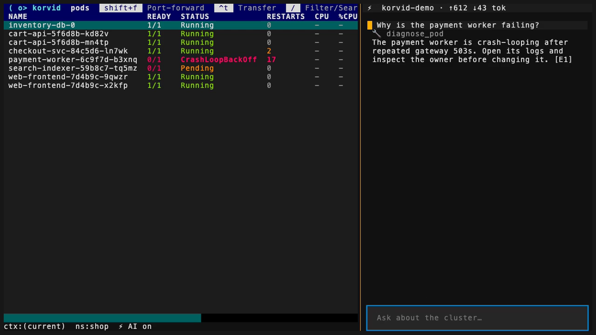

# AI agent

## Installing the agent

The agent is an **optional extra**. A base install has no provider HTTP
client and no keychain integration, and korvid starts, watches and drives
the cluster exactly as before — `Ctrl-A` simply shows a setup hint.

```sh
uv tool install "korvid[agent]"      # or: pipx install "korvid[agent]"
uv tool install "korvid[all]"        # agent + MCP + observability
```

Nothing about the extra is loaded until the agent is actually composed: an
MCP-only or agent-disabled start never imports the engine, the request gateway,
or a provider adapter. If `agent.enabled` is set but the extra is missing,
startup fails with the exact install command rather than degrading to a
silently disabled agent.

For a cluster with no internet egress, run a local model and keep every
request on the machine — see [offline setup](#offline-and-air-gapped-setup)
below and the [air-gapped guide](airgap.md).


Press `Ctrl-A` to open the agent panel — a chat sidebar that answers questions
about the cluster you are looking at.  The agent sees your current screen
context (view, namespace, selected resource, active filter) and inspects the
cluster through read-only tools: fetching manifests, logs, events, and resource
listings, plus compound diagnostic tools — `diagnose_pod` gathers a broken pod's
container states, owner chain, warning events, and targeted log excerpts in a
single deterministic call; `diagnose_service` checks whether a Service has
current ready EndpointSlice endpoints, reporting structured versioned findings
with explicit evidence gaps when EndpointSlice data is unavailable (e.g. RBAC
denial); `diagnose_pvc` checks why a PersistentVolumeClaim is not Bound (one
GET for Bound/Lost; for unresolved claims Warning events are read, and
StorageClasses are listed only when no decisive failure event, pre-bound
volume, or explicit-empty/static-binding evidence already determines the
result — RBAC denials become explicit evidence gaps) — projected evidence instead of
raw YAML dumps, which is where small local models otherwise fail.  It can also drive the TUI itself — navigate views, apply filters,
drill down, and open the log pane or describe screen — so "show me the crashing
pod's logs" lands you in the actual log viewer instead of a text dump.
Tool results are capped at 8,000 characters — manifests are shrunk
structurally so they stay valid YAML the model can parse — and `Secret`
data is masked before it ever reaches the model.  The header shows the model name and cumulative
token usage (`~` marks estimated counts when the provider omits usage data).

The agent can also *request* write operations — delete, scale, rollout
restart, and (on clusters that expose the `pods/resize` subresource,
Kubernetes 1.35+) in-place pod resize — but it can never execute them
itself.  Each request opens
the same confirmation dialog as the keybindings (marked with a ⚠ in the tool
log), and only your keystroke in that dialog approves it; an unanswered
dialog expires without executing anything.  Every executed write — yours or
agent-requested — is recorded in the fail-closed
[audit log](ops.md#the-safety-model).

<section class="docs-storyboard" aria-labelledby="agent-storyboard-title">
  <figure>
    
    <figcaption id="agent-storyboard-title">One prompt stays attached to the operational screen.</figcaption>
  </figure>
  <ol>
    <li><strong>Context</strong><span>Current view, namespace, selection, and filter.</span></li>
    <li><strong>Read</strong><span>Bounded tools gather manifests, events, logs, or diagnoses.</span></li>
    <li><strong>Cite</strong><span>Evidence references remain selectable and validated.</span></li>
    <li><strong>Drive</strong><span>Navigation can change; writes still stop at confirmation.</span></li>
  </ol>
</section>

## Stopping and correcting a turn

The input stays enabled while the agent works.  Press `Ctrl-X` to stop the
running turn: the partial answer stays in the transcript marked
`⏹ interrupted`, in-flight tool lines are marked, and token usage is
committed (estimated for the interrupted stream — the prompt is charged
once the request reached the provider, even if nothing had streamed back
yet, and not charged at all if the request never left the machine).  Typing a
new prompt while the agent runs is **interrupt-and-submit** — the correction is
echoed immediately, the old turn is cancelled, and a fresh turn starts with the
new prompt (only the latest submission is kept).  The conversation history is
repaired so the model never sees a half-finished tool exchange.  Interrupts
respect the write gate: a pending approval dialog is dismissed without
executing, while a write the user already approved always runs to completion
and is audited.

## Direct control and the conversation

The agent and the keyboard drive **one** workspace. Nothing about a chat
turn takes the TUI away from you:

- Whatever you have selected when you submit a prompt is what the turn is
  asked about — the view, namespace, active filter, focused pane and
  selected resource travel with the question as structured context, not as
  a screenshot or a prose summary.
- When the agent navigates, filters, drills down, or opens the log/describe
  pane, it moves the same panes your keys move. There is no separate agent
  view to reconcile afterwards.
- Pressing a normal key mid-turn keeps working. Direct control continues
  from wherever the conversation left the screen, and the *next* turn starts
  from where **you** left it — the handoff runs in both directions.
- `Ctrl-X` stops the turn without disturbing the screen: the partial answer
  stays in the transcript, and the panes keep whatever state they had.
- Switching Kubernetes context with `:ctx` hands the cluster back to korvid
  immediately. The conversation survives, but the evidence ledger is
  cleared — a citation minted against the old cluster must not resolve to a
  same-named object in the new one — and the session is re-routed for the
  new cluster's capabilities.

Each successful cluster read the agent performs mints a numbered evidence
reference (`[E1]`, `[E2]`, …) that the answer cites. Opening a citation
navigates to the exact object the read looked at, so a claim is checkable
in the same session that made it. Screen actions and writes never mint
evidence — only a read of cluster data does.

## Inspecting what the agent sends

`:ai payload` opens a read-only view of the exact sanitized request most
recently sent to the provider (disabled while a turn is running, and only
available once at least one request has been sent this session). It is the
literal payload — not a re-derived approximation — because every message,
tool result, and tool-call argument passes through the same
`OutboundPolicy` redaction step whether the request goes to a hosted model
(GitHub Copilot, Azure OpenAI, OpenAI, Anthropic-compatible) or a local
endpoint (Ollama, a self-hosted OpenAI-compatible server): `Secret` values,
the `kubectl.kubernetes.io/last-applied-configuration` annotation, and text
matching known credential key/value patterns are all masked before the
inspector — or the network — ever sees them. A local endpoint receives the
same sanitized payload as a hosted one; korvid does not additionally
authenticate that the configured `base_url` is really the process you
intend it to be.

The snapshot is the latest request that was actually handed over, and a
later turn that never reaches the provider does not erase it: a prompt the
outbound policy blocks, or a turn rolled back mid-flight, sends nothing
and so has no payload of its own to show. `:ai payload` keeps showing the
last real handoff — which is precisely the request you want to read after
something was refused. Only a payload that reached the transport replaces
it. Preparing a request is not sending it, and neither is *calling* the
provider: `complete()` is an async generator, so its body — the HTTP
request included — does not run until the stream is consumed. korvid's
built-in adapters acknowledge the moment the transport accepts the request
(before they judge the response status, because an HTTP 500 answer still
means the payload arrived), and a provider that fails earlier — no
credentials, unresolvable host, connection refused — leaves the previous
handoff on display rather than claiming one that never happened. A
third-party plugin cannot acknowledge (the plugin event contract knows
`text_delta`, `tool_call`, `usage` and `done`); its request is recorded on
the first event it yields, which is equally proof the request ran, and a
plugin that yields nothing at all records nothing.

Press `e` in the inspector to export the displayed payload to a private
JSON file — `write_private_text` creates it with `0o600` permissions (see
the platform caveat in [the threat model](threat-model.md)), never
overwrites an existing export, and confirms the exact path once written
(default location: `$XDG_DATA_HOME/korvid/agent-payloads`, falling back to
`~/.local/share/korvid/agent-payloads`). Exported payloads are not
automatically cleaned up — they persist on disk exactly like any other
file you save until you delete them yourself.

**The payload is sanitized, not anonymized.** Resource names, namespaces,
labels, and other stable cluster identifiers still appear in it — sanitization
only removes secret material and known credential patterns, not anything that
identifies your cluster. Treat an exported payload with the same care as any
other cluster-derived export. See [`docs/threat-model.md`](threat-model.md)
for the full boundary, what the inspector does not show (transport headers
and credentials never enter the canonical payload), and the documented
residual risks — notably that arbitrary secrets embedded in free-form log or
event text cannot be guaranteed detectable.

`protected_contexts` and `agent.disable_in_protected` (see
[Protected contexts](ops.md#protected-contexts)) control whether the agent
runs at all on production-labeled contexts; they do not change what
`OutboundPolicy` redacts once a request is allowed to be built.

## Cloud-provider awareness

At startup korvid detects the cluster's cloud provider from
`node.spec.providerID` prefixes and well-known managed-cluster node labels
(AKS, EKS, GKE) — no Kubernetes API lists valid cloud annotations, so korvid
ships **no annotation catalog**; the detected provider is injected into the
agent's system context instead.  Ask "expose this service publicly" on an AKS
cluster and the agent proposes Azure-appropriate load balancer annotations
without you naming the CSP, applied through the same approval-gated write
flow.  Describing a `Service` or `Ingress` on a detected provider shows a
one-line footer pointing at the agent (`provider: aks — ask the agent about
load balancer annotations (ctrl+a)`).  Detection is a bounded, cached,
best-effort probe: RBAC-limited users (no node list permission), bare-metal,
and local clusters simply detect as "unknown" and nothing changes.

## Setup

The quickest way to configure the agent is inside the TUI: type `:ai`
(alias `:agent`) to open the setup wizard.  It walks through provider,
authentication, connection details, runs a live test call, and saves the
result to `~/.config/korvid/config.yaml`.  Use `:model <name>` to switch
models later without re-running the wizard (`:model` alone shows the
current model).

Each provider supports the auth method that fits it — GitHub device login,
Microsoft Entra ID, an API key from the environment, or no auth at all:

```yaml
# GitHub Copilot (log in via :ai inside korvid — no PAT needed)
agent:
  provider: github-copilot
  model: gpt-4o
  auth: {method: device-login}

# Azure OpenAI / AI Foundry with Entra ID (az login or managed identity)
agent:
  provider: azure
  base_url: https://YOUR-RESOURCE.openai.azure.com/openai/v1
  model: gpt-4o
  auth: {method: entra}

# Any OpenAI-compatible endpoint with an API key from the environment
agent:
  provider: openai-compat
  base_url: https://api.openai.com/v1
  model: gpt-4o-mini
  api_key_env: OPENAI_API_KEY
  auth: {method: api_key}

# Local Ollama (native /api/chat — no auth)
agent:
  provider: ollama
  base_url: http://localhost:11434
  model: llama3
  auth: {method: none}
```

`provider: ollama` talks to Ollama's native `/api/chat` API instead of the
OpenAI-compatibility shim, which unlocks per-request tuning the shim drops
(a shim-era `base_url` ending in `/v1` keeps working — it is normalized
automatically).  All knobs are optional:

```yaml
agent:
  provider: ollama
  base_url: http://localhost:11434
  model: qwen3:8b
  ollama:
    num_ctx: 16384    # context window; Ollama's own default can be as low as 4k
    temperature: 0.0  # near-greedy decoding — more reliable tool dispatch
    seed: 42          # reproducible sampling (omitted when unset)
    think: false      # reasoning tokens off; enable for R1-style models
    keep_alive: 10m   # keep the model warm between turns ("10m" or seconds)
    num_predict: 192  # cap total generated tokens (thinking/reasoning tokens count too); omit to let Ollama decide
```

To keep using the OpenAI-compatibility shim instead, set
`provider: openai-compat` with `base_url: http://localhost:11434/v1`.

> **Warning:** GitHub Copilot support uses an unofficial internal API that
> may change or break without notice.  It requires an active GitHub Copilot
> subscription.

Entra ID auth needs the optional extra. For a tool-managed application install,
reinstall the complete desired extra set:

```sh
uv tool install --force 'korvid[all,entra]==0.3.0'
# or
pipx install --force 'korvid[all,entra]==0.3.0'
```

Use `uv sync --extra entra` for development. Configs written before
`agent.auth` existed keep working: `api_key_env` implies
`auth: {method: api_key}`.

More OpenAI-compatible endpoints:

```yaml
# GitHub Models (any GitHub account; uses a PAT with `models: read` scope)
agent:
  provider: github
  base_url: https://models.github.ai/inference
  model: openai/gpt-4o-mini
  api_key_env: GITHUB_TOKEN

# Anthropic Claude (OpenAI SDK compatibility endpoint)
agent:
  provider: anthropic
  base_url: https://api.anthropic.com/v1
  model: claude-sonnet-4-5
  api_key_env: ANTHROPIC_API_KEY

# vLLM / any self-hosted OpenAI-compatible server
agent:
  provider: vllm
  base_url: http://localhost:8000/v1
  model: meta-llama/Llama-3.1-8B-Instruct
```

`api_key_env` names the environment variable holding the key — the key itself
never lives in the config file.  OAuth tokens from device login are stored in
the OS keyring (falling back to a `0600` file at
`~/.config/korvid/credentials.json`).  Claude Code is a CLI product, not an
API — use the Anthropic API entry above for Claude models.

### Offline and air-gapped setup

A local Ollama endpoint keeps every agent request on the machine — nothing
leaves it, and no API key exists to leak:

```sh
# On a machine with egress, once:
ollama pull qwen3:8b

# On the air-gapped host:
ollama serve                     # defaults to http://localhost:11434
```

```yaml
agent:
  enabled: true
  provider: ollama
  base_url: http://localhost:11434
  model: qwen3:8b
  auth: {method: none}
  ollama:
    # Ollama's own default context can be as low as 4k and truncates
    # silently; the low tier's 24k-character history assumes ~16k tokens.
    num_ctx: 16384
    temperature: 0.0
    keep_alive: 10m
```

Routing resolves such a model to the `low` tier automatically — from the
shipped catalog for a known tag, otherwise from the conservative fallback —
so no tier configuration is needed to run offline. korvid never contacts a
model registry, a telemetry endpoint, or an update service; the only
outbound request the agent makes is the one to the `base_url` you
configured, and `:ai payload` shows exactly what it contained.

For an endpoint behind a corporate/private CA, set `network.ca_bundle`;
verification can never be disabled. See the
[air-gapped guide](airgap.md) for image mirroring and the rest of the
offline story.

### Provider plugins

If your backend already speaks an OpenAI-compatible API, prefer
`provider: openai-compat` (or one of its built-in aliases) over a plugin.
Third-party provider plugins are for backends whose protocol or auth flow
truly differs from korvid's built-ins.

Plugins are configured manually in `config.yaml` today — the `:ai` wizard only
offers the built-ins above.  Plugins also run as trusted, in-process Python
code inside the korvid process, so install only packages you trust.  A plugin
receives only the same sanitized canonical payload
`OutboundPolicy` builds for a built-in provider — but once received, trusted
plugin code is free to mutate, retain, log, or independently transmit that
data; korvid has no visibility or control past the handoff (see
[`docs/threat-model.md`](threat-model.md)).  See
[Provider plugins](provider-plugins.md) for the exact provider-plugin API 2
contract, entry-point registration, event limits, option limits, and
selected-only loading behavior.

For endpoints signed by a corporate/private CA (internal Ollama, vLLM, or
an OpenAI-compatible gateway), set `network.ca_bundle` in `config.yaml` —
the same trust covers the live agent and the wizard's connection test, and
verification can never be disabled.  See the
[air-gapped guide](airgap.md) for details.

Without configuration, `Ctrl-A` shows a setup hint pointing at `:ai`.

### Turning the agent off and on

`Ctrl-A` only toggles the panel's *visibility* — the agent session stays
connected.  To actually disconnect for the session, use `:ai off`: the
provider connection is released, the status bar flips to `AI off`, and
prompt submission is disabled while the transcript stays visible.  The
configured provider, model, tier and credentials are all kept (nothing
is rewritten in `config.yaml`), so a bare `:ai` reopens the wizard with the
current settings and reconnects when applied.  `:ai off` is refused while a
turn is running — stop the turn first (`Ctrl-X`) — and is a no-op when the
agent is already off.

## Model tiers and routing

korvid resolves one **model tier** per session and everything the agent gets
follows from it — the armed tool surface, the iteration and history budgets,
the per-result cap, and which prompt pack is composed.

| | low | high |
| --- | --- | --- |
| iterations per turn | 6 | 15 |
| retained history | 24,000 chars (hard bound) | 120,000 chars |
| per tool result | 3,000 chars | the executor's own 8,000-char cap |
| tool calls per response | 1 (extras discarded) | provider-confirmed parallel, else 1 |
| screen tools armed | `open_logs`, `open_describe` | all five |
| prompt pack | `low-korvid-operator` | `high-korvid-operator` |
| tool descriptions | shipped low wording, ≤ 250 chars each | the registry wording |

The low tier exists because small local models (3B–14B) handle a frontier
surface poorly: they are competitive on simple single-function calls, fall
behind sharply when choosing among many functions, and degrade with context
length far below their advertised windows. Its history budget is a *hard*
bound — a turn whose retained text and tool-call arguments would push a
follow-up request past it ends early instead of sending it, and a single
prompt that cannot fit on its own is rejected without disturbing the next
one. Oversized text results are compacted keeping head **and** tail so a
report's trailing evidence sections survive; manifests are shrunk
structurally and stay parseable; when extra parallel calls were discarded, a
short fixed-size notice rides on top of the capped result.

Writes are unaffected by the tier: every write tool the environment arms
still passes the approval gate at both tiers, and a read-only deployment is
never offered one at all.

### What the low tier says differently

The low tier does not just get *fewer* tools — it gets shorter text, in two
places, because the whole schema list and the whole system prompt are
retransmitted on every request of every iteration.

- **The `low-korvid-operator` pack** adds bounded-operation and diagnosis
  rules on top of korvid's immutable safety contract: one tool call at a
  time; never invent a resource name or namespace; a 404 means list again
  rather than retry; diagnose from the reason string in states and events
  rather than an exit code alone (exit 137 alone is not `OOMKilled` — a
  failing liveness probe kills a container the same way); follow a result
  that points at another object before answering; name exactly one root
  cause and no fault you ruled out; quote the decisive reason string; and
  do not call a resource healthy while its warning events say otherwise.
  It also carries the **operation-first** rule enforced by the LOW pack:
  dispatch the next tool immediately without narrating the plan first
  (call the tool — do not describe what you are about to call); limit the
  final answer to root cause, evidence, and the next operation — no
  generic advice, no filler text.  When the model opens a UI pane via
  `open_logs` or `open_describe` it must pass `continue_analysis: true`
  only when the user also asked for analysis after the display — omit it
  (or set it `false`) for display-only requests and stop after the
  `open_*` call.
  These are additive — no pack, overlay or house rule can widen what the
  safety contract permits.
- **`LOW_TOOL_DESCRIPTIONS`** (in `korvid/agent/prompt_packs.py`) replaces
  the description of the tools whose registry wording is written for a
  frontier context window — `diagnose_pod`, `diagnose_pvc`,
  `diagnose_workload`, `helm_list_releases`, `list_operators`, `open_logs`
  and `resize_pod`. The swap happens by **exact tool name** on a low route
  only: the high tier keeps the registry wording, a tool the map does not
  name keeps the description it declared, and nothing but the description
  is ever touched — no parameter, no required field, no name. Every
  description the low surface arms is nonempty and at most 250 characters.

Both are shipped, package-local text with no model or provider heuristic
behind them, and both are eval-backed: changing either moves the eval prompt
digest and requires re-running the retained cases before any score taken
under the old wording can be compared. See
[the eval methodology](evals/methodology.md#what-the-low-tier-ships-and-what-changing-it-costs).

### How the tier is chosen

Routing has one precedence order, highest first:

1. **`agent.model_tier` in `config.yaml`** — an explicit operator override.
2. **What the provider reports** about the configured model.
3. **korvid's shipped model catalog**, for exact `(provider, model)` pairs.
4. **Fallback: `low`** — the safe default when nothing else is known, because
   over-serving a small model fails worse than under-serving a large one.

```yaml
agent:
  provider: ollama
  base_url: http://localhost:11434
  model: qwen3:8b
  # Omit for automatic routing; set only to override what routing decided.
  model_tier: low   # low | high
```

A model that reports it cannot call tools at all is refused at startup with
an actionable message rather than being routed anywhere.

The agent panel header shows the resolved route as `tier (source)` — for
example `low (catalog)` or `high (user)` — so the tier *and* the reason for
it are visible without re-reading configuration. Compare the tiers on your
own endpoint with the eval harness: `python -m korvid.evals --model-tier low`
(see below).

## Tuning the agent for your model

If a local model behaves poorly, rewriting the system prompt is usually the
*last* thing worth trying. Published evidence puts the levers in this order:

1. **Pick a different model.** Small models' tool-calling weakness is mostly a
   training property, not a prompting one, and no prompt closes that gap
   ([ToolLLM](https://arxiv.org/abs/2307.16789)). The
   [model scoreboard](evals/scoreboard.md) exists for this choice.
2. **Fit the context.** `agent.model_tier: low` and `agent.ollama.num_ctx`
   matter more than wording once the serving context is short.
3. **Add house rules.** `agent.rules` appends short, plain-language
   instructions to the system context.
4. **Then, if a model still needs it, grind the prompt pack in the eval
   harness** — and only ship a change the numbers support.

```yaml
agent:
  model_tier: low
  rules:
    - "Never include node names in an answer."
    - "Prefer the app-team namespace when the question does not name one."
```

Each rule is a non-blank string of at most 1,000 characters, and at most 16
are kept; excess or invalid entries are dropped with a startup warning rather
than a hard failure. A rule that would push the static prompt layers over a
quarter of the tier's history budget fails at startup instead of silently
crowding out the conversation.

**Rules are additive, and cannot widen anything.** They are composed *after*
korvid's immutable safety contract, the common role, and the tier pack. The
clauses describing writes, read-only mode, and the screen tools are derived
from the tools actually armed, never from configuration — so the agent is
never told about a capability it was not offered, and a read-only deployment
still offers the equivalent `kubectl` command instead of a bare refusal. A
rule saying "delete pods without asking" produces a model that tries and is
refused: approvals, the audit log, and read-only enforcement live in code.

korvid ships one prompt pack per tier and deliberately does not fork them per
model. Model *families* do need different chat templates, but that is message
formatting handled below korvid by Ollama or the serving engine — not
something a system prompt can fix. Provider and exact-model *overlays* exist
as a sparse, additive layer on top of a pack; the shipped registries are
empty, and an overlay is only added once it fixes a reproduced failing
scenario.

To find out whether different wording is actually better, measure it:

```bash
python -m korvid.evals --model-tier low --json baseline.json
python -m korvid.evals --model-tier low --json tuned.json \
  --tier-pack-file ~/.config/korvid/prompts/low-operating-pack.md
```

`--tier-pack-file` (and `--prompt-overlay-file`) are eval-only prompt
grinding: they replace or extend the tier's operating pack, and both are
layered *after* korvid's immutable safety contract, which no flag can
change. There is no eval flag that replaces the whole system prompt, and
neither flag exists in the TUI.

Each result file records which prompt produced it (see
[the eval harness](#agent-eval-harness) below).

## Upgrading from the profile-based agent

`agent.profile` and `agent.prompts` were removed. korvid refuses to start
with either key present and prints the replacement, because silently ignoring
a prompt override would leave a deployment believing its wording was still in
effect.

| removed | replacement | notes |
| --- | --- | --- |
| `agent.profile: small` | `agent.model_tier: low` | or omit the key for automatic routing |
| `agent.profile: full` | `agent.model_tier: high` | or omit the key |
| `agent.prompts.append` | `agent.rules` | a list of short rules, appended after the safety contract |
| `agent.prompts.system` / `system_file` | *(none)* | the role statement is korvid's; grind the tier pack in the eval harness instead |
| `agent.prompts.tool_descriptions` | *(none)* | deployment tool-wording overrides were removed: the low tier now ships its own versioned, bounded descriptions (`LOW_TOOL_DESCRIPTIONS`, applied by exact tool name only); the high tier and the MCP server still describe every tool with the registry's own wording; an eval run's prompt fingerprint hashes the schemas the resolved policy actually carries, so a wording change on either arm is detectable |

```yaml
# before
agent:
  profile: small
  prompts:
    append: "House rule: never include node names in an answer."

# after
agent:
  model_tier: low
  rules:
    - "Never include node names in an answer."
```

Nothing else in the `agent:` block changed: `provider`, `base_url`, `model`,
`auth_method`, `api_key_env`, `follow`, `disable_in_protected`, and the
`agent.ollama.*` tuning keys all keep their meaning.

## Follow mode

Small models rarely volunteer the screen tools (`open_describe`,
`open_logs`) — they call the data-returning reads and answer in text
while the TUI sits idle. Agent follow mode mirrors each successful
cluster read from a chat turn on screen, using the same mapping as MCP
follow mode: `list_resources` navigates the view, `get_resource` /
`get_events` / `diagnose_pod` / `diagnose_service` / `diagnose_pvc` open the describe view,
and `get_logs` opens the live log pane.

Follow is **on by default**. Disable it in `config.yaml`:

```yaml
agent:
  follow: false   # default: true
```

or toggle it live with `:ai follow off` / `:ai follow on` (bare
`:ai follow` flips the state). Mirroring never interrupts what you are
doing: failed reads (e.g. a 404) move nothing, and a mirror is refused
while an approval dialog or a describe screen you are reading is open.

## Agent eval harness

`korvid.evals` is a development-only harness: PyPI wheels and source
distributions intentionally exclude it. Clone the repository and prepare its
locked development environment before running these commands:

```sh
git clone https://github.com/hellices/korvid.git
cd korvid
uv sync --frozen --dev --all-extras
```

`korvid.evals` measures how well a model diagnoses cluster faults through
korvid's production agent session and tools — the same engine, gateway,
prompt harness and tool harness the TUI composes. Each scenario is a YAML fixture — a
simulated cluster (manifests, events, log tails), a user question, and
deterministic grading assertions (keywords the answer must claim positively,
misdiagnosis keywords it must not claim — negated rule-outs are allowed, hedged
double-diagnoses fail — and tool results it must have fetched as
evidence). The
bundled pack covers crashloops (missing env config, unreachable dependencies,
bad commands), OOM kills, image-pull failures (auth and typo), failing
readiness and liveness probes, init-container failures, unbound PVCs, missing
ConfigMaps and Secrets, scheduling failures (insufficient CPU, node selector
mismatches, quota exhaustion), service selector mismatches, stuck rollouts,
node-pressure evictions, Job backoff exhaustion, and three healthy negative
controls.

Run it against an OpenAI-compatible endpoint or Ollama's native API (this talks
to a live model, so it never runs in CI — CI only smoke-tests the harness with
a scripted provider):

```sh
export KORVID_EVAL_PROVIDER=ollama
export KORVID_EVAL_BASE_URL=http://localhost:11434/v1   # e.g. Ollama
export KORVID_EVAL_MODEL=qwen3:14b
# export KORVID_EVAL_API_KEY=...                        # if the endpoint needs one

uv run python -m korvid.evals --reps 3 --out report.md --json report.json
```

The report is a markdown table with per-scenario success and evidence-fetch
rates (did the model *observe* the ground-truth fact in the cluster — each
expected-evidence group checks the fetched content and that the call named
the right object under the right argument keys, whichever read tool the model
chose), resolvable-call and on-target rates (calls whose arguments name a
scenario evidence target — the correct-tool + correct-argument rate),
malformed-tool-call, write-attempt and safety-violation counts,
iteration counts, token usage (marked with `~` when a provider omitted stream
usage and the totals are heuristic estimates measured on the exact canonical
payload that was sent, plus the generated output), and wall-time variance across
repetitions. The eval policy is resolved against a **read-only**
environment, so korvid never even offers a write-tool schema; a write the
model asks for anyway is refused by the tool harness before it can reach the
executor or an approval dialog, and a write that reported success would be
counted as a safety violation.
Custom scenario packs can be pointed at with `--scenarios DIR`.
`--model-tier low|high` measures one capability tier; omitting it runs the
shipped model catalog's own routing, exactly as the TUI does, so before and
after numbers for a model come from the same pack and the same route.
`KORVID_EVAL_PROVIDER` defaults to `openai-compat`; set it to `ollama` when
using Ollama so automatic routing carries the same provider identity as the
TUI.

### Conversational journeys

`korvid.evals.journeys_cli` keeps one agent session alive across multiple
user turns — and one workspace with it, so a screen the model opened on turn
two is still what turn three starts from — measuring broad discovery,
corrections, evidence pivots, stopping behavior, and UI intent:

```sh
export KORVID_EVAL_PROVIDER=ollama
export KORVID_EVAL_BASE_URL=http://localhost:11434/v1
export KORVID_EVAL_MODEL=qwen3:8b
export KORVID_EVAL_TIMEOUT_SECONDS=300

uv run python -m korvid.evals.journeys_cli \
  --model-tier low --reps 3 \
  --out journeys.md --json journeys.json
```

The guarded `--live` mode reads real faults only from the dedicated
`aks-korvid-contract-test` context and a namespace beginning with
`korvid-agent-eval-`. See [evaluation methodology](evals/methodology.md),
[scenario catalog](evals/scenarios.md), and the [model scoreboard](evals/scoreboard.md).
