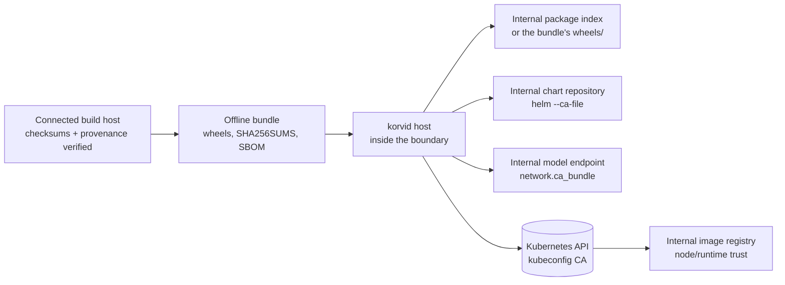

# Air-gapped and restricted-network operation

korvid's own runtime dependencies each point at an internal endpoint, so no
internet access is required for core operation. The decisions are *which*
endpoint to internalize, and who owns the trust for it — korvid configures
TLS only for the connections it makes itself, and there is **no way to
disable TLS verification** through korvid configuration, by design. Optional
features that authenticate against an external identity provider (for
example GitHub Copilot or Entra device login) still need their own external
connectivity; they are called out below.

## The artifact and trust path



**Every connection korvid or a feature it depends on can make, who owns the
trust decision for it, and how to configure that trust:**

| Connection | Owner | Configure with |
| --- | --- | --- |
| Agent LLM endpoint (OpenAI-compatible, native Ollama) | **korvid** | `network.ca_bundle` |
| `:ai` wizard connection test | **korvid** | `network.ca_bundle` (same builder — the test and the live agent cannot disagree) |
| Prometheus / Loki observability connectors | **korvid** | `network.ca_bundle` (same builder again — see [`docs/observability.md`](observability.md)) |
| Internal Helm chart repository | **helm** (korvid passes it through) | CA-file field in the repo dialog → `helm repo add --ca-file` |
| Kubernetes API server | kubeconfig | `certificate-authority[-data]` in kubeconfig |
| OLM catalogs, bundle/operand images | cluster nodes / container runtime | registry mirror + node trust configuration |
| Workload, debug, and node-shell images | container runtime | registry mirror + node trust configuration |
| Telepresence and other external CLIs | the CLI itself | its own configuration |
| GitHub Copilot / Entra device login | the provider SDK | requires its usual external connectivity |

## Corporate CA for the agent (`network.ca_bundle`)

Internal LLM gateways (Ollama, vLLM, an OpenAI-compatible proxy) are usually
served over HTTPS signed by a corporate CA. Point korvid at the bundle once:

```yaml
# ~/.config/korvid/config.yaml
network:
  ca_bundle: /etc/korvid/company-ca.pem

agent:
  provider: openai-compat
  base_url: https://llm.corp.example/v1
  model: qwen3:32b
```

- The bundle is validated at startup: a missing, unreadable, or malformed
  file fails with an error naming the configured path — never a silent
  fallback to default trust.
- The same bundle covers OpenAI-compatible completions, native Ollama
  completions, and the `:ai` setup wizard's connection test.
- When `network.ca_bundle` is unset, standard environment behavior applies
  (`SSL_CERT_FILE`, `HTTP_PROXY`, `HTTPS_PROXY`, `NO_PROXY`).
- The system trust store is never modified.

## Offline installation bundles

Every tagged release attaches versioned offline archives built from the
committed lockfile with **all extras** (`korvid[all,entra]`):

| Archive | Platform | Python |
| --- | --- | --- |
| `korvid-X.Y.Z-offline-linux-manylinux_2_28-x86_64-py3.11.tar.gz` … `py3.13` | Linux x86-64, glibc 2.28+ | 3.11–3.13 |
| `korvid-X.Y.Z-offline-windows-x86_64-py3.11.zip` … `py3.13` | Windows x86-64 | 3.11–3.13 |

Pick the archive matching the target's OS and Python minor version. Each
contains `wheels/` (korvid plus every locked dependency, built on a native
runner of that platform), `install.sh`/`install.ps1`, `SHA256SUMS`,
`sbom.cdx.json`, and `README.txt`. Linux wheel selection and offline
verification run inside the pinned `manylinux_2_28_x86_64` image, making
**glibc 2.28** the explicit compatibility floor rather than inheriting
whichever newer glibc happens to be installed on `ubuntu-latest`.

On the connected side, verify before carrying it across the boundary:

```sh
sha256sum -c SHA256SUMS --ignore-missing          # release-level checksums
gh attestation verify korvid-X.Y.Z-offline-linux-manylinux_2_28-x86_64-py3.12.tar.gz \
  --repo hellices/korvid                          # build provenance
```

On the air-gapped side:

```sh
tar xzf korvid-X.Y.Z-offline-linux-manylinux_2_28-x86_64-py3.12.tar.gz
cd korvid-X.Y.Z-offline-linux-manylinux_2_28-x86_64-py3.12
sha256sum -c SHA256SUMS      # bundle-internal integrity
./install.sh                 # or: python -m pip install --no-index \
                             #       --find-links ./wheels "korvid[all,entra]==X.Y.Z"
```

Upgrading is the same procedure with the newer archive — pip replaces the
installed version in place (`--no-index` still applies). Every archive is
verified in CI in a clean environment with package indexes unreachable,
including a negative check proving the install fails when a dependency wheel
is missing (i.e. nothing is silently fetched).

**Boundary:** the Python bundle contains korvid and its locked Python
dependencies only. Helm, Telepresence, debug images, model artifacts, and
Kubernetes credentials are separate operator-supplied dependencies.

## Internalize the remaining dependencies

- **LLM endpoint**: run Ollama/vLLM inside the network and point
  `agent.base_url` at it, with `network.ca_bundle` for its CA.
- **Helm charts**: mirror charts into an internal repository (e.g.
  ChartMuseum, Harbor). The repository dialog (`Ctrl-R` from the chart
  picker) has an optional CA file field; when set, korvid validates the path
  and runs `helm repo add <name> <url> --ca-file <path>` through its
  fixed-argv wrapper (never a shell). Helm remains the owner of persisted
  repository configuration and credentials — korvid stores nothing.
- **OLM catalogs**: mirror the catalog and its bundle/operand images with
  `oc-mirror` or `opm`, and configure the cluster's `CatalogSource` and
  registry mirrors (`ImageContentSourcePolicy` / containerd mirror config).
- **Debug images (pods)**: `s` on a shell-less pod offers an *ephemeral
  debug container* built from `debug.default_image`, or from one of the
  named `debug.images` offered in the picker — point both at your internal
  registry (see [ops.md](ops.md)).
- **Node shell image (nodes)**: `s` on a node is a *separate* config key.
  It creates a privileged `node-debugger-…` pod from `node_shell.image`,
  which falls back to korvid's built-in public default when unset, so it
  must be pointed at the internal registry in its own right. It is
  node-level troubleshooting — reaching a node's host filesystem and
  runtime — not a rescue path: the debugger is a pod scheduled onto that
  node and waited for, so it only runs while the node still schedules
  workloads, and with an unmirrored image it fails on the pull.
- **Workload images**: standard registry mirroring; korvid never pulls
  images itself.

Registry trust for OLM catalogs, debug/node-shell images, and workload
images belongs to the nodes and the container runtime, not to korvid.

## Readiness checklist (detect, don't assume)

Run these from the korvid host to *detect* leftover external dependencies
instead of assuming the firewall catches them:

```bash
# 1. Agent endpoint reachable and trusted with the configured bundle:
curl --cacert /etc/korvid/company-ca.pem https://llm.corp.example/v1/models

# 2. Helm repositories all point inside (no public URLs left):
helm repo list

# 3. Cluster image sources: every image referenced by running pods —
#    including init and ephemeral (kubectl debug) containers — should
#    resolve to the internal mirror. Branch on kubectl success so a
#    connectivity/auth error is never mistaken for "all internal", and
#    anchor the registry prefix so look-alike hostnames don't count:
if images=$(kubectl get pods -A -o jsonpath='{range .items[*]}{range .spec.containers[*]}{.image}{"\n"}{end}{range .spec.initContainers[*]}{.image}{"\n"}{end}{range .spec.ephemeralContainers[*]}{.image}{"\n"}{end}{end}'); then
  printf '%s\n' "$images" | sort -u | grep -v '^registry\.corp\.example/' \
    || echo "all images internal"
else
  echo "kubectl failed — cannot verify images"
fi

# 4. Both image keys configured to the internal registry — the pod debug
#    images and the node shell image are separate settings:
grep -A3 -e '^debug:' -e '^node_shell:' ~/.config/korvid/config.yaml

# 5. OLM catalog sources (if OLM is installed) point at the mirror:
kubectl get catalogsources -A -o jsonpath='{range .items[*]}{.spec.image}{"\n"}{end}'
```

A korvid start with `network.ca_bundle` set verifies that the bundle loads;
the `:ai` wizard's test call verifies the agent endpoint end to end with the
exact trust the runtime will use.
