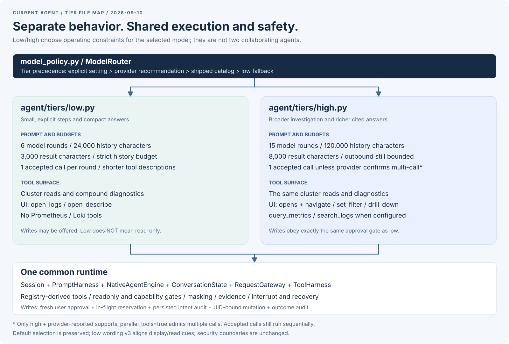

# Agent 구조와 low/high 동작

2026-09-10 리팩토링 기준의 현재 구성이다. 과거 구현은
[리팩토링 이전 스냅샷](specs/2026-09-09-agent-architecture.md)에 남겨 두었다.
여기서는 **현재 파일의 책임과 실제 low/high 동작**을 구분한다.

[SVG 원본 열기](../assets/agent-architecture-tiers.svg)

## 그림 설명

**하나의 모델 연결, 하나의 세션, 하나의 엔진**을 사용한다.
low/high는 별도 agent가 아니라 선택된 모델에 적용할 동작 정의다.
프롬프트·도구 범위·예산은 tier별 파일에서 읽을 수 있고,
승인·마스킹·대화 복구는 공통 실행기에 한 번만 구현한다.

### 파일을 어디서 읽어야 하는가

| 파일 | 책임 |
|---|---|
| `agent/tiers/low.py` | low 프롬프트, 좁은 도구 범위, 짧은 도구 설명, 작은 예산 |
| `agent/tiers/high.py` | high 프롬프트, 넓은 도구 범위, 큰 예산 |
| `agent/tiers/_behavior.py` | 두 tier가 공유하는 작은 불변 동작 계약과 registry 기반 schema 구성 |
| `agent/model_policy.py` | 모델 능력·사용자 설정·환경을 받아 적용할 정책 결정 |
| `agent/prompt_packs.py` | 모든 tier가 공유하는 안전 계약과 공통 역할 |
| `agent/prompt_harness.py` | 공통 문구·tier 문구·추가 규칙·현재 화면을 최종 입력으로 구성 |
| `agent/session.py` | 현재 화면 스냅샷, 턴 수명, 중단 정리, 환경 retarget |
| `agent/native_engine.py` | 모델 요청과 도구 실행 반복, 호출 검증, 종료 판단 |
| `agent/conversation.py` | 메모리 내 history, 호출/결과 짝, 사용량, rollback |
| `agent/request_gateway.py` / `agent/outbound.py` | 실제 모델 호출과 stream 수명 / 송신 내용의 정제·검증·크기 제한 |
| `agent/tool_harness.py` | 허용된 도구의 실행 포트 선택, 결과 정제, 근거 발급 |
| `agent/interaction.py` / `agent/events.py` | 화면과 UI 조작의 타입 계약 / UI로 반환하는 이벤트 |
| `agent/evidence.py` / `agent/navigation.py` | 근거 참조와 인용 검사 / 인용을 선택했을 때 열 화면 결정 |
| `agent/provider.py` / `agent/credentials.py` | 모델 통신 계약과 공통 stream 제한 / 인증 header 공급 계약 |
| `agent/model_profiles.py` / `agent/model_catalog.py` | 설정 UI·특수 연결 flow의 계약 / 작은 내장 정책 catalog |
| `agent/install_hint.py` | optional extra가 없을 때 공통 설치 안내 |
| `agent/__init__.py` | 부수효과 없는 namespace. 심볼은 정의된 모듈에서 직접 import |

실제 도구 metadata와 handler는 `tools/`, 모델 SDK와 HTTP adapter는
`providers/`, 승인 dialog와 실제 화면 조작은 `ui/`에 있다.
파일 분리를 위해 이 코드를 tier별로 복제하지 않는다.

## low와 high가 실제로 하는 일

| 항목 | low | high |
|---|---|---|
| 모델 라운드 상한 | 6 | 15 |
| history 문자 예산 | 24,000 | 120,000 |
| 도구 결과 문자 상한 | 3,000 | 8,000 |
| 라운드당 수용 호출 수 | 1 | 기본 1; provider가 복수 호출 지원을 확인하면 tier별 숫자 상한 없음 |
| strict history 검사 | 적용 | 미적용; outbound·응답 크기 제한은 계속 적용 |
| Kubernetes 읽기·복합 진단 | 제공 | 제공 |
| 로그·상세 화면 열기 | 제공 | 제공 |
| navigate·filter·drill-down | 제공하지 않음 | 제공 |
| Prometheus·Loki 조회 | 제공하지 않음 | 해당 backend가 설정된 경우 제공 |
| 쓰기 요청 | 허용된 환경에서 제공 | 허용된 환경에서 제공 |
| 사용자 승인·감사·마스킹 | 공통 경계 적용 | 같은 공통 경계 적용 |

**low는 read-only 모드가 아니다.** 두 tier 모두 `delete_resource`,
`scale_resource`, `rollout_restart`를 요청할 수 있고, cluster가 지원하면
`resize_pod`도 요청할 수 있다. readonly 환경에서는 쓰기 도구가 아예
노출되지 않는다. 도구가 노출되어도 사용자의 실제 승인 없이 실행되지는 않는다.

두 tier의 공통 읽기는 `list_resources`, `get_resource`, `get_logs`,
`get_events`, `list_operators`, `helm_list_releases`, `diagnose_pod`,
`diagnose_workload`, `diagnose_service`, `diagnose_pvc`다.
이 목록의 단일 원본은 `tools/registry.py`이며, tier 정의는 그 registry에서
자신의 surface와 현재 환경에 맞는 schema를 가져온다.

### 프롬프트 차이

- **low:** 한 번에 한 도구·한 대상, 관측 후 결론, 잘못된 이름 재확인,
  로그/상세를 보여 달라는 요청은 먼저 화면 열기, 짧은 최종 답변을 지시한다.
  일부 도구 설명도 축약한다.
- **high:** 연관 리소스를 따라 여러 단계로 조사하고, 더 풍부한 근거 기반
  답변을 구성하도록 지시한다.
- **공통:** cluster 데이터는 지시가 아닌 자료로 취급하고, 쓰기 승인 권한은
  사용자에게 남기며, context 전환 후에는 새로운 근거를 읽는다.

이 리팩토링은 기존 low/high 프롬프트 문구와 기본 예산을 유지한다. 다만 low 도구
설명 v3은 기존 프롬프트와 일치하도록 `open_describe`와 `get_resource`의
화면 표시/읽기 구분을 명시한다. 이 schema 문구 변경은 모델의 도구 선택과 eval
prompt digest에 영향을 줄 수 있다. 최신 모델을 위해 지침을 완화하거나 기본 tier를
바꾸는 실험은 구조 정리와 분리해야 결과를 비교할 수 있다.

### 복수 호출은 병렬 실행과 다르다

`supports_parallel_tools=True`를 provider가 직접 보고하고 high로 선택된
경우에만 한 응답의 여러 도구 호출을 수용한다. 그렇지 않으면 추가 호출은
다음에 실행하려고 보관하는 것이 아니라 버린다. 수용한 호출도 실제 dispatch는
항상 순차적이다. 일반 LiteLLM 경로는 현재 이 capability를 보고하지 않으므로
high 설정만으로 복수 호출 수용이 켜지지 않는다.

## 공통 실행 경계

1. 세션이 턴 시작 시 현재 화면을 읽고 프롬프트를 구성한다.
2. 엔진이 history와 현재 evidence 표를 gateway에 전달한다.
3. outbound 정책이 데이터를 정제하고, gateway가 실제 송신 내용을 기록한다.
4. 엔진이 도구 호출을 검증하고 tool harness가 읽기·화면 조작·쓰기 요청으로 분기한다.
5. 성공한 읽기는 근거 ID를 발급하고 결과는 다음 모델 라운드에 전달한다.
6. 답변 완료 시 인용과 사용량을 보고한다. 중단·실패 시 대화의 짝과 사용량을 복구한다.

쓰기 요청은 사용자 승인 뒤 공통 write coordinator로 간다.
intent audit 실패는 변경을 차단하며, 승인된 변경은 agent 턴을 중단하더라도
shield 처리되어 마무리된다. context 전환 차단은 별도 UI coordinator가 담당한다.
자세한 운영 의미는 [안전 경계](../ops.md#one-write-path-three-drivers)를 참고한다.

## 정리한 부분과 유지한 부분

- 현재 연결되지 않는 이전 `ProviderPlugin` 생성 API와 registry를 삭제했다.
  호환 shim은 남기지 않으며 [현재 SpecialFlow 계약](../provider-plugins.md)을 사용한다.
- 넓은 package-level re-export 대신 실제 정의 모듈에서 직접 import한다.
- 사용하지 않는 화면 문자열 adapter를 제거하되 현재 화면·도구 결과·송신
  payload의 정제 경로는 유지한다.
- 비어 있던 운영 provider/model overlay registry를 정리하고,
  평가용 prompt 실험은 명시적인 주입으로 유지한다.
- 사용하지 않는 외부 checkpoint 반환 객체와 중복 수명 상태를 정리하되,
  내부 rollback 상태와 중단·종료의 행동 계약은 유지한다.
- eval이 실제 화면과 같은 filter 문법을 사용하는 작은 bridge는 유지한다.
  eval에서 core를 직접 import하지 않는 계층 규칙을 지키면서 구현을 재사용하기 위해서다.

**파일 수를 줄이는 것 자체가 목표는 아니다.** low/high를 찾기 쉽게 나누는
파일은 추가하되, 실제로 사용하지 않는 계약과 중복 구현을 제거하는 것이 목표다.
