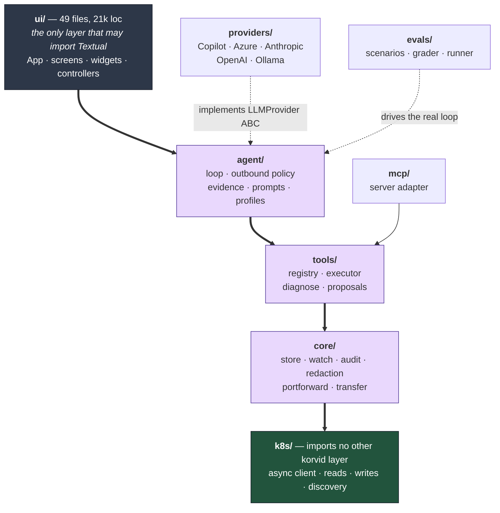
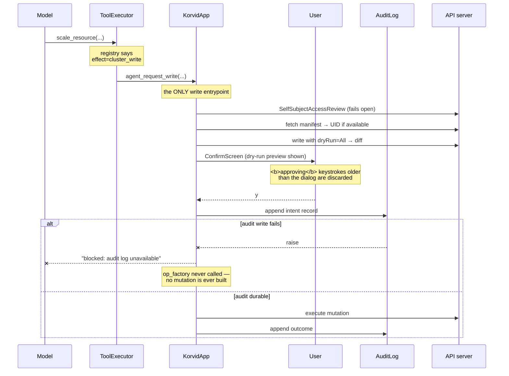
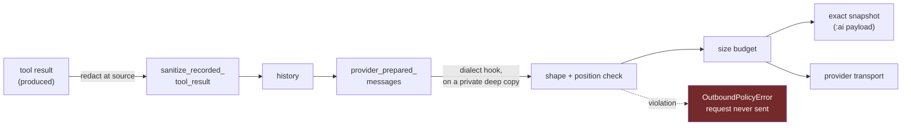
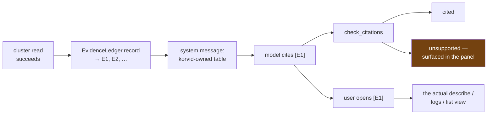
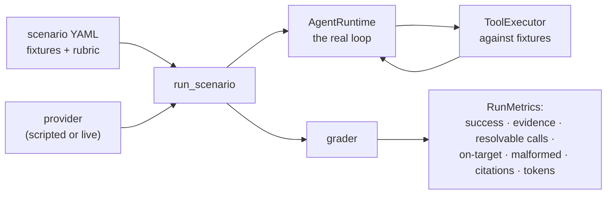
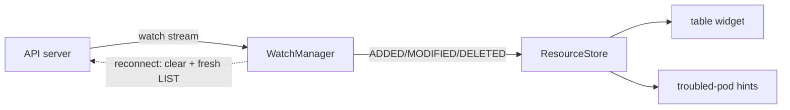
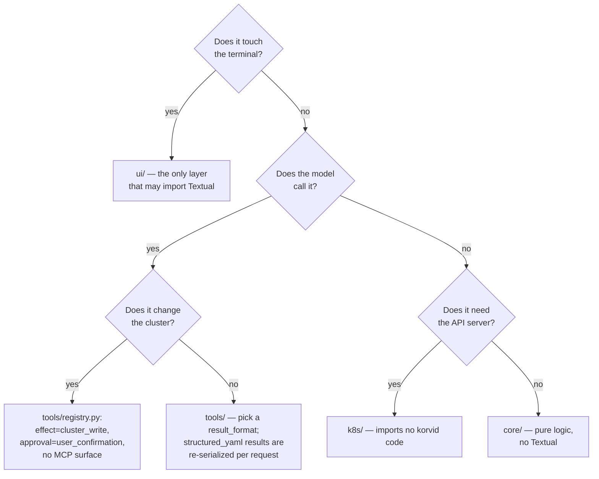

# korvid architecture: how the pieces hold each other honest

This document explains what korvid is built out of and — more importantly —
*why the parts are arranged the way they are*. It documents the system as it
exists at `131f77d9`, not as it was planned.

The original design doc
([`2026-07-23-korvid-tui-design.md`](2026-07-23-korvid-tui-design.md)) states
the intent. This one states the realised structure, names the invariants that
survived contact with the code, and points at the file that enforces each one.
Where an invariant is enforced by a *mechanism* rather than by discipline, the
mechanism is named — that distinction is the main subject of this document.

**Audience.** Contributors deciding where a change belongs, and reviewers
deciding whether a change is safe. If you want to *use* korvid, read the
[README](../../../README.md). If you want the AI data boundary specifically,
read [`docs/threat-model.md`](../../threat-model.md), which goes deeper on
that one seam than this overview does.

---

## 1. The thesis

Most "AI for Kubernetes" tools are a chat box that emits `kubectl` commands.
That design has three failure modes, and korvid's architecture is a response
to each:

| Failure | korvid's structural answer |
|---|---|
| The model claims something the cluster never said | Every read mints an **evidence reference**; the answer cites them, and the citation opens the actual view |
| The model executes something destructive | A write is **unreachable** from model output — it can only *request*, and only a human keystroke on a visible dialog completes it |
| The model leaks secrets to a third party | One **fail-closed choke point** every model-facing message and tool result crosses, with redaction one layer below it |

None of these are policies written in a contributing guide. Each is a
structure that makes the wrong thing hard to express: an unapproved write path
fails at *import time*, an uncrossed boundary fails the request, an invented
citation resolves to nothing.

---

## 2. Layer map



The bold arrows are the spine: each layer may import everything *below* it, not
only its neighbour (`ui/` reaches `core/`, `k8s/` and `tools/` directly;
`agent/` reaches `core/` and `k8s/`). The exact permitted set lives in
`tach.toml` — the diagram shows the shape, the config is the authority.

Read the arrows as "may import". The graph is acyclic and **machine-checked**:
`tach.toml` declares it and `uv run tach check` fails the build on a violation.
It is a required CI check, so the layering cannot rot by accident.

Two properties of this graph carry most of the weight:

**`k8s/` depends on no other layer.** It owns the in-process async API client
and imports only its own submodules, which is what makes every layer above it
testable without a cluster — the 4,700-test suite runs offline in ~13 minutes.

It is not, however, the only path to a cluster: the terminal-bound flows in
`ui/shell_controller.py` shell out to `kubectl` for `exec` and `debug`, because
those need a real TTY handed to the user's terminal. That is a deliberate
exception, not an oversight — but it means "all cluster I/O lives in `k8s/`" is
the goal, not an invariant you can rely on.

**Textual appears in exactly one layer.** `core/`, `tools/`, `agent/` and
`k8s/` are plain async Python. This is not tidiness for its own sake: it is why
the agent loop can be driven by the eval harness (§7) with no terminal, and why
the same `ToolExecutor` serves the TUI and the MCP server without a second
implementation.

**`providers/` points *up*.** Concrete providers implement the `LLMProvider`
ABC declared in `agent/provider.py`, so the agent core knows nothing about
Azure or Ollama. Both `providers/` and `mcp/` are optional extras; `__main__.py`
imports them lazily and degrades to a `None` wiring when the extra is missing —
unless the feature was explicitly requested, in which case startup fails with an
install hint rather than silently disabling it.

**Cross-layer** wiring happens in `__main__.py`: which provider, which
executor, which bridge, assembled once at one place you can read top to bottom.
There is no DI container and no service locator — dependencies are constructor
arguments.

`KorvidApp.__init__` then composes the UI's own controllers (shell, forward,
transfer, operator, helm) from what it was given. That is intra-layer
composition, not a second wiring root: nothing there decides which layer talks
to which. Worth knowing before you go looking for a controller's construction
in `__main__.py` and fail to find it.

---

## 3. The tool registry: policy as data, checked at import

`tools/registry.py` is the smallest file with the largest safety consequence.
Every tool is a `ToolDef` that models its policy dimensions *independently*:

```
name · schema · dispatch · effect · approval · capability · result_format · surfaces
```

Because the dimensions are separate fields rather than tangled in handler code,
a validator can check the combinations. `_validate_write_policy()` rejects, at
**import time**:

- a `cluster_write` whose `approval` is not `user_confirmation`;
- a `cluster_write` exposed on any MCP surface;
- an `approval` gate on anything that is not a write (a gate that guards
  nothing trains users to dismiss dialogs);
- a `write_proposal` on any surface other than `mcp_proposal`.

That is half the import-time guarantee. The other half is
`validate_dispatch_targets()`, which resolves every tool's dispatch key against
the class its effect implies — reads on the executor, `ui_only` on the bridge —
and enforces `_WRITE_ENTRYPOINT = "agent_request_write"` as the *only* bridge
method a cluster write may dispatch to. `_validate_write_policy` says a write
must be approved; `validate_dispatch_targets` says it must go through the one
method that does the approving. Neither alone is sufficient.

The current registry, by construction:

| Effect | Count | Approval | Reachable from MCP? |
|---|---|---|---|
| `cluster_read` | 10 | none | yes |
| `ui_only` | 5 | none | yes |
| `cluster_write` | 4 | **user_confirmation** | **no** |
| `write_proposal` | 3 | none (proposes only) | `mcp_proposal` only |

The consequence worth internalising: **you cannot add an unapproved write by
being careless.** A `ToolDef` with `effect="cluster_write"` and
`approval="none"` does not fail review — it raises `ValueError` the moment
`korvid.tools.registry` is imported, which startup and the test suite both do
before anything else can run. (`import korvid` alone does not: the package
`__init__` defines only `__version__`.) You can reproduce it in one line:

```python
>>> from korvid.tools.registry import ToolDef, _validate_write_policy
>>> _validate_write_policy(ToolDef(..., effect="cluster_write", approval="none"))
ValueError: cluster write 'x' requires the approval gate
```

---

## 4. The write path: why a model cannot mutate your cluster

This is the flow the product's safety claim rests on. Every step below is in
the code; the ordering is the design.



Four properties are worth stating explicitly, because each closes a hole that a
simpler design leaves open:

**The approval is a keystroke, not a function call.** `ConfirmScreen` records
its construction time and discards any *approving* key event older than itself.
A burst of buffered input — from a paste, a held key, or an impatient user —
cannot approve a dialog that did not exist when those keys were pressed. The
`y` shortcut and `FreshKeysInput`'s typed-name path both filter on that
timestamp; **`n` deliberately does not**. The asymmetry is the design: a stale
keystroke must never approve, and a stale keystroke that declines costs the
user a retry, which is the safe direction to fail.

**Audit is written *before* the mutation, and failure cancels it.** The intent
record lands first; if it cannot be written, `_run_write_inner` returns
`blocked: audit log unavailable` **without calling `op_factory()`** — the
mutation is never constructed, let alone sent. Taking a factory rather than a
coroutine is what makes that possible: there is no half-created operation to
clean up. The log itself is
`fsync`-ed with the parent directory synced and an interprocess lock, so a
second korvid session cannot interleave records. A crash *can* still leave a
torn trailing line — `_repair_torn_tail` exists precisely because it can — but
that is a different failure from the one this guards: the mutation does not run
unless the append returned successfully. Fail-closed here means *the write does
not happen*, not *the write happens unlogged*.

**Agent and human writes share one path.** There is no separate agent write
route to audit. The only difference is provenance recorded in the audit detail
(`requested by agent`), which is precisely the difference you want visible
afterwards.

**The UID travels with the request — when it can be had.** The manifest fetch
before approval captures the target's UID, so a pod deleted and recreated under
the same name while the dialog was open is not silently mutated in its
replacement's stead. `_target_manifest` is fail-open: missing wiring, a
timeout or an infrastructure error yields `None`, and the write proceeds
without the precondition rather than becoming unavailable. It narrows the race
where the lookup succeeds; it does not close it in general.

The RBAC pre-check deliberately **fails open**: a cluster that refuses
`SelfSubjectAccessReview` should not become unusable, and the API server
remains the actual authority. It is a courtesy that turns a confusing 403 into
a clear warning — not a security control, and the code says so.

---

## 5. The provider boundary: one place, fail-closed

Every model-facing `messages` and `tools` payload crosses `agent/outbound.py`
before a provider request is built. Transport fields a provider adds
afterwards — `model`, streaming options, auth headers — are outside it; the
boundary governs *content the model sees and produces*, which is where the
leak risk lives. The split
with `core/redaction.py` one layer down is deliberate and worth understanding:

- **What must never leave** lives in `core/redaction.py`, so the tool executor
  can apply the identical rules *where a document is produced* — before any
  size reduction removes the classifiers those rules read.
- **How a request is built** (shape, correlation, bounding, the exact
  snapshot) lives in `agent/outbound.py`.

Redacting only at the boundary would be too late: the size cap runs first, and
a truncated manifest no longer looks like a `Secret` to a classifier. Redacting
only at the producer would leave provider-dialect adapters unchecked. Both, at
their correct layers, with one shared rule set.



The `prepare_messages` hook exists because provider wire formats genuinely
differ (Ollama's native API re-attaches `thinking`, names the executed tool,
wants object-valued arguments). Running it *inside* the boundary rather than
inside `complete()` means every field an adapter adds is still sanitized,
size-checked, and captured in the snapshot. The hook gets a private deep copy,
and each output position must still carry its input's `role` and `content` —
compared against a baseline taken *before* the hook ran, because comparing
against the copy the hook was given would check a mutated list against itself.

What the user can verify: `:ai payload` shows the exact sanitized model-facing
inputs the boundary produced, and can export them. Not the literal wire bytes —
the provider still adds `model` and streaming options, and the HTTP client does
the serialization — but it is the part where cluster data could leak, which is
the part worth inspecting. A boundary you cannot inspect is a promise, not a
control.

---

## 6. Evidence: making a claim checkable

An agent that says "the pod is OOMKilled" is only useful if you can find out
whether it read that or inferred it. `agent/evidence.py` mints a reference for
each successful cluster read, and the answer is expected to cite them.



Three decisions here were each learned the hard way, and each is load-bearing:

**Only reads are citable.** A successful *write* also reports `error=False`, so
recording every non-error result would let "I deleted the pod" be citable as
evidence for a claim about what the cluster *is*.

**The evidence table is korvid-owned text.** It is assembled from references
and registry-validated tool names only — never from model-supplied argument
values. An earlier version interpolated arguments into the system message,
which let a single newline forge an `[E9]` row and inject instructions. The
lesson generalises past this feature: *a trust region is a property of the
content, not of who wrote it.*

**A reference identifies an incarnation, not a name.** Reads that know their
target's UID carry it, and opening a citation compares it against the object
actually put on screen. A pod recreated under the same name is reported as a
replacement rather than shown as though it were the evidence. Reads that
*cannot* honestly identify an instance — `get_logs`, whose manifest lookup and
log stream are separate name-based requests — report no identity at all,
because a false identity is worse than none.

Citation quality is measured, not asserted: the eval harness reports
**precision** (are the cited references real?) and **coverage** (how much of
the answer rests on any reference?) separately, because they fail for different
reasons and averaging them hides which one you have.

---

## 7. The eval harness: the part that keeps the rest honest

`evals/` runs the **real** agent loop against scripted cluster fixtures. The
cluster side is always fixture-backed, so no run needs a cluster. The provider
side has two modes: a scripted provider (no network, deterministic — this is
what CI runs) and a live provider, which is how the local-model matrix is
produced and is neither offline nor reproducible bit-for-bit. It exists because
"the agent got better" is otherwise unfalsifiable.



This is what makes the local-model work tractable: a 3B model and a frontier
model run the *same* scenarios through the *same* code and produce comparable
numbers ([`docs/evals/scoreboard.md`](../../evals/scoreboard.md)). It is also
why the `small` profile exists as a distinct prompt/tool surface rather than a
hopeful setting.

Note what the metrics measure: not answer prose quality, but whether tool calls
were **resolvable** (did the named object exist?), **on-target** (was it the
right object?), **malformed** (did the model emit valid call syntax?), and
whether claims were cited. Those are the failures that make an agent useless
on a cluster, and they are all mechanically checkable.

---

## 8. Reading the cluster: watch, store, and why the UI stays responsive



`ResourceStore` holds the current object set per (kind, scope); `WatchManager`
feeds it from the API's watch stream and handles reconnection. The UI renders
from the store, never from a request in flight, which is why filtering and
sorting stay instant on a live cluster.

A dropped watch does **not** leave stale rows on screen: `WatchManager` clears
the bucket and re-LISTs before resuming, so the table briefly empties and then
refills with current state. When retries are exhausted the app surfaces a
`Watch failed` error. Showing nothing and saying so beats showing a cluster
state that stopped being true minutes ago.

What the agent can see about your screen — view, namespace, selection, filter —
is assembled by `_screen_context` at the moment it is needed, reading pane
state, the focused table and app state directly (only the rows themselves come
from the store). It is not a cached summary handed over earlier, which is what
keeps the agent's idea of "what you are looking at" from drifting away from
what is rendered.

---

## 9. Where a change belongs

A practical decision procedure, in the order the questions should be asked:



Two traps this diagram exists to prevent:

- **Reaching for `ui/` because it is where the app object lives.** If the logic
  is testable without a terminal, it belongs one layer down; `ui/` is 21k lines
  largely because that pull is strong. Issue #187's controller extraction is the
  ongoing correction.
- **Adding an agent-visible tool without a registry entry.** Dispatch resolves
  through validated registry metadata; a handler that is not declared there is
  not reachable, by design.

---

## 10. Invariants, and what enforces each

The distinction between *checked* and *reviewed* is the point of this table.

| Invariant | Enforced by | Fails at |
|---|---|---|
| Layer graph is acyclic and declared | `tach.toml` + CI | build |
| A cluster write requires user confirmation | `_validate_write_policy` | **import** |
| Cluster writes are not exposed on MCP | `_validate_write_policy` | **import** |
| A write dispatches only via `agent_request_write` | `validate_dispatch_targets` | **import** |
| Every tool's dispatch target exists on its class | `validate_dispatch_targets` | **import** |
| An unwritten audit record blocks the write | `_run_write_inner` | runtime |
| Only fresh keystrokes confirm a dialog | `ConfirmScreen` / `FreshKeysInput` | runtime |
| Provider-bound data crosses one policy | `agent/outbound.py` | runtime (request refused) |
| Secrets are redacted before size bounding | `core/redaction.py`, at the producer | runtime |
| A citation resolves to a real read | `EvidenceLedger` | runtime (unresolvable) |
| Public-PyPI-only lockfile | pre-commit hook + CI | commit |
| Type safety | `mypy --strict`, 348 files | CI |
| Coverage ≥ 80% | `pytest --cov` | CI |

Anything in the **import** row cannot be undone by a distracted reviewer, which
is why the security-relevant rows were moved there.

---

## 11. Known tensions

An architecture document that lists only strengths is marketing. These are the
real ones:

**`ui/` is too large.** 21k lines across 49 files, against 5.6k in `core/`.
Screens, widgets and orchestration accumulated there because `KorvidApp` owns
the state everything wants. Controller extraction (#187) is underway;
`docs/dev/ui-controllers.md` tracks it. The layer *boundary* is clean — the
distribution inside it is not.

**The RBAC pre-check fails open.** Deliberate (see §4), documented, and
correct for a courtesy check — but it means the dialog can promise a write the
API server will refuse.

**Structured results cannot carry inline markers.** `structured_yaml` results
are re-parsed and re-serialized per request, so anything written inside them —
YAML comments included — is lost, and anything written outside breaks parsing
and is refused by the outbound policy. This constrains any future feature that
wants to annotate a manifest in place.

**Prompt overhead is a real budget.** The evidence table costs characters in
every request. It was compressed from 383 to 241 characters after it broke a
history-retention test, and a budget test now pins it. Features that add
system-message text pay a measurable cost on small local models.

**MCP exposes reads and proposals, never writes.** A capable MCP client cannot
mutate the cluster through korvid — it can only leave a proposal for a human.
That is the intended trade, but it does mean MCP is not a complete automation
surface, and no amount of client-side cleverness makes it one.

---

## Related documents

| Document | What it covers that this one does not |
|---|---|
| [`2026-07-23-korvid-tui-design.md`](2026-07-23-korvid-tui-design.md) | Original intent and the product spec |
| [`2026-07-24-korvid-engineering-standards.md`](2026-07-24-korvid-engineering-standards.md) | Coding standards, review expectations |
| [`docs/threat-model.md`](../../threat-model.md) | The AI data boundary in depth, incl. residual risk |
| [`docs/ops.md`](../../ops.md) | Write safety, port-forward and transfer from the user's side |
| [`docs/agent.md`](../../agent.md) | Provider setup, profiles, prompt configuration |
| [`docs/evals/methodology.md`](../../evals/methodology.md) | How the numbers in the scoreboard are produced |
| [`docs/dev/ui-controllers.md`](../ui-controllers.md) | The in-progress `ui/` decomposition |
