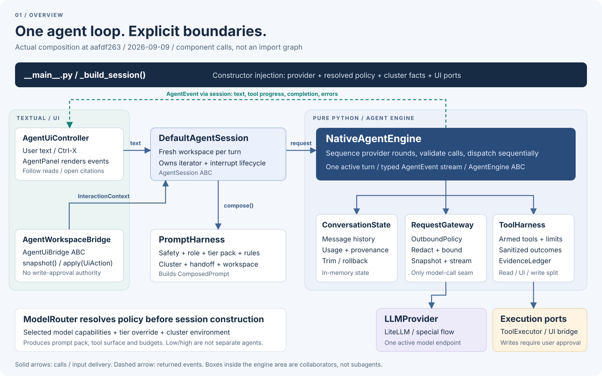
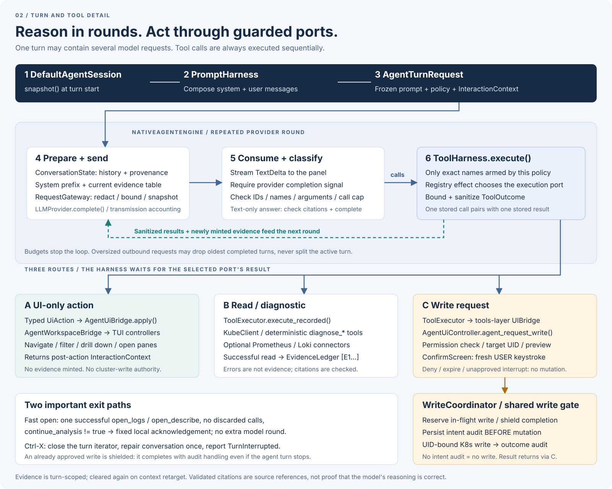
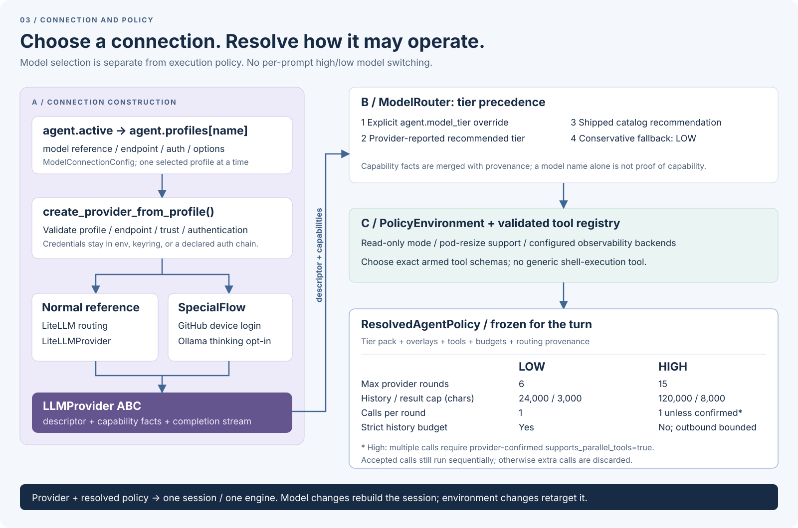

# Agent 아키텍처: 현재 구성과 고도화 이후의 변화

> 이 문서는 아래 커밋의 **리팩토링 이전 스냅샷**이다.
> 현재 low/high 파일 구성과 공통 실행 경계는
> [최신 agent 구조 문서](../agent-architecture.md)를 참고한다.

**코드 스냅샷:** 2026-09-09,
[`aafdf263`](https://github.com/hellices/korvid/commit/aafdf2633157e80fbbf845f11308a6389907c09e),
korvid 0.4.1. 앞으로 구현할 설계가 아니라 **현재 실행되는 코드의 구성**을
설명한다. 전체 TUI가 아닌 내장 agent와 그 agent가 사용하는 외부 경계만 다룬다.
아래 소스 링크는 이 커밋에 고정되어 있다.

> **한 줄 요약:** agent 수를 늘린 것이 아니다. 하나의 루프에 모여 있던
> 책임을 **세션 / 프롬프트 / 대화 상태 / 모델 요청 / 도구 실행**으로 나누고,
> 현재 화면과 모델 능력을 명시적인 입력으로 전달하는 구조로 바뀌었다.

읽는 순서는 **오버뷰 → 턴·도구 상세 → 모델 연결·정책 → 변경 이력**이다.
SVG는 별도 렌더러나 외부 폰트 없이 열 수 있으며, 원본을 열면 확대해서 볼 수 있다.

## 1. 오버뷰: 무엇이 무엇을 연결하는가

[오버뷰 SVG 원본 열기](../../assets/agent-architecture-overview.svg)

### 그림 설명

1. **조립은 한 곳에서 한다.** [`_build_session()`][composition]이 provider,
   정책, Kubernetes 클라이언트, UI bridge를 받아 객체들을 생성하고 생성자로
   연결한다. 각 컴포넌트가 전역 컨테이너에서 의존성을 찾아가는 방식이 아니다.
2. **UI는 사용자 입력을 전달하고 이벤트를 그린다.**
   [`AgentUiController`][ui-turn]는 입력 문자열을 세션에 전달하고,
   `TextDelta`, `ToolCallStarted`, `ToolCallFinished`, `TurnComplete`,
   `AgentError`를 패널에 반영한다. 읽기 결과를 화면에 따라 보여주는 follow도
   이 UI 쪽 책임이다.
3. **세션은 “지금 어느 화면에서 물었는가”를 책임진다.**
   [`DefaultAgentSession`][session]은 턴이 실제 시작될 때
   [`AgentWorkspaceBridge`][workspace]를 통해 화면 상태를 읽는다.
   프롬프트를 구성하고, 턴 iterator의 종료·중단·정리도 소유한다.
4. **엔진은 실행 순서를 책임진다.** [`NativeAgentEngine`][engine]은
   준비 → 모델 요청 → 응답 소비 → 도구 실행 → 다음 요청 또는 종료를 반복한다.
   직접 화면 위젯이나 Kubernetes 클라이언트를 조작하지 않는다.
5. **세 협력 객체가 엔진의 세부 책임을 맡는다.**
   대화·회계는 [`ConversationState`][conversation], 모델 송신은
   [`RequestGateway`][gateway], 도구 라우팅·결과·근거는
   [`ToolHarness`][tools]가 담당한다.

여기서 **harness는 여러 기능을 안전하게 실행시키는 제어·연결 계층**을 뜻한다.
별도의 LLM이나 subagent가 아니다. 프로덕션 구현은 세션 하나에 엔진 하나이며,
low/high도 두 agent가 협업하는 구성이 아니다.

### 책임을 코드에 대입하면

| 구성 요소 | 소유하는 책임 | 의도적으로 맡지 않는 책임 |
|---|---|---|
| [`AgentSession` / `DefaultAgentSession`][session] | 화면 스냅샷, 턴 수명, 중단 정리, 환경 retarget | 모델 전송 구현, Kubernetes 작업 |
| [`PromptHarness`][prompt] | system/user 메시지 구성과 프롬프트 예산 검사 | API 송신, 도구 실행 |
| [`AgentEngine` / `NativeAgentEngine`][engine] | 단일 실행 루프, 응답·호출 검증, 순차 dispatch | 모델 선택 UI, 승인 권한 |
| [`ConversationState`][conversation] | 메시지, redaction provenance, 사용량, checkpoint·rollback | UI 상태, provider, 도구 정책 |
| [`RequestGateway`][gateway] | outbound 검증·마스킹·크기 제한, 송신 스냅샷, stream 수명 | 대화의 의미 해석, 도구 실행 |
| [`ToolHarness`][tools] | 허용된 도구만 실행, 포트 선택, 결과 정제, 근거 발급 | 사용자 대신 쓰기 승인 |
| [`LLMProvider`][provider] | 모델 identity·capability, completion stream 계약 | agent 루프 자체 |

`ConversationState`의 history는 **현재 세션의 메모리 상태**다.
여기서의 checkpoint/rollback을 데이터베이스나 재시작 후 복구되는 영속 대화
저장소로 해석하면 안 된다.

## 2. 상세: 한 번 질문하면 실제로 무슨 일이 일어나는가

[턴·도구 상세 SVG 원본 열기](../../assets/agent-architecture-detail.svg)

### 그림 설명: 턴과 라운드는 다르다

**턴(turn)**은 사용자 질문 하나를 처리하는 단위다.
**라운드(iteration)**는 그 안에서 모델을 한 번 호출하고 결과를 처리하는 단위다.
조사에 도구가 필요하면 한 턴 안에서 여러 라운드가 실행된다.

1. **현재 화면을 스냅샷으로 고정한다.**
   [`InteractionContext`를 읽는 코드][workspace]는 Kubernetes context와
   epoch, 포커스된 pane, 보조 pane, 선택 리소스, scope, filter를 전달한다.
   화면이 바뀌었다는 가짜 사용자 발화를 history에 넣지 않는다.
   `timeline_cursor` 필드는 있지만 **현재 프로덕션에서는 `None`**이다.
2. **프롬프트를 정해진 순서로 조립한다.**
   [`PromptHarness.compose()`][prompt]는 다음 층을 구성한다.
   - System: 고정 안전 계약 → 공통 역할 → low/high pack → provider/model overlay
     → 사용자 추가 규칙 → 활성 도구에 맞는 capability 문구
     → cluster 설명 → 필요한 context handoff 설명.
   - User: 사용자가 입력한 텍스트 + 구조화된 현재 화면 상태.
   - **Evidence 표는 이 단계에 고정하지 않는다.** 각 모델 라운드 직전에
     엔진이 그 시점의 ledger로 다시 붙인다.
3. **모델로 나가는 실제 요청을 준비한다.**
   [`RequestGateway`][gateway]는 provider의 message 준비 hook을 먼저 적용한 뒤
   `OutboundPolicy`로 정제·검사한다. 실제 송신에 사용한 canonical payload를
   보관하므로 `:ai payload`가 별도로 재구성한 추정치가 아닌 송신 내용을 보여준다.
   이 payload는 **sanitized이지 anonymized는 아니다**.
   리소스 이름·namespace·label까지 모두 숨기는 것은 아니다.
4. **완료된 응답만 실행 가능한 결과로 취급한다.**
   [`엔진 라운드`][engine]는 텍스트를 스트리밍하지만, provider의 정상 완료 신호를
   확인한 뒤 도구를 실행한다. 불완전한 stream은 오류다. 호출 ID·이름·중복,
   JSON 객체 인자, 라운드별 호출 제한을 검사한다.
5. **도구 결과를 기록하고 다음 라운드로 간다.**
   [`순차 dispatch`][dispatch]가 결과와 redaction 기록을 history에 추가한다.
   여러 호출을 수용할 수 있는 정책에서도 **수용한 도구를 동시에 실행하지 않는다**.
   쓰기 승인과 화면 조작이 서로 끼어들지 않게 하기 위해서다.
   복수 호출 수용 조건은 아래 low/high 설명에서 구분한다.
6. **답변이 끝나면 인용과 사용량을 보고한다.**
   텍스트-only 응답은 ledger와 인용을 대조한 후 종료한다.
   호출 횟수·history·응답 예산 초과와 provider 오류는 각각 명시적으로 처리한다.
   전송되었지만 usage가 오지 않은 요청도 사용량 추정에서 빠뜨리지 않는다.

### 그림 설명: 도구는 세 갈래로 나뉜다

**A. 화면 조작 — typed UI port**

[`ToolHarness`][tools]가 `Navigate`, `SetFilter`, `OpenLogs`, `OpenDescribe`,
`DrillDown` 같은 typed action을 만들어 [`AgentUiBridge`][workspace]에 전달한다.
결과에는 동작 후의 화면 스냅샷이 포함된다. 사용자 키보드 조작과 같은
controller·화면 보호 규칙을 사용하며, 이 포트에는 쓰기 승인 권한이 없다.

**B. 읽기·진단 — recorded execution port**

[`ToolExecutor.execute_recorded()`][executor]가 Kubernetes 읽기와
결정론적 `diagnose_*` 도구를 실행한다. 설정된 경우 Prometheus/Loki의 제한된
읽기 커넥터도 사용할 수 있다. 모델이 shell 명령을 자유롭게 실행하는 구조가 아니다.
도구의 JSON schema를 범용 validator로 실행하는 것도 아니다.
실제 방어선은 **정책에 등록된 정확한 도구 이름, 검증된 dispatch metadata,
각 handler의 명시적 인자 검증**이다.

정제된 성공 읽기에는 [`EvidenceLedger`][evidence]가 `[E1]`, `[E2]` 같은
참조를 발급한다. 실패·화면 조작·쓰기는 근거를 발급하지 않는다.
근거는 **턴마다 초기화**되며 cluster context retarget 시에도 지운다.
인용 검사는 실제로 읽은 자료를 가리키는지 확인할 뿐, 모델의 인과 추론이 옳다는
보증은 아니다. 복합 진단처럼 단일 화면으로 이동할 수 없는 근거도 존재한다.

**C. 쓰기 요청 — 별도의 승인 포트**

[`ToolExecutor`의 쓰기 분기][executor]는 tools 계층의 `UIBridge`를 거쳐
[`AgentUiController.agent_request_write()`][write-request]로 간다.
이 경로는 A의 typed UI bridge와 **서로 다른 인터페이스**다.

- permission 사전 확인, 대상 UID 확보, preview 준비 후 `ConfirmScreen`을 연다.
- **사용자의 새로운 키 입력**으로 승인해야 한다. 모델의 “승인합니다”는 효력이 없다.
- [`WriteCoordinator`][write-gate]가 in-flight 예약·shield 처리,
  intent audit 기록, UID에 묶인 변경, outcome audit를 맡는다.
- context 전환 보호는 별도다. [`ContextSwitchCoordinator`][context-switch]가
  agent 실행 중, 진행 중 쓰기, 열린 dialog를 확인해 전환을 막는다.
  내장 agent가 승인 후 호출하는 `run_shielded()`에 별도의 context
  재검증 단계가 있는 것으로 해석하면 안 된다.
- **intent audit를 기록하지 못하면 변경 자체를 실행하지 않는다.**
  이미 변경이 실행된 뒤 outcome audit가 실패한 경우에는 실패를 알리며,
  실행된 변경이 자동으로 되돌아가는 것은 아니다.
- 거부·시간 만료·미승인 상태에서의 중단은 실행하지 않는다.
  이미 승인된 변경은 shield 처리되어 agent 턴 중단과 별개로 끝까지 처리된다.

### 빨라진 경로와 중단·전환

- **단순 “열어줘” 최적화:** 성공한 `open_logs` 또는 `open_describe`가
  그 라운드의 유일한 유지된 호출이고 버린 호출이 없으며,
  `continue_analysis`가 `true`가 아니면 고정 확인 문구로 끝낸다.
  [`추가 LLM 라운드를 생략하는 경로`][fast-open]이지 LLM 호출 전체를 없애는
  경로는 아니다. low에만 제한된 기능도 아니다.
- **중단:** `Ctrl-X` 또는 새 질문 제출은 진행 중 iterator를 닫고,
  세션이 대화 상태를 한 번만 정리한다. 미완료 호출과 결과의 짝을 복구하고
  부분 응답을 완료된 답변처럼 재사용하지 않는다.
- **환경 전환:** readonly·cluster 기능 등의 변경은
  [`session.retarget()`][retarget]으로 정책·도구·outbound 경계를 함께 바꾼다.
  모델 descriptor나 history 예산까지 바뀌면 composition root가
  [`세션을 재구성`][rebuild]한다.

## 3. 상세: 모델 연결과 low/high 정책은 어떻게 정해지는가

[모델 연결·정책 SVG 원본 열기](../../assets/agent-architecture-policy.svg)

### 그림 설명

**왼쪽은 “어디에 연결할 것인가”, 오른쪽은 “그 연결로 어떻게 실행할 것인가”다.**

[`ModelConnectionConfig`][connection]는 `model`, `endpoint`, `auth`, `options`를
가진다. 여러 프로필을 저장할 수 있지만 `agent.active`가 선택한 하나로
[`provider factory`][factory]가 `LLMProvider`를 만든다.
일반 model reference는 LiteLLM이 해석하고, GitHub device-login이나
Ollama thinking opt-in처럼 특수한 경우는 선택된 special flow가 맡는다.

`auth.method`에는 `none`, `environment`, `keyring`, `provider-default`,
`device-login`이 있다. 모든 모델이 모든 인증 방식을 지원한다는 뜻은 아니다.
프로필은 secret 값 대신 참조를 저장하며, provider-default의 선언된 credential
chain과 special flow는 필요한 경우에 선택적으로 사용한다.
특수 flow가 claim한 연결이 실패했다고 일반 provider로 몰래 우회하지 않는다.

[`ModelRouter`][routing]는 이미 선택된 모델에 대한 **실행 정책을 결정**한다.
질문의 난이도를 보고 다른 모델로 자동 위임하는 router가 아니다.

| 항목 | low | high |
|---|---:|---:|
| 턴당 최대 모델 라운드 | 6 | 15 |
| history 문자 예산 | 24,000 | 120,000 |
| 도구 결과 문자 상한 | 3,000 | 8,000 |
| 라운드당 실제 수용 호출 수 | 1 | 기본 1; provider가 복수 호출 지원을 직접 확인한 경우 tier별 상한 없음 |
| strict history budget | 적용 | 미적용; outbound·응답 제한은 유지 |

위 예산은 [`현재 tier 기본값`][budgets]이다. “문자”를 “토큰”으로 읽으면 안 된다.
**호출 수용과 실행 방식은 별개**다.
[`ModelRouter`][routing]는 high이면서 provider가 `supports_parallel_tools=True`를
직접 보고한 경우에만 `allow_parallel_tool_calls`를 켠다.
그렇지 않으면 [`엔진의 실제 호출 제한`][call-limit]은 1이며, 추가 호출은
나중에 순차 실행하는 것이 아니라 버린다. 현재 일반
[`LiteLLM factory의 capability 구성`][factory-capabilities]은 이 사실을 보고하지
않으므로 high로 지정해도 이 경로는 라운드당 하나만 수용한다.
복수 호출을 수용하더라도 실제 dispatch는 순차적이고 adapter의 버퍼 제한도 유지된다.

tier 우선순위는 **사용자 명시값 → provider 추천 → 내장 catalog 추천 → low**다.
추가로 readonly, pod resize 지원, observability backend 설정이
[`tool registry`][registry]에서 노출할 도구를 제한한다.
최종 `ResolvedAgentPolicy`에는 도구 schema, prompt pack·overlay,
예산, capability와 결정 출처가 함께 들어간다.

**두 catalog를 혼동하지 않아야 한다.** 설정 UI의
[`모델 검색 catalog`][search-catalog]는 연결할 모델과 metadata를 찾는 용도다.
[`agent의 작은 내장 catalog`][policy-catalog]는 정확히 일치하는 모델에 대한
정책 fallback과 검증된 overlay를 제공한다. 현재 후자에는 `ollama/qwen3:8b`
항목이 있다. 검색 결과 개수만큼 별도 agent 구현이 생기는 것이 아니다.

## 4. 이전과 비교하면 무엇이 바뀌었는가

변경 시점을 지정하지 않았으므로, 현재 구조를 만든 최근 두 축인
**8월 27일 interaction harness 전환**과 **9월 8일 모델 연결 전환**을 기준으로 비교한다.

| 시점·근거 | 이전 | 현재 의미 |
|---|---|---|
| [2026-08-27 · `67d520b0` / #318](https://github.com/hellices/korvid/commit/67d520b03b4db78a9184434bf13665c70afd4688) | `AgentRuntime`에 대화·요청 준비·도구·중단 로직이 집중 | `DefaultAgentSession` + `NativeAgentEngine`와 책임별 harness/state로 분리. 종전 구현과 신규 구현을 선택하는 이중 backend는 남기지 않음 |
| 같은 변경 | 화면 설명과 실행 준비가 UI·runtime에 걸쳐 있음 | typed `InteractionContext`와 frozen `AgentTurnRequest`로 턴 입력을 명시. 화면 snapshot과 중단 수명을 session이 소유 |
| 같은 변경 | `agent.profile` / `agent.prompts` 방식 | low/high 정책과 정해진 prompt pack, 추가 규칙 `agent.rules`로 통합. 역할·안전 계약을 사용자 설정으로 통째로 교체하지 않음 |
| [2026-08-27 · `596265fc` / #320](https://github.com/hellices/korvid/commit/596265fc36b408682e25bb85429702cf41d54f93) | 화면을 연 다음 설명만 하려고 모델을 다시 호출할 수 있음 | 단일 direct-open 성공 시 로컬 확인으로 턴 종료. `continue_analysis: true`이면 조사 계속 |
| [2026-09-08 · `cd45c20a` / #364](https://github.com/hellices/korvid/commit/cd45c20a) | CSP/provider별 선택·설정 분기에 의존 | model reference 기반 연결 프로필, LiteLLM 라우팅, 선언형 auth·special flow로 전환 |

**안전장치가 모두 이때 새로 생긴 것은 아니다.** 종전 runtime에도 outbound
마스킹, evidence, 사용량·중단 처리가 있었다. 특히 evidence는
[8월 11일의 변경](https://github.com/hellices/korvid/commit/06c835f4) 등에서 이미
들어왔다. 이번 고도화의 핵심은 기존 기능을 없애고 다른 agent 프레임워크로
옮긴 것이 아니라, **책임과 계약을 분리하면서 현재 화면·모델 정책과 일관되게
묶은 것**이다. LiteLLM은 모델 통신을 맡지 agent loop를 대신하지 않는다.

## 5. 이 그림에 포함하지 않은 것

- **MCP는 이 엔진의 하위 agent가 아니다.** 외부 agent가 공통 도구 계층에
  접근하는 별도 adapter다. 내장 agent 없이도 사용할 수 있다.
  자세한 내용은 [MCP 문서](../../mcp.md)를 참고한다.
- **evals는 프로덕션 턴에 참여하지 않는다.** 엔진·정책을 오프라인에서 검증하는
  별도 harness다. [평가 방법론](../../evals/methodology.md)을 참고한다.
- 전체 resource watch/store, pane rendering, 모든 쓰기 controller는 생략했다.
  agent가 연결되는 포트와 쓰기 경계만 표시했다.
- 설치·운영 방법은 [AI agent 가이드](../../agent.md), 전체 계층 구조는
  [기존 전체 아키텍처 문서](2026-08-12-korvid-architecture.md)를 참고한다.

## 6. 소스를 읽을 때 추천하는 순서

1. [`_build_session()`][composition]: 실제 객체 연결을 먼저 확인한다.
2. [`DefaultAgentSession._request()`][session]: 화면과 질문이 어떻게 하나의
   요청이 되는지 확인한다.
3. [`NativeAgentEngine._turn()` / `_round()`][engine]: 반복과 종료 조건을 읽는다.
4. [`ToolHarness.execute()`][tools]: UI / read / write 경계가 갈라지는 곳을 읽는다.
5. [`RequestGateway.prepare()` / `stream()`][gateway]: 송신 경계와 payload 확인.
6. [`ModelRouter.resolve()`][routing]: 어떤 근거로 어떤 실행 정책이 정해지는지 확인.

[composition]: https://github.com/hellices/korvid/blob/aafdf2633157e80fbbf845f11308a6389907c09e/src/korvid/__main__.py#L858
[session]: https://github.com/hellices/korvid/blob/aafdf2633157e80fbbf845f11308a6389907c09e/src/korvid/agent/session.py#L341
[engine]: https://github.com/hellices/korvid/blob/aafdf2633157e80fbbf845f11308a6389907c09e/src/korvid/agent/native_engine.py#L253
[conversation]: https://github.com/hellices/korvid/blob/aafdf2633157e80fbbf845f11308a6389907c09e/src/korvid/agent/conversation.py#L1
[prompt]: https://github.com/hellices/korvid/blob/aafdf2633157e80fbbf845f11308a6389907c09e/src/korvid/agent/prompt_harness.py#L261
[gateway]: https://github.com/hellices/korvid/blob/aafdf2633157e80fbbf845f11308a6389907c09e/src/korvid/agent/request_gateway.py#L199
[tools]: https://github.com/hellices/korvid/blob/aafdf2633157e80fbbf845f11308a6389907c09e/src/korvid/agent/tool_harness.py#L232
[workspace]: https://github.com/hellices/korvid/blob/aafdf2633157e80fbbf845f11308a6389907c09e/src/korvid/ui/agent_workspace_bridge.py#L61
[ui-turn]: https://github.com/hellices/korvid/blob/aafdf2633157e80fbbf845f11308a6389907c09e/src/korvid/ui/agent_ui_controller.py#L1308
[dispatch]: https://github.com/hellices/korvid/blob/aafdf2633157e80fbbf845f11308a6389907c09e/src/korvid/agent/native_engine.py#L500
[call-limit]: https://github.com/hellices/korvid/blob/aafdf2633157e80fbbf845f11308a6389907c09e/src/korvid/agent/native_engine.py#L685
[executor]: https://github.com/hellices/korvid/blob/aafdf2633157e80fbbf845f11308a6389907c09e/src/korvid/tools/executor.py#L923
[evidence]: https://github.com/hellices/korvid/blob/aafdf2633157e80fbbf845f11308a6389907c09e/src/korvid/agent/evidence.py#L81
[write-request]: https://github.com/hellices/korvid/blob/aafdf2633157e80fbbf845f11308a6389907c09e/src/korvid/ui/agent_ui_controller.py#L1911
[write-gate]: https://github.com/hellices/korvid/blob/aafdf2633157e80fbbf845f11308a6389907c09e/src/korvid/ui/write_coordinator.py#L729
[context-switch]: https://github.com/hellices/korvid/blob/aafdf2633157e80fbbf845f11308a6389907c09e/src/korvid/ui/context_switch_coordinator.py#L671
[fast-open]: https://github.com/hellices/korvid/blob/aafdf2633157e80fbbf845f11308a6389907c09e/src/korvid/agent/native_engine.py#L351
[retarget]: https://github.com/hellices/korvid/blob/aafdf2633157e80fbbf845f11308a6389907c09e/src/korvid/agent/session.py#L493
[rebuild]: https://github.com/hellices/korvid/blob/aafdf2633157e80fbbf845f11308a6389907c09e/src/korvid/__main__.py#L1157
[provider]: https://github.com/hellices/korvid/blob/aafdf2633157e80fbbf845f11308a6389907c09e/src/korvid/agent/provider.py#L312
[connection]: https://github.com/hellices/korvid/blob/aafdf2633157e80fbbf845f11308a6389907c09e/src/korvid/core/config.py#L238
[factory]: https://github.com/hellices/korvid/blob/aafdf2633157e80fbbf845f11308a6389907c09e/src/korvid/providers/litellm_factory.py#L115
[factory-capabilities]: https://github.com/hellices/korvid/blob/aafdf2633157e80fbbf845f11308a6389907c09e/src/korvid/providers/litellm_factory.py#L661
[routing]: https://github.com/hellices/korvid/blob/aafdf2633157e80fbbf845f11308a6389907c09e/src/korvid/agent/model_policy.py#L275
[budgets]: https://github.com/hellices/korvid/blob/aafdf2633157e80fbbf845f11308a6389907c09e/src/korvid/agent/model_policy.py#L169
[registry]: https://github.com/hellices/korvid/blob/aafdf2633157e80fbbf845f11308a6389907c09e/src/korvid/tools/registry.py#L64
[search-catalog]: https://github.com/hellices/korvid/blob/aafdf2633157e80fbbf845f11308a6389907c09e/src/korvid/providers/litellm_catalog.py#L189
[policy-catalog]: https://github.com/hellices/korvid/blob/aafdf2633157e80fbbf845f11308a6389907c09e/src/korvid/agent/model_catalog.py#L36
