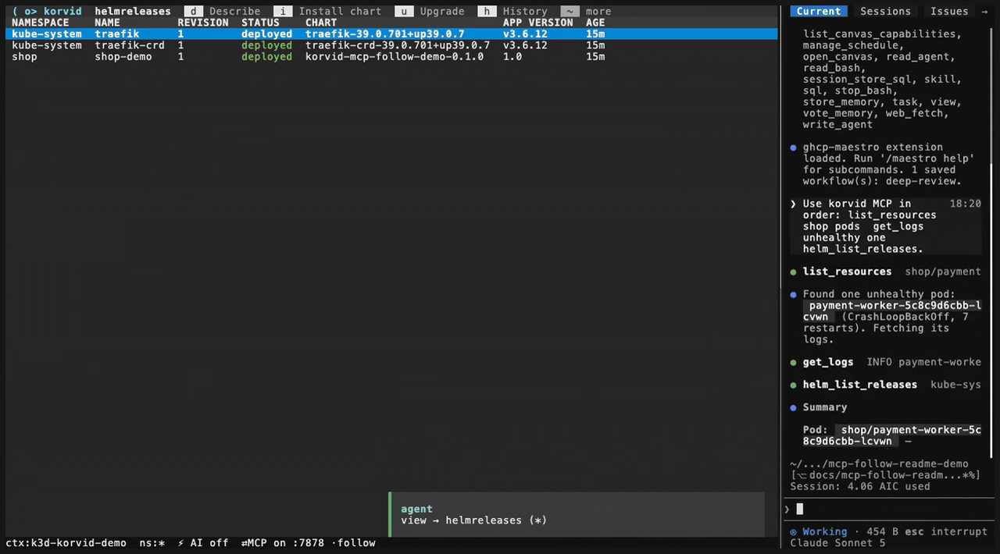
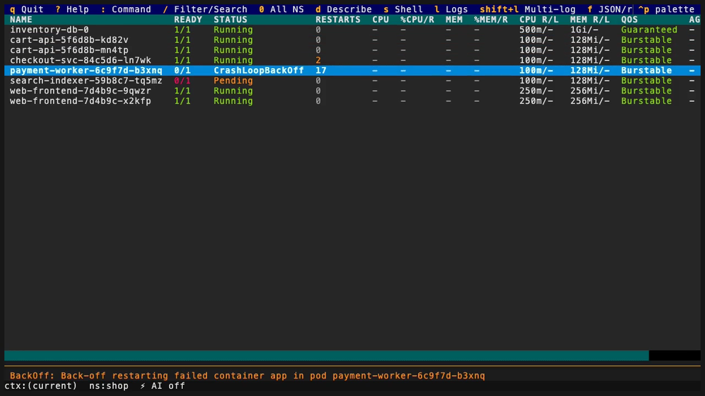
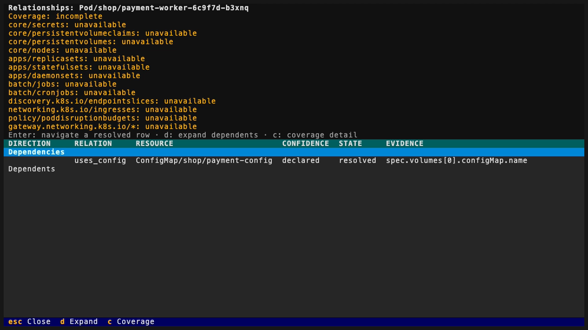
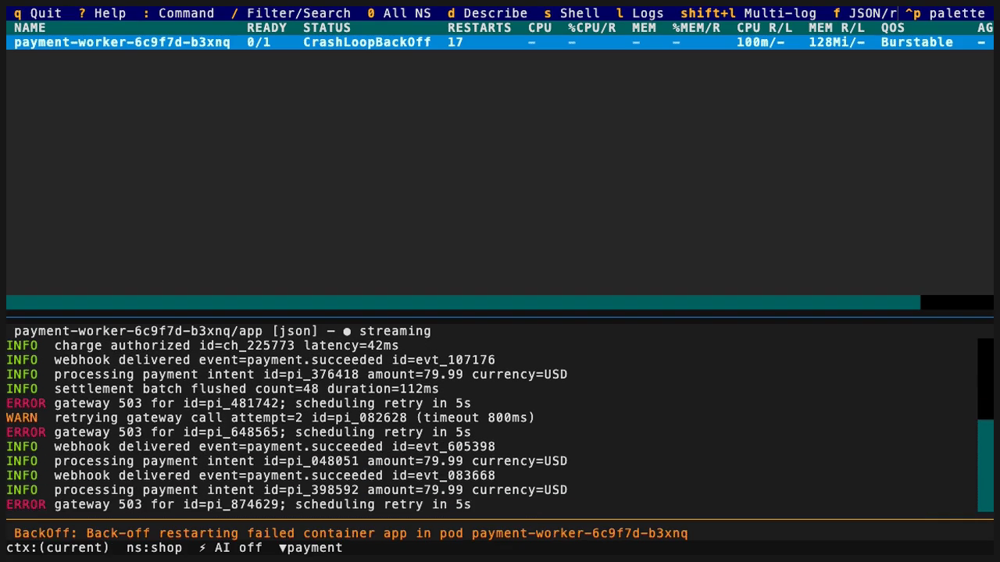
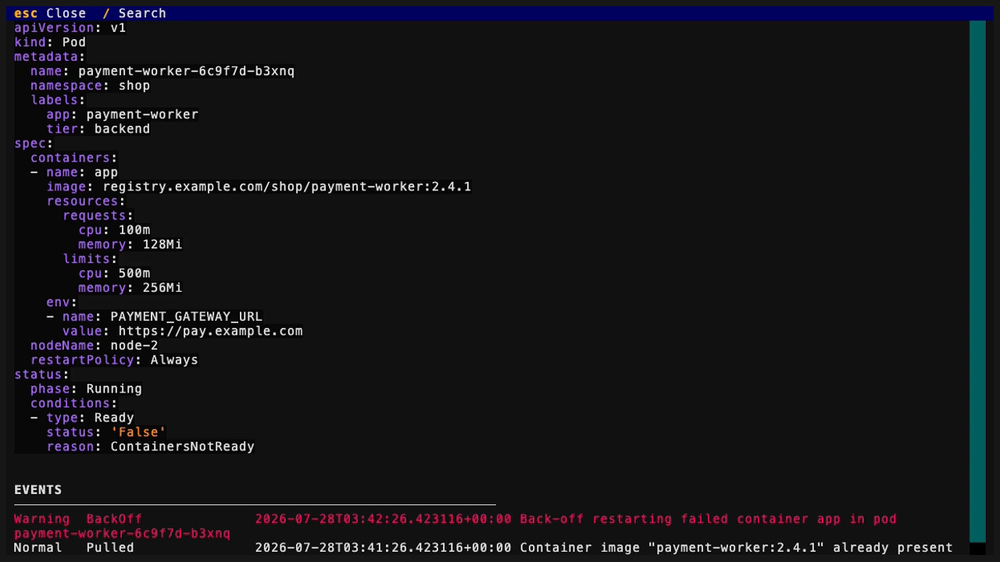

<section class="hero">
  

    
AI-NATIVE KUBERNETES TUI

    <h1>See the cluster. Drive the response.</h1>
  

  <figure class="hero-demo">
    

      
<strong>ctx:(current) · ns:shop</strong>

      <video src="assets/demo.mp4" poster="assets/scenes/cockpit-poster.png" controls muted loop playsinline preload="metadata" aria-label="korvid browsing, filtering, describing, and following logs for a failing workload">Your browser does not support the korvid demo video.</video>
    

    <figcaption><strong>Real korvid, synthetic cluster.</strong> The cockpit needs only your kubeconfig; AI is optional.</figcaption>
  </figure>
  

    
Operate from the keyboard, delegate bounded investigation to an agent, or connect an external assistant over MCP. Every write still stops for you.

    

      <a class="md-button md-button--primary" href="getting-started/">Start flying</a>
      <a class="md-button" href="https://github.com/hellices/korvid">View on GitHub</a>
    

    
$<code>uv tool install 'korvid[all]==0.3.0'</code>

  

</section>

<section class="scene-switcher" data-scene-switcher aria-labelledby="scene-switcher-title">
  

    
ONE OPERATIONAL EXPERIENCE

    <h2 id="scene-switcher-title">One incident. Three ways to drive it.</h2>
    
Find the failing workload, inspect its evidence, and land on the useful screen—directly, through the embedded agent, or from an external MCP client.

  

  

    <button id="scene-tab-direct" type="button" role="tab" aria-selected="true" aria-controls="scene-direct">You drive</button>
    <button id="scene-tab-agent" type="button" role="tab" aria-selected="false" aria-controls="scene-agent" tabindex="-1">Agent delegates</button>
    <button id="scene-tab-mcp" type="button" role="tab" aria-selected="false" aria-controls="scene-mcp" tabindex="-1">MCP connects</button>
  

  

    <article id="scene-direct" class="scene-panel" role="tabpanel" aria-labelledby="scene-tab-direct" tabindex="0">
      <video src="assets/demo.mp4" poster="assets/scenes/cockpit-poster.png" controls muted loop playsinline preload="none" aria-label="An operator filters to a failing pod, describes it, and opens its logs in korvid">Your browser does not support this direct-operation demo.</video>
      
<strong>Input</strong> Keyboard intent

      
<strong>Evidence</strong> Watch-backed table + fresh describe and log reads

      
<strong>Result</strong> The real korvid view

      
You stay on the live cockpit and choose every next step.

      <a href="tui/">Explore the TUI</a>
    </article>
    <article id="scene-agent" class="scene-panel" role="tabpanel" aria-labelledby="scene-tab-agent" tabindex="0">
      <video src="assets/scenes/agent-demo.mp4" data-poster="assets/scenes/agent-poster.png" controls muted loop playsinline preload="none" aria-label="A deterministic scripted AgentPanel walkthrough: a prompt typed into korvid's real agent input, then scripted tool events and a scripted answer whose E1 marker the panel flags as an unsupported citation">Your browser does not support this scripted AgentPanel walkthrough.</video>
      <noscript></noscript>
      
<strong>Input</strong> Prompt typed and submitted in the real AgentPanel input

      
<strong>Evidence</strong> Scripted tool events and an E1 marker the panel flags as unsupported, not bounded reads

      
<strong>Result</strong> Real AgentPanel rendering of the scripted answer

      
This capture does not execute korvid's provider or tool pipeline; nothing is read, so the panel flags the scripted E1 marker as an unsupported citation. The agent guide documents what a real turn does.

      <a href="agent/">Explore the embedded agent</a>
    </article>
    <article id="scene-mcp" class="scene-panel" role="tabpanel" aria-labelledby="scene-tab-mcp" tabindex="0">
      <video src="assets/scenes/mcp-follow-demo.mp4" class="mcp-media" data-poster="assets/scenes/mcp-poster.png" controls muted loop playsinline preload="none" aria-label="An external MCP client reads the cluster while korvid follow mode mirrors its navigation">Your browser does not support this MCP follow demo.</video>
      <noscript></noscript>
      
<strong>Input</strong> External assistant

      
<strong>Evidence</strong> Tool-specific bounded fresh reads

      
<strong>Result</strong> MCP response + optional follow

      
MCP exposes bounded tools; write proposals are off by default.

      <a href="mcp/">Explore MCP</a>
    </article>
  

</section>

<section class="contract-map" aria-labelledby="contract-title">
  

    
ONE PRODUCT CONTRACT

    <h2 id="contract-title">Different reads. Shared context and safety.</h2>
    
Korvid keeps each surface honest about where its evidence came from while preserving the same operational frame.

  

  

    <article>Human operator<strong>Watch-backed table + fresh describe and log reads</strong></article>
    <article>Model / provider<strong>Bounded fresh reads</strong></article>
    <article>Editor / external assistant<strong>Bounded fresh reads over MCP</strong></article>
  

  

    <strong>Active cluster context</strong>
    <strong>Navigation semantics</strong>
    <strong>Approval gate</strong>
    <strong>Fail-closed audit</strong>
  

  
The watch-backed table, korvid's own describe and log reads, and each tool's fresh reads are taken at different moments, so snapshots can differ without splitting the product contract.

  <a href="overview/">Inspect the complete architecture</a>
</section>

<section class="write-path" aria-labelledby="write-path-title">
  

    
SHARP TOOLS. HUMAN HANDS.

    <h2 id="write-path-title">Every mutation stops at the same gate.</h2>
  

  

    Direct action
    Agent proposal
    Opt-in MCP proposal
  

  <ol class="write-path__stages">
    <li data-stage="observe">01<strong>Observe</strong><small>Gather bounded evidence</small></li>
    <li data-stage="propose">02<strong>Propose</strong><small>Render the intended change</small></li>
    <li data-stage="confirm">03<strong>Confirm</strong><small>Fresh human keystroke</small></li>
    <li data-stage="audit">04<strong>Audit</strong><small>Append must succeed</small></li>
    <li data-stage="execute">05<strong>Execute</strong><small>Validate and mutate</small></li>
  </ol>
  
<strong>Audit write failed</strong>→ action blocked. The audit path is fail-closed.

  
Embedded provider payloads are masked; MCP result disclosure is tool-specific. <a href="threat-model/">Inspect both boundaries.</a>

</section>

<section class="evidence-mosaic" aria-labelledby="evidence-title">
  

    
PRODUCT EVIDENCE

    <h2 id="evidence-title">Built for the incident, not the screenshot.</h2>
    
Each surface below is a real korvid view captured against synthetic or disposable local cluster data.

  

  

    <article class="evidence-card evidence-card--wide">
      <figure><figcaption>Resource cockpit</figcaption></figure>
      
Browse and filter live resources, keeping status, scope, and restart signals in one keyboard path.

      <a href="tui/">Browse the cockpit</a>
    </article>
    <article class="evidence-card">
      <figure><figcaption>Relationship graph</figcaption></figure>
      
Follow metadata-only dependencies without exposing Secret values.

      <a href="resource-relationships/">Follow relationships</a>
    </article>
    <article class="evidence-card">
      <figure><figcaption>Pod log stream</figcaption></figure>
      
Follow, filter, and reconnect a selected pod's logs beside the table you started from.

      <a href="tui/#log-viewer">Read the log workflow</a>
    </article>
    <article class="evidence-card">
      <figure><figcaption>Operational evidence</figcaption></figure>
      
Put manifests, warning events, and failure context beside the selected resource.

      <a href="tui/#ops-hints">Inspect diagnosis surfaces</a>
    </article>
    <article class="evidence-card">
      <figure><figcaption>Agent panel walkthrough</figcaption></figure>
      
A scripted capture: the panel renders a prompt, a tool event, and an answer whose E1 marker it flags as unsupported — no live tool execution, no validated evidence.

      <a href="agent/">Use the embedded agent</a>
    </article>
    <article class="evidence-card evidence-card--wide">
      <figure><figcaption>MCP follow</figcaption></figure>
      
Let an external assistant read bounded tools while korvid can mirror where it went.

      <a href="mcp/#follow-mode">Connect over MCP</a>
    </article>
  

</section>

<nav class="flight-paths" aria-labelledby="flight-paths-title">
  

    
CHOOSE A FLIGHT PATH

    <h2 id="flight-paths-title">Go from proof to practice.</h2>
  

  

    <a href="getting-started/"><strong>Operate a cluster</strong>Install and take the five-minute route.</a>
    <a href="agent/"><strong>Add the embedded agent</strong>Choose a provider and inspect its boundary.</a>
    <a href="mcp/"><strong>Connect an MCP client</strong>Expose bounded reads and optional proposals.</a>
    <a href="performance/"><strong>Evaluate production use</strong>Check scale, air-gap, and threat assumptions.</a>
  

</nav>
