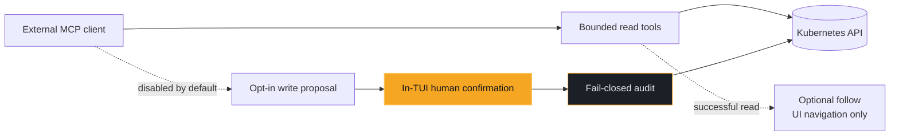

# MCP server

Requires the `[mcp]` extra (see the README's
[installation section](https://github.com/hellices/korvid/blob/main/README.md#installation)).
Start with `korvid --mcp` (or set `mcp: {enabled: true}` in
`~/.config/korvid/config.yaml`) to expose the read and UI-drive tools to
external agents — VS Code Copilot Chat, Claude Code, Cursor, Zed — over a
[Streamable HTTP MCP](https://modelcontextprotocol.io) server bound to
`127.0.0.1:7878` (`mcp: {port: N}` to change).  External hosts can list
resources, fetch manifests, logs, events, and helm release status, and
drive the TUI you are
looking at (navigate, filter, open logs/describe).  Write tools are **not**
exposed: cluster mutations stay behind the in-TUI confirmation dialog.
An opt-in *proposal* flow lets external agents queue writes for your review
(see [External write proposals](#external-write-proposals)) — even then, a
proposal never executes without a fresh keystroke in the TUI.

**MCP tool calls never go through korvid's embedded-provider boundary.**
No korvid-managed model call is involved, so `OutboundPolicy` — the
snapshot, the request caps, the text credential-pattern masking — does not
run on this surface at all. What a result carries therefore depends on its
format:

- **Structured manifests** (`get_resource`) are recursively redacted where
  they are produced, by the same `korvid.core.redaction` primitive the
  embedded agent's boundary uses: `Secret` `data`/`stringData`, the
  `kubectl.kubernetes.io/last-applied-configuration` annotation,
  credential-named keys, and credential-named env values are masked at any
  nesting depth before the document is bounded and returned. An MCP client
  sees the same redacted manifest the model would.
- **Compound diagnoses** (`diagnose_workload`) are credential-pattern
  masked where they are shaped — every section, not only the expanded pod
  blocks: the workload's own conditions and Warning events, the
  owned-ReplicaSet lines and the child-LIST error are masked before the
  line clamp and the section budget shorten them, and each pod block
  before it is compacted to fit. Order matters in both places: a clamp
  keeps a line's head and the compaction cuts at a byte offset, so
  redacting afterwards would let an assignment split across a cut escape
  both halves; redacting first means the value is gone before there is
  anything to split. An MCP client sees the same masked report the model
  would.
- **Service endpoint diagnosis** (`diagnose_service`) is deterministic
  structured YAML: one Service GET and one EndpointSlice LIST, projected
  into versioned findings with explicit evidence gaps. EndpointSlice RBAC
  denials are surfaced as `gaps[].source == "endpointslices"` rather than
  as an error, so the model can reason about incomplete evidence. The result
  is bounded to the shared 8,000-character cap and is always parseable YAML.
  Replacement detection considers only core-v1 Service owner references;
  custom-controller owners do not invalidate manually managed slices.
- **PVC binding diagnosis** (`diagnose_pvc`) is deterministic structured
  YAML. For `Bound`/`Lost` claims only one GET is made. For unresolved
  claims Warning events are fetched; StorageClasses are listed only when
  no decisive failure event, pre-bound volume (`spec.volumeName` set), or
  explicit-empty/static-binding evidence already determines the result.
  RBAC denials on either secondary read become `gaps[]` entries so the
  model can reason about incomplete evidence; transport and decoding
  failures remain tool errors. Follow opens the `persistentvolumeclaims`
  describe screen.
- **Logs, events, lists, single-pod diagnoses, and helm status** get only
  their own tool-specific shaping (scoping, formatting, size caps). They
  are **not** credential-pattern masked: a token printed into a pod's log
  reaches the client verbatim.

The external MCP client (and whatever model or data policy it applies to
what it receives) owns its own AI data boundary; korvid's guarantee at this
surface is limited to the producer-side redaction above, what tools are
exposed (read-only plus opt-in write proposals), and that writes still
require your keystroke — not what the connected client does with the data
those tools return.



The external client owns its model/data boundary. Follow never changes the
tool result, and a proposal never becomes a mutation until the TUI receives a
fresh user keystroke and the audit append succeeds.

The live endpoint is also published to
`$XDG_STATE_HOME/korvid/mcp-endpoint.json` (defaulting to
`~/.local/state/korvid/mcp-endpoint.json` when `XDG_STATE_HOME` is unset)
while korvid runs.  The file is a registry keyed by process id, so multiple
korvid instances can be discovered side by side:

```json
{"servers": {"12345": {"url": "http://127.0.0.1:7878/mcp", "port": 7878, "pid": 12345}}}
```

## Host configuration

**VS Code** (`.vscode/mcp.json`):

```json
{"servers": {"korvid": {"type": "http", "url": "http://127.0.0.1:7878/mcp"}}}
```

**Claude Code:**

```sh
claude mcp add --transport http korvid http://127.0.0.1:7878/mcp
```

**Cursor** (`.cursor/mcp.json`):

```json
{"mcpServers": {"korvid": {"type": "http", "url": "http://127.0.0.1:7878/mcp"}}}
```

**Zed** (`settings.json`):

```json
{"context_servers": {"korvid": {"url": "http://127.0.0.1:7878/mcp"}}}
```

## Follow mode

External hosts overwhelmingly call the *read* tools (those return the data
they need), which by themselves move nothing on screen. **Follow mode**
mirrors those reads in the TUI so you can watch the assistant work:

| External read | Mirrored as |
|---|---|
| `list_resources` | navigate to that view/scope |
| `get_resource`, `get_events` | describe pane on that object |
| `get_logs` | log pane on that pod/container |
| `diagnose_pod` | describe pane on the pod |
| `diagnose_service` | Service describe pane |
| `list_operators` | navigate to subscriptions |
| `helm_list_releases` | navigate to the helm release browser |

Off by default — screen hijacking mid-task is worse than invisibility.
Enable at startup with `mcp: {follow: true}` in the config, or live with
`:mcp follow on|off` (bare `:mcp follow` toggles; bare `:mcp` reports both
server and follow state). While active, the status bar's MCP label shows
`·follow`.

Mirroring is fire-and-forget: the MCP response never waits on (or fails
with) the UI action, a failed read is never mirrored, and a mirror never
opens a screen over an approval dialog — approvals are confirmed only by
your keystrokes. With follow **off**, each external read still surfaces as
a transient toast (`client-name: get_logs api-1 (ns prod)`), so nothing
reads your cluster invisibly.

## External write proposals

Off by default.  With

```yaml
mcp:
  enabled: true
  write_proposals: true
```

the MCP surface adds three tools — `propose_write`, `get_write_proposal`,
`cancel_write_proposal` — that let an external agent *propose* a cluster
write (delete, scale, rollout restart, in-place pod resize).  A proposal
never mutates anything by itself:

- `propose_write` runs the same validation as the built-in agent write path
  (kind resolution, read-only mode, RBAC pre-check, target-UID capture,
  server-side dry-run preview) and then queues an **immutable** proposal.
  The caller gets the proposal id back immediately and polls
  `get_write_proposal` for the terminal outcome — no MCP request is held
  open while you decide.
- The TUI shows a persistent `⚑` indicator in the status bar naming the
  caller and target.  Nothing auto-opens and focus is never stolen.
- `:proposals` reviews pending proposals one at a time in the same
  confirmation dialog as every other write — including the typed-name gate
  for cluster-scoped deletes and the typed-context gate in protected
  contexts.  Only your keystroke can approve; MCP tools cannot focus, type,
  or confirm.
- Before executing, korvid rechecks the kube context epoch, RBAC, and the
  captured target UID (a same-named replacement fails the proposal instead
  of being mutated), then writes through the same fail-closed
  audit-before-mutation path with `source=external_mcp`, the proposal id,
  and the caller metadata in the audit record.
- Deny, dismiss (leave pending), TTL expiry (10 minutes), and caller cancel
  are distinct outcomes.  Pending proposals are invalidated by a context
  switch, an MCP server restart, and TUI shutdown.

Local callers are untrusted: read access alone does not grant proposal
access.  Each server run generates a high-entropy capability token,
published only in the owner-readable (`0600`) endpoint registry file and
removed on shutdown; callers must echo it as the `capability` argument on
every proposal tool call.  MCP `clientInfo` is displayed as caller-supplied
metadata, never treated as authenticated identity.  Every caller of one
server run shares a single session identity (the transport is stateless
and the token file is the shared credential), so the pending caps and the
cancel check operate per server run; terminal outcomes stay pollable for
a bounded retention window and argument/preview sizes are bounded.
