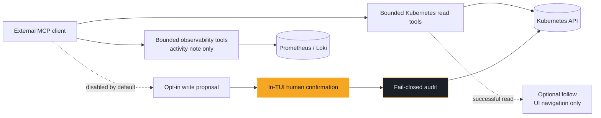

# MCP server

Requires the `[mcp]` extra (see the README's
[installation section](https://github.com/hellices/korvid/blob/main/README.md#installation)).
Start the TUI with `korvid --mcp` (or set `mcp: {enabled: true}` in
`~/.config/korvid/config.yaml`), then configure your external MCP host to run
**`korvid mcp stdio`**. The adapter connects to the already-running TUI's
authenticated loopback endpoint; it does not start another TUI, Kubernetes
client, embedded agent, or provider. The internal
[Streamable HTTP MCP](https://modelcontextprotocol.io) endpoint binds to
`127.0.0.1:7878` (`mcp: {port: N}` to change).

Read and UI-drive tools are exposed; write tools are **not**:
cluster mutations stay behind the in-TUI confirmation dialog. An
opt-in *proposal* flow lets external agents queue writes for your review
(see [Propose a write](#propose-a-write)) — even then, a proposal never
executes without a fresh user keystroke in the TUI.

## Evidence crosses a tool boundary

**MCP tool calls never go through korvid's embedded-provider boundary.** No
korvid-managed model call is involved, so `OutboundPolicy` — the sanitized
payload, the request caps, the text credential-pattern masking the embedded
[agent](agent.md#inspecting-what-the-agent-sends) applies — does not run on this
surface at all. Disclosure is **tool-specific**, and what an MCP client
receives is **not necessarily the same snapshot** a Direct keybinding or the
embedded Agent would show for the same object:

- **Structured manifests** (`get_resource`) are recursively redacted where
  they are produced, by the same `korvid.core.redaction` primitive the
  embedded agent's boundary uses: `Secret` data, the
  `kubectl.kubernetes.io/last-applied-configuration` annotation, and
  credential-named keys/values are masked **structurally** — by where they
  sit in the parsed document, not by how they look — before the document is
  bounded and returned. An MCP client sees the same redacted document the
  model would.
- **Compound workload diagnoses** (`diagnose_workload`) are a shaped text
  report rather than a parsed document, so the structural pass above never
  runs over them. What they do get is producer-side **credential-pattern
  text redaction**: korvid masks credential-shaped text in every shaped
  section of the report, and in each embedded pod diagnosis, *before* the
  report is compacted to its size cap — a cut taken first would split a
  credential across the boundary and leave the tail unclassifiable. Pattern
  matching is weaker than the structural guarantee above: a secret no
  pattern recognises is not masked here.
- **Service and PVC binding diagnoses** (`diagnose_service`, `diagnose_pvc`)
  are deterministic structured YAML: EndpointSlice or secondary-read RBAC
  denials become explicit `gaps[]` entries rather than an error, so the
  caller can reason about incomplete evidence instead of a hard failure.
- **Logs and events** get producer-side **credential-pattern text redaction**
  after their tool-specific shaping and before the result size cap. A
  credential printed into a pod log or event message is masked before it
  reaches the client.
- **Lists, single-pod diagnoses, and helm status** get only their own
  tool-specific shaping and size caps. They are **not** credential-pattern
  masked.

The external client (and whatever model or data policy it applies) owns its
own AI data boundary past this producer-side redaction; korvid's guarantee
stops at what is exposed, how each tool shapes it, and that writes still
require your keystroke — not what the connected client does with the data.
See [the threat model](threat-model.md) for the full boundary.



Follow never changes a tool result, and a proposal never becomes a mutation
until the TUI receives a fresh user keystroke and the audit append succeeds.
Prometheus and Loki queries never reach the Kubernetes API through this
surface — they route to their own backends and never touch `KUBE` above.

The live endpoint is also published to
`$XDG_STATE_HOME/korvid/mcp-endpoint.json` (defaulting to
`~/.local/state/korvid/mcp-endpoint.json` when `XDG_STATE_HOME` is unset)
while korvid runs. This private registry is keyed by process ID and contains
the internal credential. Do not copy it into MCP configuration, prompts,
logs, or issue reports. The stdio adapter reads it automatically.

## Connect a client

| Host | Configuration |
|---|---|
| VS Code | `.vscode/mcp.json`: `{"servers": {"korvid": {"type": "stdio", "command": "korvid", "args": ["mcp", "stdio"]}}}` |
| Claude Code | `claude mcp add --transport stdio korvid -- korvid mcp stdio` |
| Cursor | `.cursor/mcp.json`: `{"mcpServers": {"korvid": {"command": "korvid", "args": ["mcp", "stdio"]}}}` |
| Zed | `settings.json`: `{"context_servers": {"korvid": {"command": "korvid", "args": ["mcp", "stdio"]}}}` |

The host must find the installed `korvid` executable on its PATH; use an
absolute executable path if a graphical editor has a different PATH.
Run the host as the same user as the TUI, with the same `XDG_STATE_HOME`.

One live instance is selected automatically. With multiple instances, append
`"--instance", "12345"` to the arguments (or run
`korvid mcp stdio --instance 12345`). Each TUI needs its own configured
`mcp.port` (for example, 7878 and 7879). No instance is selected
arbitrarily, and a missing selected PID never falls back to another instance.

Start the TUI and enable MCP before connecting. Missing, stale, invalid, or
unsafe registry data produces an actionable error on stderr, never protocol
noise on stdout. Restart the host's MCP connection after a TUI restart,
`:mcp off`/`:mcp on`, or a kube-context switch. Context switching deliberately
stops the old MCP run before changing clients and starts a fresh authenticated
run afterward: an existing stdio connection fails closed instead of silently
following it into another cluster. Reconnecting discovers the new endpoint
and credential. OAuth, remote access, and a
headless Kubernetes backend are not part of this local stdio flow.

## Local transport authentication

Each server run generates a high-entropy capability token. The stdio adapter
reads it from the private registry and sends it only in the internal HTTP
`Authorization: Bearer` header. All MCP reads, UI actions, and opt-in proposals
require authentication before request parsing or dispatch. Tool arguments
never carry credentials; the legacy `capability` argument is rejected.
Do not paste a token into client configuration or ask a model to retrieve it.

The registry is atomically created with POSIX owner-only mode `0600`;
macOS also sets an explicit non-inheriting ACL at creation.
On Windows it uses a protected DACL for the current user, SYSTEM, and
Administrators instead of relying on a mode argument. The adapter validates
file ownership and permissions, rejects symlinks, bounds registry reads,
accepts only the registered loopback URL, bypasses environment HTTP proxies,
and refuses redirects. Failed private publication prevents MCP startup.

This separates other unprivileged local accounts, not hostile processes
running as the same user or an administrator. They remain in the local trust
domain. Host/Origin checks remain in place; authentication does not replace
them or the TUI approval gate. See the [threat model](threat-model.md).

**Existing direct HTTP integrations:** unauthenticated requests now receive
401, including read/UI calls. Migrate host configurations to stdio above.
Deliberate low-level HTTP integrations must read the private registry and
authenticate in headers; no token-in-URL or token-in-tool fallback exists.
This is an internal local transport, not an OAuth-enabled remote service.

## Read once or follow activity

External hosts overwhelmingly call the *read* tools, which by themselves
move nothing on screen. **Follow mode** mirrors those reads in the TUI so you
can watch the assistant work — off by default, since screen hijacking
mid-task is worse than invisibility. Enable at startup with
`mcp: {follow: true}`, or live with `:mcp follow on|off` (bare `:mcp follow`
toggles; bare `:mcp` reports both server and follow state).

With follow on, a successful **Kubernetes** read navigates the TUI:
`list_resources` selects that view, `get_resource` / `get_events` open the
describe pane, `get_logs` opens the log pane, and the `diagnose_*` tools open
the relevant describe pane too. The mirror is fire-and-forget UI navigation,
not a resumable feed; if it cannot land, korvid falls back to an activity
note.

With follow off, Kubernetes reads surface only as activity notes. Prometheus
and Loki reads always use an activity note instead of navigating anywhere
because no korvid screen can display them.
An activity note does not make the read followable; it only makes the external
read visible.

Mirroring never waits on, or fails with, the MCP response; a failed read is
never mirrored, and a mirror never opens over an approval dialog — approvals
are confirmed only by your keystrokes. With follow **off**, each external
read still surfaces as a transient toast (`client-name: get_logs api-1 (ns
prod)`), so nothing reads your cluster invisibly.

The landing clip of this flow is recorded from this repository alone: a real
MCP SDK client making read-only requests over Streamable HTTP to a loopback
korvid serving a synthetic cluster, with follow mirroring each answer.

## Propose a write

Off by default. With

```yaml
mcp:
  enabled: true
  write_proposals: true
```

the MCP surface adds three **opt-in** tools — `propose_write`,
`get_write_proposal`, `cancel_write_proposal` — that let an external agent
*propose* a cluster write (delete, scale, rollout restart, in-place pod
resize). A proposal never mutates anything by itself:

- `propose_write` runs the same validation as the built-in agent write path
  (kind resolution, read-only mode, RBAC pre-check, target-UID capture,
  dry-run preview) and queues an **immutable** proposal; the caller polls
  `get_write_proposal` for the terminal outcome.
- The TUI shows a persistent `⚑` status-bar indicator naming the caller and
  target. Nothing auto-opens and focus is never stolen.
- `:proposals` reviews pending proposals one at a time in the same
  confirmation dialog as every other write — including the typed-name and
  typed-context gates. Only your keystroke — the same fresh user keystroke
  every write path requires — can approve; MCP tools cannot focus, type, or
  confirm.
- Before executing, korvid rechecks the kube context epoch, RBAC, and the
  captured target UID, then writes through the same fail-closed
  audit-before-mutation path with `source=external_mcp` and the caller
  metadata recorded.
- Deny, dismiss, TTL expiry (10 minutes), and caller cancel are distinct
  outcomes. A context switch, an MCP server restart, or TUI shutdown
  invalidates pending proposals.

Local callers are untrusted: authentication alone does not enable write
proposals. The TUI must opt in with `write_proposals: true`; read-only mode
and all approval, context, UID, and audit checks still apply. Proposals use
the same authenticated transport as reads, never a second credential in
tool arguments. MCP `clientInfo` is caller-supplied display metadata, never
treated as authenticated identity.

## Representative tools

Not a full schema inventory — a compact map of what each family does and how
it is disclosed:

| Family | Examples | Backend | Disclosure / follow |
|---|---|---|---|
| Recursively redacted manifests | `get_resource` | Kubernetes API | Producer-side recursive **document** redaction (`Secret` data, last-applied annotation, credential-named keys); may emit a follow activity note |
| Pattern-masked compound diagnoses | `diagnose_workload` | Kubernetes API | Producer-side **credential-pattern text** redaction of each shaped section, applied before compaction — not a recursive document pass; may emit a follow activity note |
| Pattern-masked log and event reads | `get_logs`, `get_events` | Kubernetes API | Producer-side **credential-pattern text** redaction after shaping and before the result cap; may emit a follow activity note |
| Shaped Kubernetes reads | `list_resources`, `diagnose_pod`/`_service`/`_pvc`, `helm_list_releases` | Kubernetes API | Tool-specific shaping and size caps only — **not** credential-pattern masked; may emit a follow activity note |
| Observability reads | Prometheus / Loki query tools | Prometheus / Loki | Activity note only — never followable navigation |
| Write proposals (opt-in) | `propose_write`, `get_write_proposal`, `cancel_write_proposal` | Kubernetes API, gated | Inert until a fresh user keystroke in the TUI |
