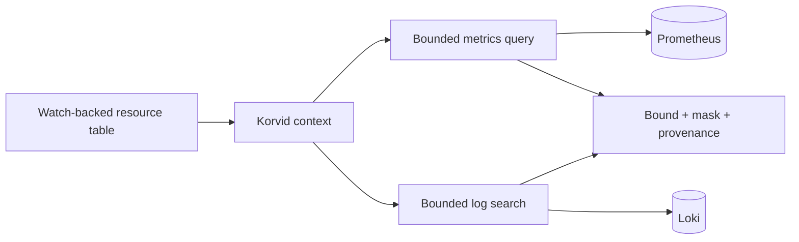

# Observability connectors

korvid can ask a Prometheus and a Loki backend a **fixed set of
resource-scoped questions** about the workload you are looking at. It does
not become an observability client: there is no free-form query surface,
every call is bounded before it leaves the process, and both backends are
read-only. Kubernetes state alone does not explain every incident — error
rate and latency move before a pod fails, saturation lives at service level
rather than in one pod, and centralized logs outlive the pod that wrote
them — which is why these two connectors exist as opt-in add-ons rather than
core panels. Configure neither and nothing changes: the two tools are not
offered to the agent or to MCP hosts at all.

## Install

Install the complete application variant in its own tool environment:

```bash
uv tool install 'korvid[agent,observability]==0.3.0'  # embedded agent tools
uv tool install 'korvid[mcp,observability]==0.3.0'    # external MCP tools
```

`pipx install` accepts the same requirement strings. Observability is a tool
add-on for the agent or MCP surface, not a standalone base-TUI panel; the
connector boundary itself is stdlib, and the extra provides the `httpx`
client a plain MCP install otherwise lacks.

## Configure

```yaml
observability:
  prometheus:
    url: https://prometheus.internal/prometheus
    token_env: PROM_TOKEN          # or: token_file: /var/run/secrets/prom
    timeout_seconds: 10
    default_window_minutes: 60
    max_window_minutes: 360
    max_series: 50
    max_response_bytes: 1048576
    max_concurrency: 2             # in-flight requests to this backend

  loki:
    url: https://loki.internal
    token_file: /var/run/secrets/loki
    tenant: team-a                 # X-Scope-OrgID, for multi-tenant Loki
    max_lines: 200
    label_mappings:                # how your log shipper labels things
      namespace: namespace
      pod: pod
      workload: app
    mask_labels:                   # values always masked in results
      - tenant
      - customer
```

The two backends are independent — configure either, both, or neither.
Every key is optional except `url`. A backend is **disabled with a startup
warning**, never half-configured, when its endpoint is missing, malformed,
or not `http(s)://`; when the `url` carries a username or password (an
inline credential wearing a URL's clothes — use `token_env`/`token_file`
instead); when a `label_mappings` name is not a valid label identifier; or
when two scope fields map to the same backend label (a lost matcher, not a
preference).

## Independent reads, not the watch snapshot



The resource table is watch-backed: every row is a live snapshot the cluster
API keeps current. A metrics or logs call is a separate, **independent
read** against its own backend at the moment it runs — not a replay of that
watch snapshot, and not itself watched or cached. In the TUI, a call this
triggers appears as an activity note rather than a screen navigation: there
is no Prometheus view to mirror a query to, and no resource screen owns the
result. Every answer carries its own provenance (endpoint, window, query)
independent of whatever the resource table shows at that instant.

Provenance is what the two consumers share; a citation is not. The embedded
agent records the answer into its evidence ledger and can cite it `[E1]` like
any cluster read, but an **MCP host receives the same bounded, masked text
directly** — korvid keeps no ledger for it and mints no citation, so the
provenance carried inside the answer is all the host has to attribute it by.

## Query examples

`query_metrics` reads one signal for a workload or pod, aggregated over a
window — for example `signal: cpu` against `workload: payment-worker`
resolves to a rate over `container_cpu_usage_seconds_total`, matching pods by
**name prefix** (the only relationship visible in cAdvisor labels without a
second lookup). A cluster whose metrics are named differently gets an empty
result, not a wrong one — `no series matched`, not a guess.

`search_logs` searches centralized logs for a workload or pod over a
window — for example `contains: "connection refused"` against
`pod: payment-worker-6c9f7d` becomes a **plain substring** line filter, never
a regular expression or LogQL, so it can narrow a result but never widen the
label scope beyond what `label_mappings` resolved.

## Bounds and masking

| limit | default | behaviour at the limit |
|---|---|---|
| time window | 60 min (max 360) | **refused**, not shortened |
| result series / log lines | 50 / 200 | truncated, and the result says so |
| response bytes | 1 MiB | request aborted |
| concurrent requests (`max_concurrency`) | 2 per backend | excess calls queue on a semaphore; the wait is inside the request timeout |
| request timeout | 10 s | reported as a timeout, budgets the whole call |

An over-long window is refused rather than clamped, because silently
shrinking it would answer a different question from the one that was asked.
Truncation is never silent: every result carries `truncated: yes|no`, the
window it covers, the endpoint that answered, and the query that ran, so it
participates in the agent's evidence citations like any cluster read.

Concurrency is a bound like the others, not a tuning hint: each backend
admits `max_concurrency` requests at a time — **2** by default — and queues
the rest on a semaphore, so a burst of tool calls cannot open an unbounded
number of connections to your Prometheus. That wait happens *inside* the
request timeout rather than before it: a call that spends nine seconds queued
and two in flight is reported as a timeout, because the 10 s budget covers
the whole call, not just the socket.

Results are masked before they leave korvid, in two passes — a host
receives them directly, so masking cannot depend on a downstream provider.
**Credential-shaped text** (an API key a workload logged, a bearer token
echoed by a backend error) is scrubbed from every result and every error the
call can raise. **`mask_labels`** covers what shape alone cannot recognise —
a tenant id, a customer name — replacing those label values, case-insensitive,
everywhere they would otherwise appear, including in the echoed query and
provenance, not only in response labels.

## Credentials and TLS

A token is **named** in config, never stored there — exactly one of
`token_env` (an environment variable name) or `token_file` (a path to a
regular file; a FIFO or device is refused since opening one can block
forever). Setting both, or an inline `token:`/`password:`/`api_key:`,
disables the backend when the configuration is loaded rather than guessing.
The token is read at call time and its header safety is validated then —
any control character or non-ASCII byte refuses *that call* with a `config`
error instead of sending an invalid header value. The already-constructed
backend stays configured, so correcting or rotating the value restores
subsequent calls without restarting korvid. A valid token is used in one
`Authorization` header, and dropped — never in a tool result, error, audit
record, or log line. If a `url` carries userinfo, only the host is ever
reported.

TLS verification cannot be disabled — there is no `insecure` option, and a
config that sets one disables the backend with a warning instead. A
plaintext `http://` endpoint is accepted, but configuring a credential for
one warns, since the token would then cross the network in the clear.
Corporate CAs use the same `network.ca_bundle` setting the agent providers
use (see [air-gapped operation](airgap.md)); the connectors get their HTTP
client from the same composition-root trust builder as the rest of korvid.

## Errors

| kind | meaning |
|---|---|
| `config` | the URL, credential source, or signal name is wrong |
| `auth` / `permission` | the backend rejected (401) or denied (403) the credential |
| `network` / `timeout` | the endpoint is unreachable, or did not answer in time |
| `limit` | the request or the answer exceeded a configured bound |
| `backend` | the backend refused or malformed the query |

The kind travels with the message: `ERROR: [permission] loki.internal
refused the query …`.

## What this is not

korvid does not host Prometheus, Loki, or an OpenTelemetry collector, does
not write alerts, dashboards, or recording rules, and does not accept
free-form queries. Tracing and cloud-provider connectors are not part of
this surface.
