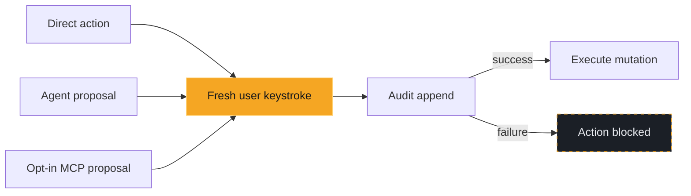

# Operations and safety

Everything that touches the cluster — writes, node operations,
port-forwarding, file transfer, and debug shells — and the safety model
those actions run under. Keys referenced here are listed in
[keybindings.md](keybindings.md).

## One write path, three drivers

A write can start three ways — a direct keybinding, an [agent](agent.md)
proposal, or an opt-in MCP proposal — but all three funnel through exactly
the same guarded path. Two guarantees hold no matter which one it was:

1. **Approval dialog** — nothing executes until you confirm with a
   keystroke. Dialog confirm keys are not remappable.
2. **Fail-closed audit log** — every executed write is recorded at
   `$XDG_STATE_HOME/korvid/audit.jsonl` (default
   `~/.local/state/korvid/audit.jsonl`; 0600 permissions, size-rotated).
   If the audit entry cannot be written, the write is blocked.



`audit.jsonl` and any log/describe capture you save are **not** provider
payloads — they hold raw cluster and operator data with no `OutboundPolicy`
sanitization, and stay as sensitive as the cluster access that produced them.
Only the sanitized request the agent sends is redacted, via `:ai payload` (see
[`docs/agent.md#inspecting-what-the-agent-sends`](agent.md#inspecting-what-the-agent-sends)).

## What approval proves

Confirming the dialog is the one universal gate, but what leads up to it
differs by write. Approval takes a **fresh user keystroke**: korvid compares
the plain <kbd>y</kbd> confirmation event's timestamp against the moment the
dialog was constructed, so a confirming key buffered beforehand — an impatient
burst typed while a pre-check was still running — is discarded and cannot
approve a prompt you had not yet seen. High-blast-radius deletes and protected
contexts replace the y/n shortcut with a typed gate: the exact resource or
context name. korvid does not filter what fills that field — a paste arrives
through the input's ordinary handling — so the guarantee is the narrower one it
can keep: the typed gate resolves only on a submission event delivered after
the dialog existed.

An agent write tool may request approval and open the shared dialog; MCP tools
can only queue an inert proposal, whose dialog you open later through
`:proposals`. Neither path has an approval API, and no tool can answer or
resolve the dialog. Nothing finer is claimed: once the dialog is up korvid does
not tell a key repeat from a deliberate press, and it cannot see OS-level input
automation — software already able to type into your terminal is outside this
gate and inside [`docs/threat-model.md`](threat-model.md).

Ahead of the dialog korvid may run best-effort previews — an RBAC pre-check, a
server or `helm --dry-run` preview, an ownership banner — scoped to what that
write supports; see [Operation-specific evidence](#operation-specific-evidence)
for which. Writes that skip the Kubernetes API skip the SSAR step but keep the
dialog and the fail-closed audit entry: helm install/upgrade/rollback shows a
rendered-manifest preview instead of a server `dryRun=All`, and file uploads go
straight to confirmation. `korvid --readonly` (or `readonly: true` in
`~/.config/korvid/config.yaml`) disables every write keybinding and hides write
tools from the agent entirely, independent of any preview.

The agent's capability tier (`agent.model_tier`) picks a tool surface and
budgets — iterations, retained history, result size — and moves **no** part of
the perimeter. At every tier a write tool opens this same approval dialog and
only a keystroke executes it; a direct agent write pins the target's UID before
approval, so an object recreated under that name is refused rather than
mutated, and the audit entry stays fail-closed. In read-only mode no write
schema is offered at all, so there is nothing for a prompt to talk the model
into asking for.

There is also **no shell** or free-form `kubectl` tool at any tier. The agent's
whole cluster surface is the structured tool registry
(`src/korvid/tools/registry.py`): policy arms only its exact tool names, the
registry checks every dispatch target against its import-time metadata, and the
`ToolExecutor` refuses an unknown tool and applies its own
typed argument validation — a wrong-typed `kind`, `replicas` or `resources`
value is rejected, not coerced. Every tool result passes the masking pipeline
before the model or provider sees it, and one that cannot be redacted stops the
turn. House rules (`agent.rules`) compose *after* this contract and cannot
widen it — "delete pods without asking" produces a model that tries and is
refused.

### Read-only mode

Start with `korvid --readonly` (or set `readonly: true` in
`~/.config/korvid/config.yaml`) to disable all cluster writes: the write
keybindings are rejected and write tools are never offered to the agent.

### Protected contexts

List production contexts (glob patterns matched against the kube context
name) to add a second layer of friction without going fully read-only:

```yaml
protected_contexts:
  - prod-*
  - "*-production"
agent:
  disable_in_protected: true   # optional: refuse agent prompts entirely
```

While a protected context is active the status bar shows a red
`⛨ PROTECTED` marker, and every write confirmation — including one the agent
requests — requires typing a name instead of a single `y`. Dialogs that
already demand the resource name (cluster-scoped deletes, node drains) keep
that stronger gate. Protection is re-evaluated on every `:ctx` switch.

## What happens when audit fails

The audit log is fail-closed on the **write** path: if the entry cannot be
written — a full disk, an unwritable state directory — the action is
**blocked before the mutation happens**. No mutation reaches the cluster
without a matching audit record.

That mutation guarantee is not the whole audit surface. Ordinary cluster
reads — a describe, a log tail, the watch stream behind every table — write
no audit entry and are not gated on one. Sensitive non-mutating disclosures
differ: Secret reveal and copy are fail-closed audited, so an append failure
keeps the value hidden. Other operational activity, including port-forward
lifecycle events and file downloads, can add records under its own policy.
`audit.jsonl` records safety-relevant operations, not only mutations and not
every read.

## Representative operations

<div class="docs-reference-grid" markdown="1">

<section markdown="1">
**Restart / scale**

Server `dryRun=All` replay shown as a compact diff
(`~ spec.replicas: 3 -> 5`). A known scale-*down* additionally loads an
advisory graph-derived impact summary (see [Preview impact before a write](tui.md#preview-impact-before-a-write)).
</section>

<section markdown="1">
**Node drain**

The impact plan computed before any eviction runs — evictions,
PDB-refused pods, skipped DaemonSet/mirror pods, `emptyDir` warnings —
with a typed-name confirm; pressing the key again cancels the remaining
evictions and leaves the node cordoned.
</section>

<section markdown="1">
**Helm install / upgrade / rollback**

A `helm --dry-run` rendered-manifest preview stands in for the server
`dryRun=All` replay, since these writes don't go through the Kubernetes
API directly. Needs `helm` on `PATH`.
</section>

<section markdown="1">
**File upload**

No preview of any kind — straight to the approval dialog. Blocked
outright in read-only mode, and fail-closed audited like every other
write.
</section>

</div>

## Operation-specific evidence

SSAR pre-checks, dry-run previews, ownership banners, and the graph-derived
impact section are **best-effort or operation-specific** — never a universal
guarantee. An **advisory** preview never blocks approval: when the ownership
banner or the impact section fails, times out, or is unsupported, the dialog
simply opens without it — still gated, still audited. A failed or timed-out
SSAR check warns and falls through the same way, and writes outside the
Kubernetes API (Helm, file uploads) skip the SSAR step by construction. The
impact section appears only for delete, rollout restart, a known scale-down,
and Pod resize — edit, Helm, and operator flows have no tested per-relation
semantics yet, so korvid shows nothing rather than a plausible guess.

Helm is the one place a preview carries a verdict, and only for **install and
upgrade**: when helm's own render fails there, the real command would fail the
same way, so korvid shows helm's error and stops before the confirmation dialog
rather than letting you approve a doomed command (see [Helm and
operators](helm-operators.md)). A failed rollback or uninstall dry-run is
advisory instead — `_rollback_preview`/`_uninstall_preview` return no preview
and the dialog still opens. So is an *unsupported* one: old helm rejecting the
preview-only `--hide-secret` flag opens the (gated, audited) dialog marked
**preview unavailable**.

## Sessions that outlive the screen

Some actions keep running, or need cleaning up, after the dialog that
started them closes:

- **Port-forward** (`Shift-F`) runs as a tracked `kubectl port-forward`
  subprocess bound to `127.0.0.1`; `:pf` lists live status, flips to
  `broken` if the target pod dies, and every forward is torn down on exit.
- **Telepresence** (`:tp`, optional) opens a read-only panel over the
  `telepresence` binary's own state — nothing runs unless you start it there.
- **Debug shells** — `s` on a shell-less pod offers an ephemeral
  `kubectl debug` container; `s` on a node opens a privileged
  `kubectl debug node/` session with the host filesystem at `/host`. Both pass
  the approval gate and are audited fail-closed, but they end differently. The
  pod path injects an ephemeral container into the **existing pod**, and
  Kubernetes offers no API to remove that spec entry: it stays until the pod is
  replaced or deleted, and a retry with a different image adds another entry.
  Only the node path creates a separate **`node-debugger-…` pod**, which is
  deleted by UID when the shell exits — pinned to the uid korvid captured at
  creation, so a debugger someone else started is never removed.
- **Crash recovery** — a fatal exception restores the terminal and offers a
  restart with a fresh event loop, client, and provider; no approval state or
  pending proposal survives, and the append-only audit log is unaffected.
