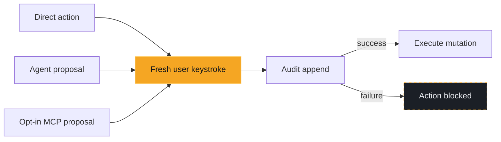

# Operations and safety

Everything that touches the cluster — writes, node operations,
port-forwarding, file transfer, and debug shells — and the safety model
those actions run under. Keys referenced here are listed in
[keybindings.md](keybindings.md).

## One write path, three drivers

A write can start three ways — a direct keybinding, an [agent](agent.md)
proposal, or an opt-in MCP proposal — but all three funnel through exactly
the same guarded path. Two guarantees hold no matter which one it was:

1. **Approval dialog** — nothing executes until you confirm with a
   keystroke. Dialog confirm keys are not remappable.
2. **Fail-closed audit log** — every executed write is recorded at
   `$XDG_STATE_HOME/korvid/audit.jsonl` (default
   `~/.local/state/korvid/audit.jsonl`; 0600 permissions, size-rotated).
   If the audit entry cannot be written, the write is blocked.



`audit.jsonl` and any log/describe capture you save are **not** provider
payloads — they are raw cluster and operator data with no `OutboundPolicy`
sanitization applied, and stay just as sensitive as the cluster access that
produced them. Only the sanitized request the agent actually sends is
redacted and inspectable via `:ai payload` (see
[`docs/agent.md#what-leaves-the-machine`](agent.md#what-leaves-the-machine)
and [`docs/threat-model.md`](threat-model.md)).

## What approval proves

- **SSAR pre-check** — a SelfSubjectAccessReview surfaces "missing RBAC
  permission" before the dialog opens instead of after a failed mutation.
  It is advisory: if the check itself fails or times out, korvid warns
  and proceeds to the (still gated, still audited) dialog rather than
  locking you out.
- **Server dry-run preview** — where the API supports it, the write is
  replayed with `dryRun=All` and the outcome shown in the dialog (see
  below). If the preview cannot be produced, the dialog opens without
  one and says so.
- **Ownership banner** — when the target is managed by a helm release,
  an OLM operator, or another controller's custom resource (detected
  from the object's own labels, annotations, and ownerReferences; pods
  are traced up their controller chain), the dialog shows a
  `⚠ managed by …` line naming the manager and the right lever — chart
  values for helm, the CR for an operator, whose reconcile loop would
  otherwise revert the change within seconds. It warns, never blocks:
  direct writes stay legitimate (emergencies, debugging), and a failed
  lookup simply means no banner.

Writes that do not go through the Kubernetes API skip the SSAR step but
still require the approval dialog and the fail-closed audit entry: helm
install/upgrade/rollback shows a `helm --dry-run` rendered-manifest
preview in its dialog instead of a server `dryRun=All`, and file uploads
into pods go straight to confirmation with no preview.

### What the agent changes about this model: nothing

The agent's capability tier (`agent.model_tier`) selects a tool surface and
budgets — how many iterations a turn gets, how much history is retained, how
big a tool result may be. It has **no** effect on the safety perimeter:

- every write tool the environment arms opens the same approval dialog at
  every tier, and only a user keystroke in that dialog executes it; korvid
  never confirms, replays, or speculatively executes a write on the model's
  behalf;
- a direct agent write establishes the target's UID before approval and passes
  it as an execution precondition, so an object recreated under the same name
  between lookup and approval is refused rather than mutated;
- the audit entry is still fail-closed — a write whose audit record cannot
  be written does not run;
- read-only mode and protected contexts are enforced in code, above the
  model: in read-only mode no write schema is offered at all, so there is
  nothing for a prompt to talk the model into asking for;
- there is no shell or free-form `kubectl` tool at any tier, so there is
  no command line to smuggle a flag into: the agent's whole cluster
  surface is the structured tool registry
  (`src/korvid/tools/registry.py`). The resolved policy arms only the
  registry's own exact tool names — never one it invents — and the
  registry validates every dispatch target against its import-time
  metadata (which class and method an effect may reach). The
  `ToolExecutor` rejects any name outside that registry as an unknown tool
  and performs its own explicit, typed argument validation before a write
  reaches the cluster — a wrong-typed `kind`, `name`, `namespace`,
  `replicas`, or `resources` value is refused, not coerced. The tool's
  declared JSON schema is model-facing wording sent to the provider, not
  the runtime check;
- every tool result — cluster read, screen action, or failure — passes
  the masking pipeline before it reaches the model or the provider, and
  a result that cannot be safely redacted stops the turn instead of
  being sent.

House rules (`agent.rules`) are local configuration, no more privileged
than `agent.provider`. They are composed after korvid's immutable safety
contract and cannot widen it: a rule saying "delete pods without asking"
produces a model that tries and is refused.

### Read-only mode

Start with `korvid --readonly` (or set `readonly: true` in
`~/.config/korvid/config.yaml`) to disable all cluster writes: the write
keybindings are rejected and write tools are never offered to the agent.

### Protected contexts

List production contexts (glob patterns matched against the kube context
name) to add a second layer of friction without going fully read-only:

```yaml
protected_contexts:
  - prod-*
  - "*-production"
agent:
  disable_in_protected: true   # optional: refuse agent prompts entirely
```

While a protected context is active the status bar shows a red
`⛨ PROTECTED` marker, and every write confirmation — including one
requested by the agent — requires typing a name instead of a single `y`.
Dialogs that already demand the resource name (cluster-scoped deletes,
node drains) keep that stronger gate. Protection is re-evaluated on every
`:ctx` switch, and `agent.disable_in_protected: true` rejects the agent
prompt outright.

## What happens when audit fails

The audit log is fail-closed on the **write** path: if the entry cannot be
written — a full disk, an unwritable state directory — the action is
**blocked before the mutation happens**. No mutation reaches the cluster
without a matching audit record.

That mutation guarantee is not the whole audit surface. Ordinary cluster
reads — a describe, a log tail, the watch stream behind every table — write
no audit entry and are not gated on one. Sensitive non-mutating disclosures
are different: Secret reveal and copy are fail-closed audited, so an append
failure keeps the value hidden. Other operational activity, including
port-forward lifecycle events and file downloads, can also add records under
its own policy. `audit.jsonl` records safety-relevant operations, not only
mutations and not every read.

## Representative operations

<div class="docs-reference-grid" markdown="1">

<section markdown="1">
**Restart / scale**

Server `dryRun=All` replay shown as a compact diff
(`~ spec.replicas: 3 -> 5`). A known scale-*down* additionally loads an
advisory graph-derived impact summary (see [Preview impact before a write](tui.md#preview-impact-before-a-write)).
</section>

<section markdown="1">
**Node drain**

The impact plan computed before any eviction runs — evictions,
PDB-refused pods, skipped DaemonSet/mirror pods, `emptyDir` warnings —
with a typed-name confirm; pressing the key again cancels the remaining
evictions and leaves the node cordoned.
</section>

<section markdown="1">
**Helm install / upgrade / rollback**

A `helm --dry-run` rendered-manifest preview stands in for the server
`dryRun=All` replay, since these writes don't go through the Kubernetes
API directly. Needs `helm` on `PATH`.
</section>

<section markdown="1">
**File upload**

No preview of any kind — straight to the approval dialog. Blocked
outright in read-only mode, and fail-closed audited like every other
write.
</section>

</div>

## Operation-specific evidence

SSAR pre-checks, dry-run previews, ownership banners, and the graph-derived
impact section are **best-effort or operation-specific** — never a
universal guarantee. A failed or timed-out SSAR check warns and falls
through to the (still gated, still audited) dialog rather than blocking
you. Writes outside the Kubernetes API (Helm, file uploads) skip the SSAR
step by construction. The impact section appears only for delete, rollout
restart, a known scale-down, and Pod resize — edit, Helm, and operator
flows have no tested per-relation semantics yet, so korvid shows nothing
rather than a plausible guess.

An **advisory** preview never blocks approval: when the SSAR check, the
ownership banner, or the impact section fails, times out, or is
unsupported, the dialog simply opens without it — still gated, still
audited. A failed Helm **rollback** or **uninstall** dry-run preview is
advisory too: `_rollback_preview`/`_uninstall_preview` catch the failure
and return no preview, so the dialog still opens without a preview —
still gated, still audited. The **Helm install/upgrade render is the
exception**, because its verdict is not advisory: when helm's own render
fails for an install or upgrade, the real command would fail the same
way, so korvid shows helm's error and stops before the confirmation
dialog rather than letting you approve a doomed command (see [Helm and
operators](helm-operators.md)). An *unsupported* preview is still not a
verdict — old helm rejecting the preview-only `--hide-secret` flag opens
the (gated, audited) dialog marked **preview unavailable**.

## Sessions that outlive the screen

Some actions keep running, or need cleaning up, after the dialog that
started them closes:

- **Port-forward** (`Shift-F`) runs as a tracked `kubectl port-forward`
  subprocess bound to `127.0.0.1`; `:pf` lists live status, flips to
  `broken` if the target pod dies, and every forward is torn down on
  exit.
- **Telepresence** (`:tp`, optional) opens a read-only panel over the
  `telepresence` binary's own state — no forward or intercept runs unless
  you start it there.
- **Debug shells** — `s` on a shell-less pod offers an ephemeral
  `kubectl debug` container; `s` on a node opens a privileged
  `kubectl debug node/` session with the host filesystem at `/host`.
  Both pass the approval gate explicitly and are audited fail-closed, but
  they end differently. The pod path injects an ephemeral container into
  the **existing pod**, and Kubernetes offers no API to remove that spec
  entry again: it stays on the pod until the pod itself is replaced or
  deleted (a retry with a different image adds another entry rather than
  replacing the first). Only the node path creates a **separate
  `node-debugger-…` pod**, and that pod is deleted by UID when the shell
  exits — pinned to the uid korvid captured at creation, so a debugger
  someone else started is never removed.
- **Crash recovery** — a fatal exception restores the terminal and offers
  a restart with a fresh event loop, client, and provider; no approval
  state or pending proposal survives a restart, and the append-only audit
  log is unaffected.
