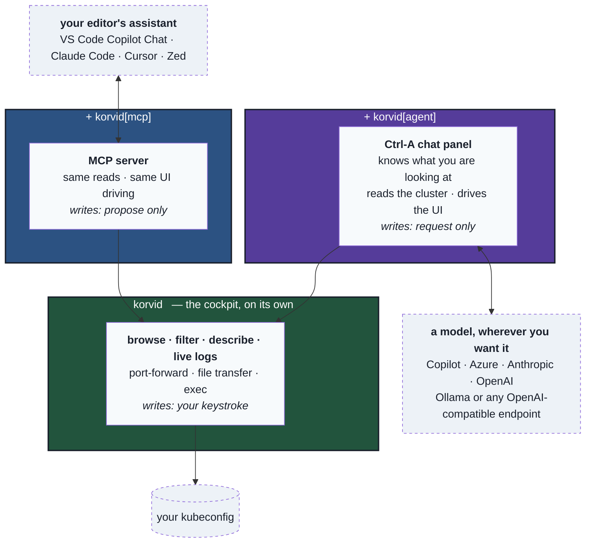
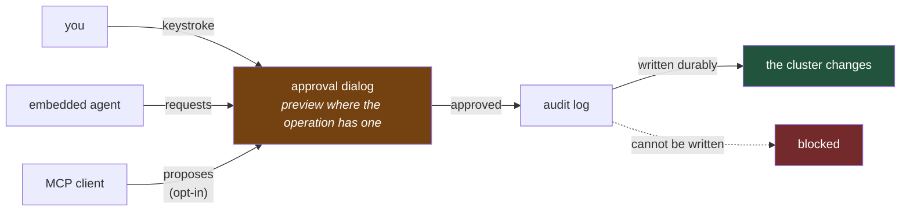

# What korvid is

> A tool-using bird for your cluster.

korvid is one program that grows with what you install. The base is a
keyboard-first Kubernetes cockpit that needs nothing but a kubeconfig. Add an
extra and it gains an embedded AI agent. Add another and it becomes a tool
*other* AI clients can drive.

Three shapes, one binary, one safety model.

---

## The shape



Each layer is optional and additive. The cockpit never depends on the agent;
the agent never depends on MCP. Install what you want:

```sh
uv tool install korvid                 # cockpit only
uv tool install 'korvid[agent]'        # + embedded AI agent
uv tool install 'korvid[mcp]'          # + MCP server for external agents
uv tool install 'korvid[all]'          # everything
```

(`pipx` works the same way. Pin a version for a reproducible install — see the
[README](../README.md) for the current one.)

A missing extra is not an error. korvid starts, and the feature it powers is
simply absent — unless you *asked* for it on the command line, in which case it
refuses to start and tells you what to install. Silently doing nothing when you
explicitly requested a feature is the one behaviour worth failing over.

---

## Layer 1 — the cockpit

**What it is:** a terminal UI for operating a cluster, built for people who
would rather not remember `kubectl` flag order.

Navigate any resource kind with `:`, filter with `/` (fuzzy, regex, or label
selectors), drill into relationships with `Enter` — pods to containers,
deployment to replicaset to pods, a Helm release or operator to the tree of
everything it installed. Split into two panes. Sort on live data. Pods show
live CPU/MEM against their enforced limits, and a troubled pod explains itself
before you open anything.

Beyond browsing: live log tailing, port-forwards that survive a pod restart and
tell you when they break, file transfer in and out of containers without the
`kubectl` binary, and `exec` into a shell.

**What it needs:** a kubeconfig. No AI, no network beyond your cluster, no
account anywhere.

---

## Layer 2 — an agent inside the cockpit

**What it is:** `Ctrl-A` opens a chat panel that already knows what you are
looking at — view, namespace, selection, filter. You do not describe your
screen to it.

It reads the cluster through read-only tools (manifests, logs, events, compound
diagnostics) and **drives the UI itself**. "Show me the crashing pod's logs"
does not print a suggestion; it navigates, filters, and opens the log pane.

Its answers cite the reads behind them, and selecting a citation opens the
actual view. korvid validates the citations that appear — an invented reference
is reported rather than quietly accepted — but it cannot make a model cite
everything it says, so an uncited sentence is exactly that: uncited. The point
is that the checkable parts *are* checkable. An answer you cannot check at all
is a guess with better grammar.

**What it needs:** a provider. GitHub Copilot, Azure OpenAI, Anthropic, OpenAI,
a local Ollama, or any OpenAI-compatible endpoint. A `small` profile targets
3B–14B models that run on your own hardware — for air-gapped clusters, or for
people who would rather their production incidents not leave the building.

---

## Layer 3 — korvid as a tool for other agents

**What it is:** the same read and UI-driving tools, exposed over MCP so an
external agent can use them. VS Code Copilot Chat, Claude Code, Cursor, Zed.

Your editor's assistant gains cluster sight: it can list, describe, read logs,
run diagnostics, and move korvid's UI so you watch what it looks at.

**What it cannot do:** change anything. Cluster writes are not on the MCP
surface at all — not gated there, *absent*.

If you opt in with `mcp.write_proposals: true` (off by default), a client gains
one further ability: leaving a write **proposal** for a human to review and
approve inside korvid. That is the whole automation story over MCP,
deliberately — and it stays off until you turn it on.

---

## The one rule all three share



**Nothing changes your cluster without a human keystroke, and nothing changes
it unlogged.**

Most dialogs show a preview of what will change — a server-side dry-run diff
for Kubernetes API writes, a rendered manifest for Helm. Some operations have
none to show (a file upload into a pod), and a preview that times out does not
hold the dialog hostage. The preview is a courtesy; the dialog and the audit
entry are the guarantee.

Not "the agent is instructed not to". Not "you can turn on confirmations". The
write path *goes through* the dialog — there is no second route, for you, for
the agent, or for an MCP client, and a write whose audit record cannot be
written does not happen at all.

Add `--readonly` to remove writes entirely, or mark production contexts as
protected: every confirmation then requires typing the **context** name instead
of a single `y` — and the operations that already demand the resource name
(cluster-scoped deletes, node drains) keep that stronger gate.

`Secret` values and the credential patterns korvid recognises are masked before
anything reaches the **embedded** agent's provider, and `:ai payload` shows you
what was sent — a boundary you cannot inspect is a promise, not a control. Two
honest limits: a secret that only your application knows is a secret, sitting in
a log line, may pass undetected; and an external MCP client applies its own data
policy, not korvid's. [`threat-model.md`](threat-model.md) is specific about
both.

---

## Why this shape

Three convictions, each visible in the structure above:

**An operator's tool should work without AI.** Layer 1 is complete on its own.
The agent is an addition to a working cockpit, not the reason it exists — so
your cluster tooling does not stop working when a provider is down, a token
expires, or a policy forbids sending cluster data anywhere.

**An AI that cannot act is a search engine; one that acts unsupervised is a
liability.** The middle ground is an agent that does everything *except* the
irreversible part, and hands you that part with a preview attached.

**Where the model runs is your decision.** Frontier API, or a 3B model on a
node in your own cluster. The `small` profile and a published per-model
scoreboard exist so that choice is informed rather than hopeful.

---

## Where to go next

| You want to | Read |
|---|---|
| Install and start using it | [README](../README.md) |
| Learn the keys | [`keybindings.md`](keybindings.md) |
| Set up the agent | [`agent.md`](agent.md) |
| Connect an editor over MCP | [`mcp.md`](mcp.md) |
| Understand the write safety model | [`ops.md`](ops.md) |
| Know exactly what reaches a model | [`threat-model.md`](threat-model.md) |
| Run without internet access | [`airgap.md`](airgap.md) |
| See how the code is organised | [`dev/specs/2026-08-12-korvid-architecture.md`](dev/specs/2026-08-12-korvid-architecture.md) |
