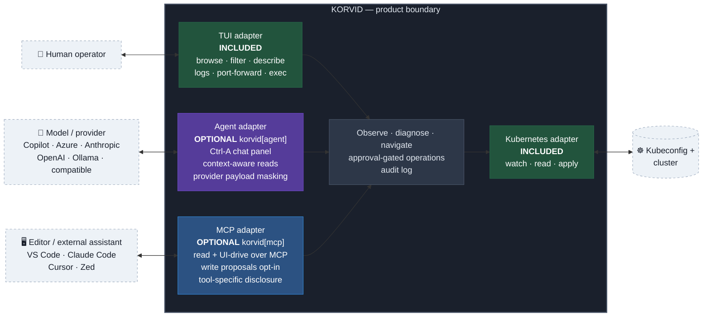
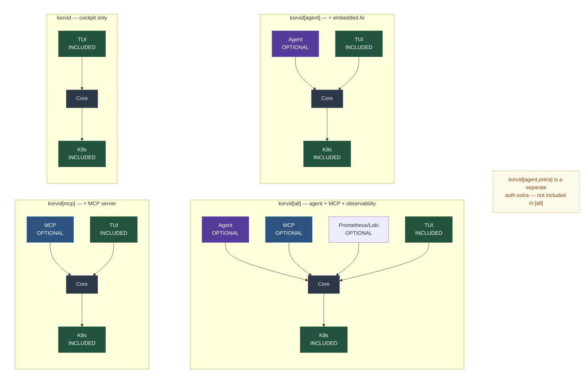

# What korvid is

> A tool-using bird for your cluster.

korvid is one program that grows with what you install: a keyboard-first
Kubernetes cockpit that needs nothing but a kubeconfig, plus one extra for an
embedded AI agent and another that makes it a tool *other* AI clients can
drive. One core, independent adapters, one safety model.

## The shape

Three independent drivers, one korvid boundary, one Kubernetes adapter. The
center is a behavior contract, not a claim that every read shares one snapshot.



The center is a product contract, not the `src/korvid/core/` package: every
adapter shares cluster reads and UI control, and any write request that reaches
korvid — from the TUI, the embedded agent, or an MCP write proposal — passes
through the approval gate and is logged. Provider payload masking belongs to
the embedded Agent boundary; MCP result disclosure remains tool-specific.

The two adapter extras are **independent**, not a ladder, and neither implies
the other: `korvid[mcp]` gives an editor's assistant cluster sight with no
embedded agent, and `korvid[agent]` needs no MCP. Observability is an add-on to
either tool surface (`korvid[agent,observability]`, `korvid[mcp,observability]`),
never a standalone base-TUI surface:

```sh
uv tool install korvid                 # cockpit only
uv tool install 'korvid[agent]'        # + embedded AI agent
uv tool install 'korvid[mcp]'          # + MCP server for external agents
uv tool install 'korvid[all]'          # agent, mcp, observability

brew install hellices/korvid/korvid    # macOS/Linux, no Python needed (= agent)
```

Entra ID auth for Azure OpenAI is a separate `korvid[agent,entra]` extra,
excluded from `[all]`. (`pipx` works the same way.) A missing extra is not an
error: korvid starts and the feature it powers is simply absent — unless you
*asked* for it on the command line, in which case it refuses to start and tells
you what to install.

---

## The three surfaces

**The cockpit (included).** Navigate any resource kind with `:`, filter with
`/` (fuzzy, regex, or label selectors), drill into relationships with `Enter` —
deployment to replicaset to pods, a Helm release or operator to everything it
installed. Split panes, live sort, CPU/MEM against enforced limits, and a
troubled pod that explains itself before you open it. Plus log tailing, `exec`,
file transfer without the `kubectl` binary, and port-forwards that flip to
`broken` when their pod dies instead of failing silently. All it needs is a
kubeconfig — no AI, no account, no network beyond your cluster. Keys in
[`keybindings.md`](keybindings.md), the tour in [`tui.md`](tui.md).

**The agent (`korvid[agent]`).** `Ctrl-A` opens a chat panel that already knows
your view, namespace, selection, and filter. It reads through read-only tools —
manifests, logs, events, compound diagnostics — and **drives the UI itself**:
"show me the crashing pod's logs" navigates, filters, and opens the log pane
instead of printing a suggestion. Answers cite the reads behind them and a
navigable citation opens its actual view; korvid reports an invented reference
rather than accepting it quietly, but it cannot force a model to cite
everything, so an uncited sentence stays exactly that. It needs a provider
(Copilot, Azure OpenAI, Anthropic, OpenAI, Ollama, or any OpenAI-compatible
endpoint), and `agent.model_tier: low` targets 3B–14B models on your own
hardware. See [`agent.md`](agent.md).

**The MCP server (`korvid[mcp]`).** The same read and UI-driving tools over
MCP, so VS Code Copilot Chat, Claude Code, Cursor, or Zed gains cluster sight
and moves korvid's UI while you watch. It cannot change anything: cluster
writes are not on the MCP surface — not gated there, *absent*. Opting in
with `mcp.write_proposals: true` (off by default) adds one ability: leaving a
write **proposal** a human approves inside korvid. See [`mcp.md`](mcp.md).

---

## Four agent/MCP adapter compositions

Four core shapes come from the two independent adapters; observability is an
optional overlay on any shape with agent or MCP, and `korvid[all]` includes it.

<!-- LAYOUT NOTE: the subgraph order below is deliberately C4 → C2 then
     C3 → C1. Mermaid 11 renders nested subgraphs in reverse declaration
     order per row, so "tidying" this into logical order silently reverses
     the rendered grid. -->


---

## The one rule all four share

**Nothing changes your cluster without a human keystroke, and nothing changes
it unlogged.**

Not a policy prompt, not an opt-in confirmation setting. The write path *goes
through* the dialog — there is no second route, for you, for the agent, or for
an MCP client — and a write whose audit record cannot be
written does not happen at all. Most dialogs preview the change (a server-side
dry-run diff, a rendered Helm manifest); some have none, and a preview that
times out never holds the dialog hostage: the preview is a courtesy, the dialog
and the audit entry are the guarantee. `--readonly` removes writes entirely; a
protected context makes every confirmation there require typing the
**context** name instead of a single `y`.

`Secret` values and the credential patterns korvid recognises are masked before
anything reaches the **embedded** agent's provider, and `:ai payload` shows
what was sent — a boundary you cannot inspect is a promise, not a control. Two
honest limits: a secret only your application knows is a secret, sitting in a
log line, may pass undetected; and an external MCP client applies its own data
policy, not korvid's. [`threat-model.md`](threat-model.md) is specific about
both, [`ops.md`](ops.md) about the write path itself.

---

## Why this shape

Three convictions, visible in the structure above:

**An operator's tool should work without AI.** The cockpit is complete on its
own, so it keeps working when a provider is down, a token expires, or policy
forbids sending cluster data anywhere.

**An AI that cannot act is a search engine; one that acts unsupervised is a
liability.** The middle ground does everything *except* the irreversible part,
and hands you that part with a preview attached.

**Where the model runs is your decision.** A frontier API, or a 3B model on a
node in your own cluster; the low tier and a published per-model scoreboard
make that choice informed rather than hopeful.

---

## Where to go next

| You want to | Read |
|---|---|
| Install and start using it | [README](https://github.com/hellices/korvid/blob/main/README.md) |
| Learn the keys | [`keybindings.md`](keybindings.md) |
| Set up the agent | [`agent.md`](agent.md) |
| Connect an editor over MCP | [`mcp.md`](mcp.md) |
| Understand the write safety model | [`ops.md`](ops.md) |
| Know exactly what reaches a model | [`threat-model.md`](threat-model.md) |
| Check the measured envelope | [`performance.md`](performance.md) |
| Run without internet access | [`airgap.md`](airgap.md) |
| See how the code is organised | [`dev/specs/2026-08-12-korvid-architecture.md`](dev/specs/2026-08-12-korvid-architecture.md) |
