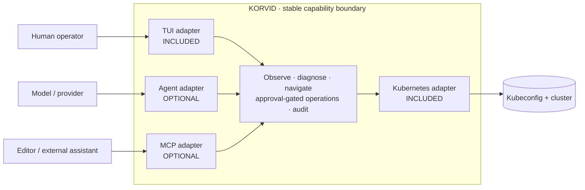

# Modular Overview Diagrams Implementation Plan

> **For agentic workers:** REQUIRED SUB-SKILL: Use superpowers:subagent-driven-development (recommended) or superpowers:executing-plans to implement this plan task-by-task. Steps use checkbox (`- [ ]`) syntax for tracking.

**Goal:** Replace the layered overview graphics with a durable ports-and-adapters concept that makes korvid's base install and independent Agent/MCP extras obvious at a glance.

**Architecture:** The first Mermaid diagram centers a stable korvid capability boundary and connects four adapters: included TUI and Kubernetes adapters, optional Agent and MCP adapters. The second diagram is a four-composition visual truth table showing every valid install shape without implying a dependency between Agent and MCP.

**Tech Stack:** Markdown, GitHub Mermaid, `@mermaid-js/mermaid-cli`, pytest documentation contracts, pre-commit.

## Global Constraints

- This is a product concept diagram, not a Python package or dependency diagram.
- Agent and MCP are independent extras; no arrow or layout may imply either includes the other.
- The base cockpit is complete without either extra.
- Approval and fail-closed audit are shared core capabilities, not optional adapters.
- TUI/Kubernetes adapters are included; Agent/MCP adapters are visibly optional.
- External actors use dashed borders; korvid-owned components use solid boundaries.
- The diagrams must render at README width without horizontal scrolling.
- Do not weaken or broaden current product claims while rewriting the prose.

---

### Task 1: Replace the layered graphics with ports-and-adapters diagrams

**Files:**
- Modify: `docs/overview.md:11-53`

**Interfaces:**
- Consumes: optional dependency semantics from `pyproject.toml`: `agent` and `mcp` are independent, `all` is `agent,mcp`, `entra` is separate.
- Produces: two GitHub Mermaid blocks whose visual vocabulary is reused consistently.

- [ ] **Step 1: Save the current diagrams as a failing visual baseline**

Extract both current Mermaid blocks and render them:

```bash
python - <<'PY'
import pathlib
import re

text = pathlib.Path("docs/overview.md").read_text()
blocks = re.findall(r"```mermaid\n(.*?)```", text, re.S)
out = pathlib.Path("/tmp/korvid-overview-before")
out.mkdir(exist_ok=True)
for index, block in enumerate(blocks, 1):
    (out / f"diagram-{index}.mmd").write_text(block)
print(f"extracted {len(blocks)} diagrams")
PY

for file in /tmp/korvid-overview-before/*.mmd; do
  npx -y @mermaid-js/mermaid-cli -i "$file" -o "${file%.mmd}.png" -w 1050
done
```

Expected: both diagrams parse, but the first presents optional products as separate boxes above the cockpit and the second is a write-flow diagram rather than a modular composition.

- [ ] **Step 2: Replace diagram 1 with the ports-and-adapters overview**

Use this semantic structure in `docs/overview.md`:



Apply the established color language: included adapters green, Agent purple, MCP blue, stable core dark neutral, external actors dashed.

- [ ] **Step 3: Replace diagram 2 with the four valid compositions**

Draw four compact assemblies:

```text
Cockpit
Cockpit + Agent
Cockpit + MCP
Cockpit + Agent + MCP
```

Each assembly must include the same base/core glyph. Agent and MCP occupy separate ports so the third assembly cannot be mistaken for including Agent. Add a small `Entra` badge beside Agent only in a note, not as another composition.

- [ ] **Step 4: Render the new diagrams**

```bash
python - <<'PY'
import pathlib
import re

text = pathlib.Path("docs/overview.md").read_text()
blocks = re.findall(r"```mermaid\n(.*?)```", text, re.S)
out = pathlib.Path("/tmp/korvid-overview-after")
out.mkdir(exist_ok=True)
for index, block in enumerate(blocks, 1):
    (out / f"diagram-{index}.mmd").write_text(block)
print(f"extracted {len(blocks)} diagrams")
PY

for file in /tmp/korvid-overview-after/*.mmd; do
  npx -y @mermaid-js/mermaid-cli -i "$file" -o "${file%.mmd}.png" -w 1050
done
```

Expected: two successful renders. Inspect both rendered images and confirm:

- the stable boundary is visually central;
- Agent and MCP are peers, not parent/child;
- included versus optional is legible without reading the prose;
- the four compositions fit without horizontal scrolling.

- [ ] **Step 5: Commit the diagram change**

```bash
git add docs/overview.md
git commit -m "docs: redraw overview around ports and adapters" \
  -m "Co-authored-by: Copilot <223556219+Copilot@users.noreply.github.com>"
```

---

### Task 2: Align the overview language and verify the document

**Files:**
- Modify: `docs/overview.md:1-220`
- Modify: `docs/dev/specs/2026-08-12-korvid-architecture.md:14-20` only if its overview link copy still says "layers"

**Interfaces:**
- Consumes: the adapter names and composition vocabulary established in Task 1.
- Produces: prose that describes the same modular concept without using stack/layer language.

- [ ] **Step 1: Replace layer language**

Rename:

```text
Layer 1 — the cockpit
Layer 2 — an agent inside the cockpit
Layer 3 — korvid as a tool for other agents
```

to:

```text
Base — the cockpit
Agent module — an agent inside the cockpit
MCP module — korvid as a tool for other agents
```

Replace "Three shapes" and "Each layer" wording with "One core, independent adapters" and "Each module adds independently to the cockpit." Do not call `[all]` everything; retain the existing statement that it is `agent,mcp` and excludes Entra.

- [ ] **Step 2: State the stable capability boundary once**

Immediately below diagram 1, add:

```markdown
The center is a product contract, not the `src/korvid/core/` package. Every
adapter gets the same cluster reads, UI control, approval gate, and audit.
```

Do not duplicate the detailed write ordering from the architecture document.

- [ ] **Step 3: Verify product semantics against the registry and extras**

```bash
uv run --no-sync python - <<'PY'
import tomllib
from korvid.tools.registry import TOOL_DEFS

extras = tomllib.load(open("pyproject.toml", "rb"))["project"]["optional-dependencies"]
assert extras["all"] == ["korvid[agent,mcp]"]
assert not any(tool.effect == "cluster_write" and "mcp" in tool.surfaces for tool in TOOL_DEFS)
print("extras and MCP write boundary verified")
PY
```

Expected:

```text
extras and MCP write boundary verified
```

- [ ] **Step 4: Run documentation checks**

```bash
UV_NO_SYNC=1 uv run --no-sync pre-commit run --all-files
uv run --no-sync pytest -p no:tach -p no:randomly -q \
  -k "readme or docs or markdown or link"
```

Expected: every hook passes; 49 documentation/README contract tests pass.

- [ ] **Step 5: Commit the language and verification change**

```bash
git add docs/overview.md docs/dev/specs/2026-08-12-korvid-architecture.md
git commit -m "docs: align overview copy with modular adapters" \
  -m "Co-authored-by: Copilot <223556219+Copilot@users.noreply.github.com>"
```
