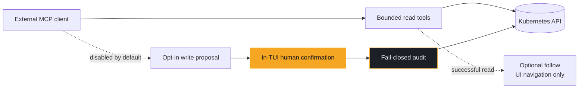
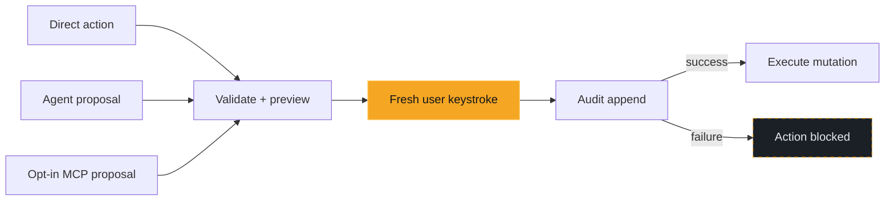

# Official Site Visual Storytelling Implementation Plan

> **For agentic workers:** REQUIRED SUB-SKILL: Use superpowers:subagent-driven-development (recommended) or superpowers:executing-plans to implement this plan task-by-task. Steps use checkbox (`- [ ]`) syntax for tracking.

**Goal:** Replace the official site's prose-led landing page with real korvid product evidence, a truthful three-driver architecture, an explicit guarded-write flow, and selectively visual core documentation.

**Architecture:** Keep MkDocs Material 9.7.7 and GitHub Pages. The landing page remains semantic HTML and CSS, with one dependency-free local script that progressively enhances a three-scene tablist; real media comes from deterministic korvid demo harnesses and remains fully understandable when JavaScript or playback is unavailable.

**Tech Stack:** MkDocs Material 9.7.7, Markdown/HTML, CSS, vanilla JavaScript, Mermaid 11.17.0, Textual demo harnesses, VHS, ffmpeg, pytest.

## Global Constraints

- Keep the site static and self-hosted; browser runtime third-party requests, analytics, accounts, backends, and remote media are forbidden.
- Do not add a JavaScript framework, frontend package manager, terminal emulator, browser cluster, or simulated Kubernetes implementation.
- TUI tables are watch-backed while Describe and the log viewer issue their own fresh reads; embedded-agent and MCP tools perform separate bounded fresh reads, so never claim identical screens, evidence, or snapshots.
- Direct writes, agent requests, and opt-in MCP proposals all require a fresh in-TUI human keystroke and a successful fail-closed audit append before execution.
- Embedded-agent provider payloads use the outbound masking boundary; MCP results retain their separate per-tool disclosure contracts.
- Every new product image or recording must use synthetic data from a documented disposable or in-memory scenario.
- The agent media comes from `ScriptedAgentRuntime`, which discards the prompt and screen context and emits fixed tool and citation events: every surface embedding it labels it a deterministic scripted AgentPanel walkthrough and never claims bounded reads, live tool execution, or validated citations from it.
- The actual product occupies at least half of the desktop hero; every other landing section is led by real media, a semantic diagram, or an ordered flow.
- Each scene, evidence tile, and destination card has no more than one sentence of body copy.
- New below-fold media is lazy or `preload="none"`; only the active hero medium may load eagerly.
- Every visual has semantic text, a caption, or a transcript; all interaction works by keyboard and remains complete without JavaScript.
- `prefers-reduced-motion` disables nonessential transitions and no script starts media automatically.
- Documentation assets remain outside `src/korvid` and outside the Python wheel.
- Use TDD for each behavioral slice: write the source-contract test, verify RED, implement, verify GREEN, then commit.

---

### Task 1: Put the real cockpit in the hero

**Files:**
- Modify: `tests/test_docs_landing_design.py`
- Modify: `docs/index.md`
- Modify: `docs/stylesheets/extra.css`
- Create: `docs/assets/scenes/cockpit-poster.png`

**Interfaces:**
- Consumes: the existing `docs/assets/demo.mp4` recording and `docs/demo/demo.tape` regeneration path.
- Produces: `.hero-demo`, `.hero-demo__frame`, and `docs/assets/scenes/cockpit-poster.png`, used by the scene switcher and evidence mosaic in later tasks.

- [ ] **Step 1: Replace obsolete hero-panel tests with failing product-stage tests**

In `tests/test_docs_landing_design.py`, update the module docstring so item 3 says the hero must show the actual product rather than a key legend. Delete these obsolete tests:

```python
test_hero_pairs_the_copy_with_an_original_cockpit_panel
test_hero_panel_is_a_keyboard_legend_of_real_korvid_keys
test_hero_panel_has_an_accessible_name_and_hidden_decoration
test_hero_panel_is_not_a_second_copy_of_the_demo_asset
test_hero_key_note_preserves_fixed_confirmation_keys
test_product_demo_has_native_motion_controls
test_hero_terminal_motif_reinforces_the_three_actors
```

Add these helpers and tests in their place:

```python
def _section(opening: str, closing: str) -> str:
    source = _index()
    start = source.index(opening)
    return source[start : source.index(closing, start) + len(closing)]


def test_hero_leads_with_real_korvid_media() -> None:
    hero = _section('<section class="hero">', "</section>")
    assert 'class="hero-demo"' in hero
    assert 'src="assets/demo.mp4"' in hero
    assert 'poster="assets/scenes/cockpit-poster.png"' in hero
    assert "hero-panel" not in hero


def test_hero_media_is_controllable_and_has_a_text_fallback() -> None:
    hero = _section('<section class="hero">', "</section>")
    video = re.search(r"<video\b[^>]*>", hero)
    assert video is not None
    opening = video.group(0)
    for attribute in ("controls", "muted", "loop", "playsinline"):
        assert re.search(rf"\b{attribute}\b", opening)
    assert 'preload="metadata"' in opening
    assert "autoplay" not in opening
    assert "Your browser does not support the korvid demo video." in hero
    assert "<figcaption>" in hero


def test_hero_gives_the_product_at_least_half_the_wide_layout() -> None:
    css = _css()
    wide_hero = re.search(
        r"@media \(min-width: 960px\).*?\.md-typeset \.hero \{(?P<body>.*?)\}",
        _strip_css_comments(css),
        re.DOTALL,
    )
    assert wide_hero is not None
    assert "grid-template-columns: minmax(0, 0.8fr) minmax(0, 1.2fr)" in wide_hero.group("body")
```

Update `test_local_assets_referenced_by_the_landing_page_exist` so nested asset paths are supported:

```python
def test_local_assets_referenced_by_the_landing_page_exist() -> None:
    """No broken media: every locally referenced landing asset is checked in."""
    sources = (_index(), COPYRIGHT_PARTIAL.read_text(encoding="utf-8"))
    referenced = {
        match
        for source in sources
        for match in re.findall(r'(?:src|poster)="(assets/[A-Za-z0-9_./-]+)"', source)
    }
    assert referenced
    for relative in referenced:
        assert (DOCS / relative).is_file(), f"docs/{relative} is referenced but missing"
    assert MARK.is_file()
```

- [ ] **Step 2: Run the focused tests to verify RED**

Run:

```bash
uv run --frozen pytest -p no:tach -q \
  tests/test_docs_landing_design.py::test_hero_leads_with_real_korvid_media \
  tests/test_docs_landing_design.py::test_hero_media_is_controllable_and_has_a_text_fallback \
  tests/test_docs_landing_design.py::test_hero_gives_the_product_at_least_half_the_wide_layout
```

Expected: FAIL because the hero still contains `.hero-panel`, the video is below the hero, and the poster does not exist.

- [ ] **Step 3: Generate the real hero poster**

Run from the repository root:

```bash
mkdir -p docs/assets/scenes
ffmpeg -y -ss 00:00:05 -i docs/assets/demo.mp4 -frames:v 1 \
  docs/assets/scenes/cockpit-poster.png
```

00:00:05 is inside the tape's settled pause after the last `Down`: the full
`shop` pod table with the crash-looping `payment-worker` row selected, its
`BackOff` ops hint, and the `ctx:/ns:` status row. 00:00:10 is mid-filter —
one row and a live `/` prompt — which is the empty-table frame the design
forbids.

Verify the capture is the settled, populated `payment-worker` table, not an
empty or mid-filter frame:

```bash
file docs/assets/scenes/cockpit-poster.png
ffprobe -v error -select_streams v:0 -show_entries stream=width,height \
  -of csv=p=0:s=x docs/assets/scenes/cockpit-poster.png
```

Expected: a valid 1280x720 PNG.

- [ ] **Step 4: Replace the hero markup and remove the separate demo figure**

Replace the current `<section class="hero">...</section>` and delete the separate `<figure class="product-demo">...</figure>` in `docs/index.md`:

```html
<section class="hero">
  <div class="hero-heading">
    <p class="eyebrow">AI-NATIVE KUBERNETES TUI</p>
    <h1>See the cluster.<br>Drive the response.</h1>
  </div>
  <figure class="hero-demo">
    <div class="hero-demo__frame">
      <div class="hero-demo__bar" aria-hidden="true"><span></span><strong>ctx:(current) · ns:shop</strong></div>
      <video src="assets/demo.mp4" poster="assets/scenes/cockpit-poster.png" controls muted loop playsinline preload="metadata" aria-label="korvid browsing, filtering, describing, and following logs for a failing workload">Your browser does not support the korvid demo video.</video>
    </div>
    <figcaption><strong>Real korvid, synthetic cluster.</strong> The cockpit needs only your kubeconfig; AI is optional.</figcaption>
  </figure>
  <div class="hero-copy-column">
    <p class="hero-copy">Operate from the keyboard, delegate bounded investigation to an agent, or connect an external assistant over MCP. Every write still stops for you.</p>
    <div class="hero-actions">
      <a class="md-button md-button--primary" href="getting-started/">Start flying</a>
      <a class="md-button" href="https://github.com/hellices/korvid">View on GitHub</a>
    </div>
    <div class="install-command" tabindex="0" role="group" aria-label="Install the current korvid release with uv"><span class="install-command__prompt" aria-hidden="true">$</span><code>uv tool install 'korvid[all]==0.3.0'</code></div>
  </div>
</section>
```

- [ ] **Step 5: Replace the legend/product-demo CSS with the product stage**

Delete the `.hero-panel*` and `.product-demo*` blocks from `docs/stylesheets/extra.css`. Replace the existing wide hero rule with:

```css
.md-typeset .hero-demo {
  min-width: 0;
  margin: 0;
}

.md-typeset .hero-demo__frame {
  overflow: hidden;
  background: var(--korvid-charcoal-sunken);
  border: 1px solid var(--korvid-charcoal-border);
  border-radius: var(--korvid-radius);
  box-shadow: 0 1.5rem 4rem rgba(0, 0, 0, 0.28);
}

.md-typeset .hero-demo__bar {
  display: flex;
  align-items: center;
  gap: 0.75rem;
  min-height: 2rem;
  padding: 0 0.85rem;
  border-bottom: 1px solid var(--korvid-charcoal-border);
  color: var(--korvid-ink-dim);
  font-family: var(--md-code-font-family, monospace);
  font-size: 0.65rem;
}

.md-typeset .hero-demo__bar span {
  width: 0.45rem;
  height: 0.45rem;
  border-radius: 50%;
  background: var(--korvid-amber);
  box-shadow:
    0.7rem 0 0 var(--korvid-charcoal-border),
    1.4rem 0 0 var(--korvid-charcoal-border);
  margin-right: 1.3rem;
}

.md-typeset .hero-demo video {
  display: block;
  width: 100%;
  aspect-ratio: 16 / 9;
  background: #07090c;
}

.md-typeset .hero-demo figcaption {
  max-width: 34rem;
  margin: 0.8rem 0 0;
  color: var(--korvid-ink-dim);
  font-size: 0.78rem;
}

@media (min-width: 960px) {
  .md-typeset .hero {
    display: grid;
    grid-template-columns: minmax(0, 0.8fr) minmax(0, 1.2fr);
    column-gap: clamp(2rem, 4vw, 4rem);
    row-gap: 1rem;
    align-items: center;
    padding: 3.5rem;
  }

  .md-typeset .hero .hero-heading {
    grid-column: 1;
    grid-row: 1;
    align-self: end;
  }

  .md-typeset .hero .hero-copy-column {
    grid-column: 1;
    grid-row: 2;
  }

  .md-typeset .hero-demo {
    grid-column: 2;
    grid-row: 1 / span 2;
    margin-top: 0;
  }
}
```

Keep the existing install-command, button, focus, narrow-viewport, and reduced-motion rules.

- [ ] **Step 6: Run hero tests and the strict build**

Run:

```bash
uv run --frozen pytest -p no:tach -q tests/test_docs_landing_design.py
uv run --frozen --group docs mkdocs build --strict
```

Expected: all landing-design tests PASS and MkDocs exits 0.

- [ ] **Step 7: Commit the product-led hero**

```bash
git add docs/index.md docs/stylesheets/extra.css \
  docs/assets/scenes/cockpit-poster.png tests/test_docs_landing_design.py
git commit -m "docs: put the real cockpit in the site hero" \
  -m "Co-authored-by: Copilot <223556219+Copilot@users.noreply.github.com>"
```

### Task 2: Produce deterministic direct, agent, MCP, and relationship evidence

**Files:**
- Modify: `docs/demo/demo.py`
- Create: `docs/demo/agent.tape`
- Create: `docs/demo/relationships.tape`
- Create: `docs/demo/visual-storytelling.md`
- Create: `docs/assets/scenes/agent-demo.mp4`
- Create: `docs/assets/scenes/agent-poster.png`
- Create: `docs/assets/scenes/mcp-follow-demo.mp4`
- Create: `docs/assets/scenes/mcp-poster.png`
- Create: `docs/assets/scenes/relationship-demo.mp4`
- Create: `docs/assets/scenes/relationship-graph.png`
- Create: `docs/assets/scenes/diagnosis.png`
- Create: `docs/assets/scenes/merged-logs.png`
- Create: `tests/test_docs_visual_assets.py`

**Interfaces:**
- Consumes: `KorvidApp`, the existing in-memory shop fixture, `docs/assets/demo.mp4`, and `docs/assets/mcp-follow-demo.gif`.
- Produces: real local scene media consumed by Tasks 3, 5, and 6; `demo.py --scene base|agent|relationships` is a documentation-only capture interface.

- [ ] **Step 1: Add failing asset and provenance contracts**

Create `tests/test_docs_visual_assets.py`:

```python
"""Contracts for real, local product evidence used by the documentation site."""

from __future__ import annotations

import struct
from pathlib import Path

ROOT = Path(__file__).parent.parent
SCENES = ROOT / "docs" / "assets" / "scenes"
INSTRUCTIONS = ROOT / "docs" / "demo" / "visual-storytelling.md"

PNG_ASSETS = {
    "cockpit-poster.png": (1280, 720, 720),
    "agent-poster.png": (1280, 720, 720),
    "mcp-poster.png": (1280, 710, 710),
    "relationship-graph.png": (1280, 720, 720),
    "diagnosis.png": (1280, 720, 720),
    "merged-logs.png": (1280, 720, 720),
}
MP4_ASSETS = {
    "agent-demo.mp4",
    "mcp-follow-demo.mp4",
    "relationship-demo.mp4",
}


def _png_size(path: Path) -> tuple[int, int]:
    payload = path.read_bytes()
    assert payload[:8] == b"\x89PNG\r\n\x1a\n"
    return struct.unpack(">II", payload[16:24])


def test_storytelling_pngs_are_real_readable_terminal_captures() -> None:
    for name, (width, min_height, max_height) in PNG_ASSETS.items():
        path = SCENES / name
        assert path.is_file(), f"{path} is required by the visual narrative"
        actual_width, actual_height = _png_size(path)
        assert actual_width == width
        assert min_height <= actual_height <= max_height
        assert path.stat().st_size <= 900_000


def test_storytelling_motion_assets_are_local_mp4_files_with_a_size_budget() -> None:
    for name in MP4_ASSETS:
        path = SCENES / name
        assert path.is_file()
        payload = path.read_bytes()
        assert payload[4:8] == b"ftyp"
        assert len(payload) <= 3 * 1024 * 1024


def test_storytelling_capture_instructions_name_every_generated_asset() -> None:
    instructions = INSTRUCTIONS.read_text(encoding="utf-8")
    for name in PNG_ASSETS.keys() | MP4_ASSETS:
        assert f"docs/assets/scenes/{name}" in instructions
    assert "synthetic" in instructions.lower()
    assert "vhs docs/demo/agent.tape" in instructions
    assert "vhs docs/demo/relationships.tape" in instructions
    assert "docs/assets/mcp-follow-demo.gif" in instructions
```

- [ ] **Step 2: Run the asset tests to verify RED**

Run:

```bash
uv run --frozen pytest -p no:tach -q tests/test_docs_visual_assets.py
```

Expected: FAIL because the agent, MCP MP4, relationship, diagnosis, and log assets do not exist.

- [ ] **Step 3: Extend the demo harness with scripted agent and relationship scenes**

Add these imports to `docs/demo/demo.py`:

```python
import argparse

from korvid.agent.events import (
    AgentEvent,
    TextDelta,
    ToolCallFinished,
    ToolCallStarted,
    TurnComplete,
)
from korvid.agent.evidence import EvidenceLedger
from korvid.k8s.relationship_facts import (
    FactConfidence,
    ReferenceFact,
    RelationKind,
    RelationshipFacts,
    TargetReference,
)
```

Add ConfigMap discovery beside the existing metadata and include it in `ALIASES`:

```python
_CONFIGMAP_META = ResourceMeta("ConfigMap", "configmaps", "", "v1", True, ("cm",))

for alias in ("configmaps", "configmap", "cm"):
    ALIASES[alias] = _CONFIGMAP_META
```

Extend `_pod` with deterministic identity and relationship facts:

```python
def _pod(
    name: str,
    ns: str,
    phase: str = "Running",
    ready: str = "1/1",
    restarts: int = 0,
    node: str = "node-1",
    qos: str = "Burstable",
    cpu: str = "100m",
    mem: str = "128Mi",
    *,
    uid: str = "",
    relationships: RelationshipFacts | None = None,
) -> PodSummary:
    return PodSummary(
        name=name,
        namespace=ns,
        phase=phase,
        ready=ready,
        restarts=restarts,
        node=node,
        qos=qos,
        cpu_request=cpu,
        mem_request=mem,
        containers=("app",),
        uid=uid,
        relationships=relationships or RelationshipFacts(),
    )
```

Give the payment pod a real metadata-only relationship:

```python
_PAYMENT_RELATIONSHIPS = RelationshipFacts(
    references=(
        ReferenceFact(
            relation=RelationKind.USES_CONFIG,
            target=TargetReference(
                group="",
                kind="ConfigMap",
                namespace="shop",
                name="payment-config",
            ),
            confidence=FactConfidence.DECLARED,
            field="spec.volumes[0].configMap.name",
        ),
    ),
)
```

Pass `uid="pod-payment"` and `relationships=_PAYMENT_RELATIONSHIPS` to the
existing `payment-worker-6c9f7d-b3xnq` call. Add this entry to `EXTRA`:

```python
"configmaps": [
    GenericSummary(
        name="payment-config",
        namespace="shop",
        kind="ConfigMap",
        created="",
        uid="cm-payment",
    )
],
```

Add the documentation-only collaborators:

```python
class ScriptedAgentRuntime:
    """Deterministic real AgentPanel input for documentation captures."""

    def __init__(self) -> None:
        self.total_tokens = (0, 0)
        self.usage_estimated = False
        self.evidence = EvidenceLedger()
        self.latest_outbound_payload = None

    async def run_turn(self, user_text: str, screen_context: str) -> AsyncIterator[AgentEvent]:
        del user_text, screen_context
        yield ToolCallStarted(
            call_id="demo-diagnose",
            name="diagnose_pod",
            arguments='{"namespace":"shop","name":"payment-worker-6c9f7d-b3xnq"}',
        )
        await asyncio.sleep(0.8)
        yield ToolCallFinished(
            call_id="demo-diagnose",
            name="diagnose_pod",
            ok=True,
            summary="CrashLoopBackOff · 17 restarts · gateway 503 evidence [E1]",
        )
        await asyncio.sleep(0.5)
        yield TextDelta(
            text=(
                "The payment worker is crash-looping after repeated gateway 503s. "
                "Open its logs and inspect the owner before changing it. [E1]"
            )
        )
        yield TurnComplete(
            input_tokens=612,
            output_tokens=43,
            estimated=False,
            # Nothing was read this turn and no evidence was minted, so `[E1]`
            # remains an unsupported marker in the real AgentPanel.
            uncited=("E1",),
        )


async def list_relationship_objects(
    meta: ResourceMeta,
    namespace: str | None,
) -> list[Any]:
    rows: list[Any] = list(PODS) if meta.plural == "pods" else list(EXTRA.get(meta.plural, []))
    if namespace is None:
        return rows
    return [row for row in rows if row.namespace == namespace]


def _parse_scene() -> str:
    parser = argparse.ArgumentParser()
    parser.add_argument(
        "--scene",
        choices=("base", "agent", "relationships"),
        default="base",
    )
    return str(parser.parse_args().scene)
```

Replace `main()` with:

```python
def main() -> None:
    scene = _parse_scene()
    store = ResourceStore()
    app = KorvidApp(
        config=KorvidConfig(namespace="shop"),
        store=store,
        watch_manager=WatchManager(store, source),
        list_namespaces=list_namespaces,
        aliases=ALIASES,
        get_manifest=get_manifest,
        get_events=DemoEvents(),
        stream_logs=stream_logs,
        agent_runtime=ScriptedAgentRuntime() if scene == "agent" else None,
        agent_model_name="korvid-demo" if scene == "agent" else None,
        list_relationship_objects=(
            list_relationship_objects if scene == "relationships" else None
        ),
    )
    app.run()
```

- [ ] **Step 4: Add exact VHS scripts for agent and relationship captures**

Create `docs/demo/agent.tape`:

```text
Output docs/assets/scenes/agent-demo.mp4

Set FontSize 15
Set Width 1280
Set Height 720
Set Padding 8
Set TypingSpeed 70ms
Set Shell bash

Hide
Type "uv run --frozen python docs/demo/demo.py --scene agent"
Enter
# Hidden cold-start allowance shared by every tape; see the reason in
# docs/demo/visual-storytelling.md ("Running the tapes reproducibly").
Sleep 20s
Show
# The demo harness already auto-opened and focused the real AgentPanel
# `#agent-input` widget by this point; type straight into it and press
# Enter through the genuine Input/on_input_submitted path.
Type "Why is the payment worker failing?"
Enter
Sleep 8s
Hide
# The focused input owns printable keys; close the panel through its
# priority binding before sending the app-level quit key.
Ctrl+A
Sleep 1s
Type "q"
```

Create `docs/demo/relationships.tape`:

```text
Output docs/assets/scenes/relationship-demo.mp4

Set FontSize 15
Set Width 1280
Set Height 720
Set Padding 8
Set TypingSpeed 90ms
Set Shell bash

Hide
Type "uv run --frozen python docs/demo/demo.py --scene relationships"
Enter
# Hidden cold-start allowance shared by every tape; see the reason in
# docs/demo/visual-storytelling.md ("Running the tapes reproducibly").
Sleep 20s
Show
Type "/"
Type "payment-worker"
Enter
Sleep 2s
Type "g"
Sleep 5s
Hide
# RelationshipScreen consumes the first q; wait for the modal to dismiss
# before sending the app-level quit key.
Type "q"
Sleep 1s
Type "q"
```

- [ ] **Step 5: Generate all scene media from the checked-in sources**

Run:

```bash
vhs docs/demo/agent.tape
vhs docs/demo/relationships.tape

ffmpeg -y -ss 00:00:05 -i docs/assets/scenes/agent-demo.mp4 \
  -frames:v 1 docs/assets/scenes/agent-poster.png
ffmpeg -y -ss 00:00:05 -i docs/assets/scenes/relationship-demo.mp4 \
  -frames:v 1 docs/assets/scenes/relationship-graph.png

ffmpeg -y -i docs/assets/mcp-follow-demo.gif -an -movflags +faststart \
  -pix_fmt yuv420p -crf 20 \
  -vf 'scale=trunc(iw/2)*2:trunc(ih/2)*2,trim=start_frame=36:end_frame=84,setpts=PTS-STARTPTS,setsar=1,drawbox=x=1000:y=22:w=280:h=320:color=0x111111:t=fill,drawbox=x=1000:y=578:w=280:h=132:color=0x111111:t=fill' \
  docs/assets/scenes/mcp-follow-demo.mp4
ffmpeg -y -i docs/assets/scenes/mcp-follow-demo.mp4 -vf "select='eq(n\,9)'" \
  -frames:v 1 docs/assets/scenes/mcp-poster.png

ffmpeg -y -ss 00:00:16 -i docs/assets/demo.mp4 \
  -frames:v 1 docs/assets/scenes/diagnosis.png
ffmpeg -y -ss 00:00:23 -i docs/assets/demo.mp4 \
  -frames:v 1 docs/assets/scenes/merged-logs.png
```

Open every PNG and scrub every MP4. If a selected timestamp does not show the
named state, change only that `-ss` value in both this plan's execution notes
and `docs/demo/visual-storytelling.md`, regenerate, and rerun the asset test.
Do not relabel a mismatched frame.

Then confirm the MCP clip displays at exactly the box it stores — the GIF's
63:64 pixels are what `setsar=1` drops, and a browser lays a `<video>` out
from the display box, not the stored one:

```bash
ffprobe -v error -select_streams v:0 -show_entries \
  stream=width,height,sample_aspect_ratio,display_aspect_ratio \
  -of default=noprint_wrappers=1 docs/assets/scenes/mcp-follow-demo.mp4
```

Expected: `1280`, `710`, `1:1`, `128:71`. Anything else means the reserved
`1280 / 710` box pillarboxes the clip; fix the chain, never the box.

- [ ] **Step 6: Document provenance and regeneration**

Create `docs/demo/visual-storytelling.md`:

```markdown
# Official-site visual evidence

Every official-site scene uses synthetic resources from a disposable or
in-memory demo. No capture may contain a real cluster, credential, customer,
or production identifier.

## Base cockpit and feature frames

`docs/demo/demo.tape` records the in-memory `shop` fixture to
`docs/assets/demo.gif`; `docs/demo/README.md` converts the same recording to
`docs/assets/demo.mp4`.

```sh
vhs docs/demo/demo.tape
ffmpeg -y -i docs/assets/demo.gif -an -movflags +faststart \
  -pix_fmt yuv420p -vf 'scale=trunc(iw/2)*2:trunc(ih/2)*2' \
  docs/assets/demo.mp4
ffmpeg -y -ss 00:00:05 -i docs/assets/demo.mp4 -frames:v 1 \
  docs/assets/scenes/cockpit-poster.png
ffmpeg -y -ss 00:00:16 -i docs/assets/demo.mp4 -frames:v 1 \
  docs/assets/scenes/diagnosis.png
ffmpeg -y -ss 00:00:23 -i docs/assets/demo.mp4 -frames:v 1 \
  docs/assets/scenes/merged-logs.png
```

## Embedded agent

`docs/demo/agent.tape` drives the real AgentPanel against the deterministic
`ScriptedAgentRuntime` in `docs/demo/demo.py`.

What that runtime **proves**: the real `AgentPanel` accepts a typed prompt,
submits it through the product's own `Input` path, and renders the turn.

What it **does not prove**: anything about the provider, tool, or evidence
pipeline — it discards the prompt and screen context, contacts no provider,
executes no read tool, and emits hard-coded tool, text, citation, and token
events, so its `[E1]` marker is not validated. Every page embedding this media
calls it a scripted AgentPanel walkthrough.

```sh
vhs docs/demo/agent.tape
ffmpeg -y -ss 00:00:05 -i docs/assets/scenes/agent-demo.mp4 \
  -frames:v 1 docs/assets/scenes/agent-poster.png
```

## Relationship graph

`docs/demo/relationships.tape` drives the real relationship screen over
metadata-only synthetic facts from `docs/demo/demo.py`.

```sh
vhs docs/demo/relationships.tape
ffmpeg -y -ss 00:00:05 -i docs/assets/scenes/relationship-demo.mp4 \
  -frames:v 1 docs/assets/scenes/relationship-graph.png
```

## MCP follow

`docs/assets/mcp-follow-demo.gif` was recorded against the disposable local
cluster documented by its repository design and test contract. Its right-hand
pane belongs to a third-party MCP client, whose startup banner and tool
inventory above the exchange, and working directory, branch, token spend and
model name below it, are unrelated to korvid and must not ship. The site uses
a deterministic reframe of that reviewed recording — frames 36-83, with those
two bands of the client pane cleared to its own background, and `setsar=1` so
the 1280×711/63:64 source becomes a square-pixel 1280×710 clip instead of one
that stores 1280×710 and displays 1258×710 — plus a poster taken from the
sanitised clip:

```sh
ffmpeg -y -i docs/assets/mcp-follow-demo.gif -an -movflags +faststart \
  -pix_fmt yuv420p -crf 20 \
  -vf 'scale=trunc(iw/2)*2:trunc(ih/2)*2,trim=start_frame=36:end_frame=84,setpts=PTS-STARTPTS,setsar=1,drawbox=x=1000:y=22:w=280:h=320:color=0x111111:t=fill,drawbox=x=1000:y=578:w=280:h=132:color=0x111111:t=fill' \
  docs/assets/scenes/mcp-follow-demo.mp4
ffmpeg -y -i docs/assets/scenes/mcp-follow-demo.mp4 -vf "select='eq(n\,9)'" \
  -frames:v 1 docs/assets/scenes/mcp-poster.png
```
```

- [ ] **Step 7: Verify the harness and assets**

Run:

```bash
uv run --frozen ruff check docs/demo/demo.py tests/test_docs_visual_assets.py
uv run --frozen ruff format --check docs/demo/demo.py tests/test_docs_visual_assets.py
uv run --frozen pytest -p no:tach -q \
  tests/test_docs_visual_assets.py tests/test_mcp_follow_demo_asset.py
```

Expected: ruff exits 0 and all asset tests PASS.

- [ ] **Step 8: Commit reproducible product evidence**

```bash
git add docs/demo/demo.py docs/demo/agent.tape docs/demo/relationships.tape \
  docs/demo/visual-storytelling.md docs/assets/scenes tests/test_docs_visual_assets.py
git commit -m "docs: add reproducible product evidence scenes" \
  -m "Co-authored-by: Copilot <223556219+Copilot@users.noreply.github.com>"
```

### Task 3: Add the progressively enhanced three-driver scene switcher

**Files:**
- Modify: `tests/test_docs_landing_design.py`
- Modify: `tests/test_docs_build_config.py`
- Modify: `docs/index.md`
- Modify: `docs/stylesheets/extra.css`
- Create: `docs/assets/javascripts/visual-storytelling.js`
- Modify: `mkdocs.yml`
- Modify: `.gitattributes`

**Interfaces:**
- Consumes: `demo.mp4`, `agent-demo.mp4`, `mcp-follow-demo.mp4`, and their posters from Tasks 1-2.
- Produces: `[data-scene-switcher]`, `scene-direct|agent|mcp` tab/panel IDs, and a local scene controller loaded through `mkdocs.yml`.

- [ ] **Step 1: Replace prose-card contracts with failing scene-switcher contracts**

Delete `_product_model_intro`,
`test_landing_frames_one_experience_rather_than_three_separate_products`,
`test_landing_names_the_boundaries_the_three_surfaces_actually_share`, and
`test_feature_cards_are_ways_to_drive_korvid_not_three_feature_silos` from
`tests/test_docs_landing_design.py`. Add:

```python
def _scene_switcher() -> str:
    return _section('<section class="scene-switcher"', "</section>")


def test_landing_presents_one_incident_through_three_drivers() -> None:
    switcher = _scene_switcher()
    assert "One incident. Three ways to drive it." in switcher
    for scene in ("direct", "agent", "mcp"):
        assert f'id="scene-tab-{scene}"' in switcher
        assert f'aria-controls="scene-{scene}"' in switcher
        assert f'id="scene-{scene}"' in switcher
    assert "same evidence" not in switcher.lower()


def test_scene_switcher_source_is_a_complete_no_javascript_fallback() -> None:
    switcher = _scene_switcher()
    panels = re.findall(r'<article id="scene-[^"]+"[^>]*role="tabpanel"[^>]*>', switcher)
    assert len(panels) == 3
    assert all(" hidden" not in panel for panel in panels)
    assert 'src="assets/demo.mp4"' in switcher
    assert 'src="assets/scenes/agent-demo.mp4"' in switcher
    assert 'src="assets/scenes/mcp-follow-demo.mp4"' in switcher


def test_scene_switcher_uses_the_aria_tab_contract() -> None:
    switcher = _scene_switcher()
    assert 'role="tablist"' in switcher
    assert switcher.count('role="tab"') == 3
    assert switcher.count('role="tabpanel"') == 3
    assert switcher.count('aria-selected="true"') == 1
    assert switcher.count('aria-selected="false"') == 2
```

Replace `test_landing_customizations_add_no_scripts_or_remote_assets` with:

```python
def test_landing_uses_no_inline_or_remote_custom_executable_assets() -> None:
    sources = [
        _index(),
        _css(),
        COPYRIGHT_PARTIAL.read_text(encoding="utf-8"),
        (OVERRIDES / "home.html").read_text(encoding="utf-8"),
    ]
    for source in sources:
        assert "<script" not in source
        assert "onclick=" not in source
    assert not re.findall(r"url\((['\"]?)(https?:)?//", _css())
```

Add to `tests/test_docs_build_config.py`:

```python
VISUAL_STORYTELLING = (
    ROOT / "docs" / "assets" / "javascripts" / "visual-storytelling.js"
)


def test_mkdocs_loads_only_the_reviewed_local_storytelling_script() -> None:
    config = _load_mkdocs_config()
    assert config.get("extra_javascript") == [
        "assets/javascripts/visual-storytelling.js"
    ]
    assert VISUAL_STORYTELLING.is_file()
    script = VISUAL_STORYTELLING.read_bytes()
    assert hashlib.sha256(script).hexdigest() == (
        "a6255deca2603a69e57e162583e0717331491c5dc2154277e2a4aa312e32f846"
    )
    assert b"\r" not in script


def test_storytelling_script_checkout_preserves_reviewed_bytes() -> None:
    attributes = (ROOT / ".gitattributes").read_text(encoding="utf-8")
    assert "docs/assets/javascripts/visual-storytelling.js text eol=lf" in attributes
```

- [ ] **Step 2: Run the switcher tests to verify RED**

Run:

```bash
uv run --frozen pytest -p no:tach -q \
  tests/test_docs_landing_design.py::test_landing_presents_one_incident_through_three_drivers \
  tests/test_docs_landing_design.py::test_scene_switcher_source_is_a_complete_no_javascript_fallback \
  tests/test_docs_landing_design.py::test_scene_switcher_uses_the_aria_tab_contract \
  tests/test_docs_build_config.py::test_mkdocs_loads_only_the_reviewed_local_storytelling_script
```

Expected: FAIL because the page still has `.feature-grid` cards and no local controller.

- [ ] **Step 3: Replace the numbered cards with complete scene markup**

Replace the current “One operational experience” intro and `.feature-grid`
with:

```html
<section class="scene-switcher" data-scene-switcher aria-labelledby="scene-switcher-title">
  <div class="section-heading">
    <p class="eyebrow">ONE OPERATIONAL EXPERIENCE</p>
    <h2 id="scene-switcher-title">One incident. Three ways to drive it.</h2>
    <p>Find the failing workload, inspect its evidence, and land on the useful screen—directly, through the embedded agent, or from an external MCP client.</p>
  </div>
  <div class="scene-tabs" role="tablist" aria-label="Choose who drives korvid">
    <button id="scene-tab-direct" type="button" role="tab" aria-selected="true" aria-controls="scene-direct">You drive</button>
    <button id="scene-tab-agent" type="button" role="tab" aria-selected="false" aria-controls="scene-agent" tabindex="-1">Agent delegates</button>
    <button id="scene-tab-mcp" type="button" role="tab" aria-selected="false" aria-controls="scene-mcp" tabindex="-1">MCP connects</button>
  </div>
  <div class="scene-panels">
    <article id="scene-direct" class="scene-panel" role="tabpanel" aria-labelledby="scene-tab-direct" tabindex="0">
      <video src="assets/demo.mp4" poster="assets/scenes/cockpit-poster.png" controls muted loop playsinline preload="none" aria-label="An operator filters to a failing pod, describes it, and opens its logs in korvid">Your browser does not support this direct-operation demo.</video>
      <div><strong>Input</strong> Keyboard intent</div>
      <div><strong>Evidence</strong> Watch-backed table + fresh describe and log reads</div>
      <div><strong>Result</strong> The real korvid view</div>
      <p>You stay on the live cockpit and choose every next step.</p>
      <a href="tui/">Explore the TUI</a>
    </article>
    <article id="scene-agent" class="scene-panel" role="tabpanel" aria-labelledby="scene-tab-agent" tabindex="0">
      <video src="assets/scenes/agent-demo.mp4" data-poster="assets/scenes/agent-poster.png" controls muted loop playsinline preload="none" aria-label="A deterministic scripted AgentPanel walkthrough: a prompt typed into korvid's real agent input, then scripted tool events and a scripted answer whose E1 marker the panel flags as an unsupported citation">Your browser does not support this scripted AgentPanel walkthrough.</video>
      <noscript></noscript>
      <div><strong>Input</strong> Prompt typed and submitted in the real AgentPanel input</div>
      <div><strong>Evidence</strong> Scripted tool events and an E1 marker the panel flags as unsupported, not bounded reads</div>
      <div><strong>Result</strong> Real AgentPanel rendering of the scripted answer</div>
      <p>This capture does not execute korvid's provider or tool pipeline; nothing is read, so the panel flags the scripted E1 marker as an unsupported citation. The agent guide documents what a real turn does.</p>
      <a href="agent/">Explore the embedded agent</a>
    </article>
    <article id="scene-mcp" class="scene-panel" role="tabpanel" aria-labelledby="scene-tab-mcp" tabindex="0">
      <video src="assets/scenes/mcp-follow-demo.mp4" class="mcp-media" data-poster="assets/scenes/mcp-poster.png" controls muted loop playsinline preload="none" aria-label="An external MCP client reads the cluster while korvid follow mode mirrors its navigation">Your browser does not support this MCP follow demo.</video>
      <noscript></noscript>
      <div><strong>Input</strong> External assistant</div>
      <div><strong>Evidence</strong> Tool-specific bounded fresh reads</div>
      <div><strong>Result</strong> MCP response + optional follow</div>
      <p>MCP exposes bounded tools; write proposals are off by default.</p>
      <a href="mcp/">Explore MCP</a>
    </article>
  </div>
</section>
```

- [ ] **Step 4: Add responsive switcher styling**

Delete `.feature-grid*` rules and add:

```css
.md-typeset .scene-switcher {
  margin: 4rem 0;
}

.md-typeset .section-heading {
  max-width: 46rem;
  margin-bottom: 1.5rem;
}

.md-typeset .section-heading > p:last-child {
  color: var(--korvid-ink-dim);
}

.md-typeset .scene-tabs {
  display: flex;
  gap: 0.5rem;
  overflow-x: auto;
  padding: 0.25rem 0 0.75rem;
}

.md-typeset .scene-tabs button {
  flex: none;
  padding: 0.65rem 1rem;
  color: var(--korvid-ink-dim);
  background: transparent;
  border: 1px solid var(--korvid-charcoal-border);
  border-radius: 999px;
  font: inherit;
  cursor: pointer;
}

.md-typeset .scene-tabs button[aria-selected="true"] {
  color: var(--korvid-charcoal);
  background: var(--korvid-amber);
  border-color: var(--korvid-amber);
}

.md-typeset .scene-tabs button:focus-visible {
  outline: 3px solid var(--korvid-amber-bright);
  outline-offset: 3px;
}

.md-typeset .scene-panel:focus-visible {
  outline: 3px solid var(--korvid-amber-bright);
  outline-offset: -3px;
}

.md-typeset .scene-panels {
  background: var(--korvid-charcoal-raised);
  border: 1px solid var(--korvid-charcoal-border);
  border-radius: var(--korvid-radius);
  overflow: hidden;
}

.md-typeset .scene-panel {
  display: grid;
  grid-template-columns: repeat(3, minmax(0, 1fr));
  gap: 0.75rem;
  padding: 1rem;
}

.md-typeset .scene-panel[hidden] {
  display: none;
}

.md-typeset .scene-panel video {
  grid-column: 1 / -1;
  display: block;
  width: 100%;
  aspect-ratio: 16 / 9;
  background: #07090c;
  border: 1px solid var(--korvid-charcoal-border);
  border-radius: calc(var(--korvid-radius) - 0.15rem);
}

.md-typeset .scene-panel noscript {
  grid-column: 1 / -1;
  display: block;
}

.md-typeset .scene-panel noscript img {
  display: block;
  width: 100%;
  height: auto;
  border: 1px solid var(--korvid-charcoal-border);
  border-radius: calc(var(--korvid-radius) - 0.15rem);
}

.md-typeset [data-scene-switcher]:not([data-enhanced]) .scene-tabs {
  display: none;
}

.md-typeset .scene-panel > div {
  color: var(--korvid-ink-dim);
  font-size: 0.75rem;
}

.md-typeset .scene-panel > div strong {
  display: block;
  color: var(--korvid-amber);
}

.md-typeset .scene-panel p {
  grid-column: 1 / -1;
  margin: 0.5rem 0 0;
}

.md-typeset .scene-panel > a {
  grid-column: 1 / -1;
  width: fit-content;
}

@media (max-width: 599px) {
  .md-typeset .scene-panel {
    grid-template-columns: 1fr;
  }

  .md-typeset .scene-panel video,
  .md-typeset .scene-panel p,
  .md-typeset .scene-panel > a {
    grid-column: 1;
  }
}
```

- [ ] **Step 5: Add the exact local scene controller**

Create `docs/assets/javascripts/visual-storytelling.js` with LF endings and a
final newline:

```javascript
(() => {
  /* Resolve a tab's panel without ever building a selector from its id: an
     `aria-controls` value is author data, and interpolating it into
     `querySelector("#" + id)` turns a stray space, dot or digit into a
     different selector — or a SyntaxError — instead of a missing panel.
     `getElementById` takes the id verbatim; containment keeps a switcher
     from adopting a panel that belongs to another one. */
  const panelFor = (switcher, tab) => {
    const id = tab.getAttribute("aria-controls");
    const panel = id ? document.getElementById(id) : null;
    if (!(panel instanceof HTMLElement) || !switcher.contains(panel)) {
      throw new Error(`Missing scene panel for ${tab.id || "an unnamed tab"}`);
    }
    return panel;
  };

  const promotePoster = (panel) => {
    for (const video of panel.querySelectorAll("video[data-poster]")) {
      const poster = video.dataset.poster;
      if (!poster) continue;
      video.setAttribute("poster", poster);
      video.removeAttribute("data-poster");
    }
  };

  /* The authored markup is the no-JavaScript fallback: every panel visible,
     the tab strip hidden by CSS while `data-enhanced` is absent. Restoring
     it is what keeps a failed enhancement from leaving a half-switched page
     behind. */
  const readAuthoredTabState = (tabs) =>
    tabs.map((tab) => [tab, tab.getAttribute("aria-selected"), tab.getAttribute("tabindex")]);

  const restoreFallback = (switcher, authoredTabState) => {
    switcher.removeAttribute("data-enhanced");
    for (const panel of switcher.querySelectorAll(".scene-panel")) {
      panel.hidden = false;
      promotePoster(panel);
    }
    for (const [tab, selected, tabIndex] of authoredTabState) {
      if (selected === null) tab.removeAttribute("aria-selected");
      else tab.setAttribute("aria-selected", selected);
      if (tabIndex === null) tab.removeAttribute("tabindex");
      else tab.setAttribute("tabindex", tabIndex);
    }
  };

  const enhance = (switcher, tabs) => {
    if (tabs.length === 0) {
      throw new Error("Scene switcher has no tabs");
    }

    /* Every tab is resolved before a single `hidden`, `aria-selected` or
       `tabindex` is written, so a switcher that cannot be driven is never
       partially rewritten. */
    const panels = new Map(tabs.map((tab) => [tab, panelFor(switcher, tab)]));

    const select = (nextTab, focus) => {
      for (const tab of tabs) {
        const selected = tab === nextTab;
        const panel = panels.get(tab);
        if (!(panel instanceof HTMLElement)) {
          throw new Error(`Missing scene panel for ${tab.id || "an unnamed tab"}`);
        }
        tab.setAttribute("aria-selected", String(selected));
        tab.tabIndex = selected ? 0 : -1;
        panel.hidden = !selected;
        if (selected) {
          promotePoster(panel);
        }
        if (!selected) {
          for (const video of panel.querySelectorAll("video")) {
            video.pause();
          }
        }
      }
      if (focus) nextTab.focus();
    };

    select(tabs.find((tab) => tab.getAttribute("aria-selected") === "true") ?? tabs[0], false);

    /* The stylesheet reveals the tab strip on this hook, so it is set only
       once the switcher demonstrably works. */
    switcher.dataset.enhanced = "true";

    for (const tab of tabs) {
      tab.addEventListener("click", () => select(tab, false));
      tab.addEventListener("keydown", (event) => {
        const index = tabs.indexOf(tab);
        const keys = new Map([
          ["ArrowLeft", (index - 1 + tabs.length) % tabs.length],
          ["ArrowRight", (index + 1) % tabs.length],
          ["Home", 0],
          ["End", tabs.length - 1],
        ]);
        const nextIndex = keys.get(event.key);
        if (nextIndex === undefined) return;
        event.preventDefault();
        select(tabs[nextIndex], true);
      });
    }

    if (typeof IntersectionObserver === "function") {
      const observer = new IntersectionObserver((entries) => {
        for (const entry of entries) {
          if (entry.isIntersecting) continue;
          for (const video of switcher.querySelectorAll("video")) {
            video.pause();
          }
        }
      });
      observer.observe(switcher);
    }
  };

  for (const switcher of document.querySelectorAll("[data-scene-switcher]")) {
    const tabs = Array.from(switcher.querySelectorAll('[role="tab"]'));
    const authoredTabState = readAuthoredTabState(tabs);
    try {
      enhance(switcher, tabs);
    } catch (error) {
      /* One malformed switcher must cost only itself: roll this one back to
         the no-JavaScript rendering, say why, and keep initializing the
         rest of the page. */
      restoreFallback(switcher, authoredTabState);
      console.error("korvid: scene switcher left unenhanced", error);
    }
  }
})();
```

Add to `.gitattributes`:

```gitattributes
docs/assets/javascripts/visual-storytelling.js text eol=lf
```

Add to `mkdocs.yml` after `extra_css`:

```yaml
extra_javascript:
  - assets/javascripts/visual-storytelling.js
```

- [ ] **Step 6: Run switcher, config, and strict-build checks**

Run:

```bash
uv run --frozen pytest -p no:tach -q \
  tests/test_docs_landing_design.py tests/test_docs_build_config.py
uv run --frozen --group docs mkdocs build --strict
```

Expected: tests PASS and MkDocs exits 0.

- [ ] **Step 7: Commit the three-driver scene switcher**

```bash
git add .gitattributes mkdocs.yml docs/index.md docs/stylesheets/extra.css \
  docs/assets/javascripts/visual-storytelling.js \
  tests/test_docs_landing_design.py tests/test_docs_build_config.py
git commit -m "docs: show three ways to drive one incident" \
  -m "Co-authored-by: Copilot <223556219+Copilot@users.noreply.github.com>"
```

### Task 4: Visualize the product contract and guarded write path

**Files:**
- Modify: `tests/test_docs_landing_design.py`
- Modify: `docs/index.md`
- Modify: `docs/stylesheets/extra.css`

**Interfaces:**
- Consumes: the product semantics already documented in `docs/overview.md`, `docs/ops.md`, `docs/agent.md`, and `docs/mcp.md`.
- Produces: `.contract-map` and `.write-path` semantic diagrams; later documentation links target their detailed source pages.

- [ ] **Step 1: Replace paragraph assertions with failing semantic-flow tests**

Replace `test_safety_section_converges_every_actor_on_one_write_path` with:

```python
def test_product_contract_map_keeps_the_read_paths_truthful() -> None:
    contract = _section('<section class="contract-map"', "</section>")
    lowered = " ".join(re.sub(r"<[^>]+>", " ", contract).lower().split())
    for fact in (
        "human operator",
        "watch-backed table",
        "fresh describe and log reads",
        "model / provider",
        "bounded fresh reads",
        "editor / external assistant",
        "active cluster context",
        "navigation semantics",
        "snapshots can differ",
    ):
        assert fact in lowered
    assert "same evidence" not in lowered


def test_guarded_write_path_orders_confirmation_audit_and_execution() -> None:
    path = _section('<section class="write-path"', "</section>")
    lowered = " ".join(re.sub(r"<[^>]+>", " ", path).lower().split())
    for origin in ("direct action", "agent proposal", "opt-in mcp proposal"):
        assert origin in lowered
    stages = ["observe", "propose", "confirm", "audit", "execute"]
    positions = [path.index(f'data-stage="{stage}"') for stage in stages]
    assert positions == sorted(positions)
    assert "fresh human keystroke" in lowered
    assert "audit write failed" in lowered
    assert "action blocked" in lowered
    assert "fail-closed" in lowered


def test_landing_keeps_agent_masking_distinct_from_mcp_disclosure() -> None:
    path = _section('<section class="write-path"', "</section>")
    lowered = " ".join(re.sub(r"<[^>]+>", " ", path).lower().split())
    assert "embedded provider payloads are masked" in lowered
    assert "mcp result disclosure is tool-specific" in lowered
    assert "secret values are masked before model calls" not in lowered
```

- [ ] **Step 2: Run the new flow tests to verify RED**

Run:

```bash
uv run --frozen pytest -p no:tach -q \
  tests/test_docs_landing_design.py::test_product_contract_map_keeps_the_read_paths_truthful \
  tests/test_docs_landing_design.py::test_guarded_write_path_orders_confirmation_audit_and_execution \
  tests/test_docs_landing_design.py::test_landing_keeps_agent_masking_distinct_from_mcp_disclosure
```

Expected: FAIL because neither semantic section exists.

- [ ] **Step 3: Replace the long safety paragraph with the two visual flows**

Insert after the scene switcher and remove the old “Sharp tools. Human hands.”
paragraph:

```html
<section class="contract-map" aria-labelledby="contract-title">
  <div class="section-heading">
    <p class="eyebrow">ONE PRODUCT CONTRACT</p>
    <h2 id="contract-title">Different reads. Shared context and safety.</h2>
    <p>Korvid keeps each surface honest about where its evidence came from while preserving the same operational frame.</p>
  </div>
  <div class="contract-map__drivers">
    <article><span>Human operator</span><strong>Watch-backed table + fresh describe and log reads</strong></article>
    <article><span>Model / provider</span><strong>Bounded fresh reads</strong></article>
    <article><span>Editor / external assistant</span><strong>Bounded fresh reads over MCP</strong></article>
  </div>
  <div class="contract-map__shared" role="group" aria-label="Shared operational contract">
    <strong>Active cluster context</strong>
    <strong>Navigation semantics</strong>
    <strong>Approval gate</strong>
    <strong>Fail-closed audit</strong>
  </div>
  <p class="contract-map__truth">The watch-backed table, korvid's own describe and log reads, and each tool's fresh reads are taken at different moments, so snapshots can differ without splitting the product contract.</p>
  <a href="overview/">Inspect the complete architecture</a>
</section>

<section class="write-path" aria-labelledby="write-path-title">
  <div class="section-heading">
    <p class="eyebrow">SHARP TOOLS. HUMAN HANDS.</p>
    <h2 id="write-path-title">Every mutation stops at the same gate.</h2>
  </div>
  <div class="write-path__origins" role="group" aria-label="Write initiators">
    <span>Direct action</span>
    <span>Agent proposal</span>
    <span>Opt-in MCP proposal</span>
  </div>
  <ol class="write-path__stages">
    <li data-stage="observe"><span>01</span><strong>Observe</strong><small>Gather bounded evidence</small></li>
    <li data-stage="propose"><span>02</span><strong>Propose</strong><small>Render the intended change</small></li>
    <li data-stage="confirm"><span>03</span><strong>Confirm</strong><small>Fresh human keystroke</small></li>
    <li data-stage="audit"><span>04</span><strong>Audit</strong><small>Append must succeed</small></li>
    <li data-stage="execute"><span>05</span><strong>Execute</strong><small>Validate and mutate</small></li>
  </ol>
  <p class="write-path__blocked"><strong>Audit write failed</strong><span aria-hidden="true">→</span> action blocked. The audit path is fail-closed.</p>
  <p class="write-path__boundary">Embedded provider payloads are masked; MCP result disclosure is tool-specific. <a href="threat-model/">Inspect both boundaries.</a></p>
</section>
```

- [ ] **Step 4: Style the semantic diagrams without relying on color**

Add:

```css
.md-typeset .contract-map,
.md-typeset .write-path {
  margin: 4rem 0;
  padding: clamp(1.25rem, 3vw, 2.5rem);
  background: var(--korvid-charcoal);
  border: 1px solid var(--korvid-charcoal-border);
  border-radius: var(--korvid-radius);
}

.md-typeset .contract-map__drivers {
  display: grid;
  gap: 0.75rem;
}

.md-typeset .contract-map__drivers article {
  padding: 1rem;
  background: var(--korvid-charcoal-raised);
  border: 1px solid var(--korvid-charcoal-border);
  border-radius: var(--korvid-radius);
}

.md-typeset .contract-map__drivers span,
.md-typeset .contract-map__drivers strong {
  display: block;
}

.md-typeset .contract-map__drivers span {
  color: var(--korvid-amber);
  font-size: 0.72rem;
  text-transform: uppercase;
  letter-spacing: 0.08em;
}

.md-typeset .contract-map__shared {
  display: grid;
  gap: 0.5rem;
  margin: 1rem 0;
  padding: 1rem;
  border: 2px solid var(--korvid-amber);
  border-radius: var(--korvid-radius);
}

.md-typeset .contract-map__truth,
.md-typeset .write-path__boundary {
  color: var(--korvid-ink-dim);
  font-size: 0.8rem;
}

.md-typeset .write-path__origins {
  display: flex;
  flex-wrap: wrap;
  gap: 0.5rem;
  margin-bottom: 1rem;
}

.md-typeset .write-path__origins span {
  padding: 0.4rem 0.7rem;
  border: 1px solid var(--korvid-charcoal-border);
  border-radius: 999px;
}

.md-typeset ol.write-path__stages {
  display: grid;
  grid-template-columns: repeat(5, minmax(0, 1fr));
  gap: 0.75rem;
  margin: 0;
  padding: 0;
  list-style: none;
}

.md-typeset .write-path__stages li {
  min-width: 0;
  padding: 1rem;
  background: var(--korvid-charcoal-raised);
  border-top: 3px solid var(--korvid-amber);
}

.md-typeset .write-path__stages span,
.md-typeset .write-path__stages strong,
.md-typeset .write-path__stages small {
  display: block;
}

.md-typeset .write-path__stages span {
  color: var(--korvid-amber);
  font-size: 0.68rem;
}

.md-typeset .write-path__stages small {
  margin-top: 0.4rem;
  color: var(--korvid-ink-dim);
}

.md-typeset .write-path__blocked {
  margin: 1rem 0 0;
  padding: 0.75rem 1rem;
  border: 1px dashed var(--korvid-amber);
}

@media (min-width: 720px) {
  .md-typeset .contract-map__drivers {
    grid-template-columns: repeat(3, minmax(0, 1fr));
  }

  .md-typeset .contract-map__shared {
    grid-template-columns: repeat(4, minmax(0, 1fr));
  }
}

@media (max-width: 799px) {
  .md-typeset ol.write-path__stages {
    grid-template-columns: 1fr;
  }
}
```

- [ ] **Step 5: Run flow tests and strict build**

Run:

```bash
uv run --frozen pytest -p no:tach -q tests/test_docs_landing_design.py
uv run --frozen --group docs mkdocs build --strict
```

Expected: tests PASS and MkDocs exits 0.

- [ ] **Step 6: Commit the contract and safety diagrams**

```bash
git add docs/index.md docs/stylesheets/extra.css tests/test_docs_landing_design.py
git commit -m "docs: visualize the shared safety contract" \
  -m "Co-authored-by: Copilot <223556219+Copilot@users.noreply.github.com>"
```

### Task 5: Replace the remaining landing prose with capability evidence

**Files:**
- Modify: `tests/test_docs_landing_design.py`
- Modify: `docs/index.md`
- Modify: `docs/stylesheets/extra.css`

**Interfaces:**
- Consumes: the six scene posters from Tasks 1-2 and the existing canonical docs routes.
- Produces: `.evidence-mosaic` and `.flight-paths`, the final landing-page sections before the footer.

- [ ] **Step 1: Add failing evidence-density and destination tests**

Add:

```python
def test_capability_mosaic_contains_six_real_linked_product_scenes() -> None:
    mosaic = _section('<section class="evidence-mosaic"', "</section>")
    cards = re.findall(r'<article class="evidence-card[^"]*".*?</article>', mosaic, re.DOTALL)
    assert len(cards) == 6
    for card in cards:
        assert "" in card
        assert re.search(r'href="[^"]+/(?:#[^"]+)?"', card)
        paragraphs = re.findall(r"<p>(.*?)</p>", card, re.DOTALL)
        assert len(paragraphs) == 1
        assert len(re.sub(r"<[^>]+>", " ", paragraphs[0]).split()) <= 30


def test_flight_paths_are_four_compact_user_destinations() -> None:
    paths = _section('<nav class="flight-paths"', "</nav>")
    for label, href in (
        ("Operate a cluster", "getting-started/"),
        ("Add the embedded agent", "agent/"),
        ("Connect an MCP client", "mcp/"),
        ("Evaluate production use", "performance/"),
    ):
        assert label in paths
        assert f'href="{href}"' in paths
    assert "Contributing?" not in paths
```

- [ ] **Step 2: Run the evidence tests to verify RED**

Run:

```bash
uv run --frozen pytest -p no:tach -q \
  tests/test_docs_landing_design.py::test_capability_mosaic_contains_six_real_linked_product_scenes \
  tests/test_docs_landing_design.py::test_flight_paths_are_four_compact_user_destinations
```

Expected: FAIL because the current page ends with prose and a Markdown list.

- [ ] **Step 3: Replace the remaining landing sections**

Delete the old “Find your flight path” list and add:

```html
<section class="evidence-mosaic" aria-labelledby="evidence-title">
  <div class="section-heading">
    <p class="eyebrow">PRODUCT EVIDENCE</p>
    <h2 id="evidence-title">Built for the incident, not the screenshot.</h2>
    <p>Each surface below is a real korvid view captured against synthetic or disposable local cluster data.</p>
  </div>
  <div class="evidence-mosaic__grid">
    <article class="evidence-card evidence-card--wide">
      <figure><a class="evidence-card__full" href="assets/scenes/cockpit-poster.png"></a><figcaption>Resource cockpit</figcaption></figure>
      <p>Browse and filter live resources, keeping status, scope, and restart signals in one keyboard path.</p>
      <a href="tui/">Browse the cockpit</a>
    </article>
    <article class="evidence-card">
      <figure><a class="evidence-card__full" href="assets/scenes/relationship-graph.png"></a><figcaption>Relationship graph</figcaption></figure>
      <p>Follow metadata-only dependencies without exposing Secret values.</p>
      <a href="resource-relationships/">Follow relationships</a>
    </article>
    <article class="evidence-card">
      <figure><a class="evidence-card__full" href="assets/scenes/merged-logs.png"></a><figcaption>Pod log stream</figcaption></figure>
      <p>Follow, filter, and reconnect a selected pod's logs beside the table you started from.</p>
      <a href="tui/#log-viewer">Read the log workflow</a>
    </article>
    <article class="evidence-card">
      <figure><a class="evidence-card__full" href="assets/scenes/diagnosis.png"></a><figcaption>Operational evidence</figcaption></figure>
      <p>Put manifests, warning events, and failure context beside the selected resource.</p>
      <a href="tui/#ops-hints">Inspect diagnosis surfaces</a>
    </article>
    <article class="evidence-card">
      <figure><a class="evidence-card__full" href="assets/scenes/agent-poster.png"></a><figcaption>Agent panel walkthrough</figcaption></figure>
      <p>A scripted capture: the panel renders a prompt, a tool event, and an answer whose E1 marker it flags as unsupported — no live tool execution, no validated evidence.</p>
      <a href="agent/">Use the embedded agent</a>
    </article>
    <article class="evidence-card evidence-card--wide">
      <figure><a class="evidence-card__full" href="assets/scenes/mcp-poster.png"></a><figcaption>MCP follow</figcaption></figure>
      <p>Let an external assistant read bounded tools while korvid can mirror where it went.</p>
      <a href="mcp/#follow-mode">Connect over MCP</a>
    </article>
  </div>
</section>

<nav class="flight-paths" aria-labelledby="flight-paths-title">
  <div class="section-heading">
    <p class="eyebrow">CHOOSE A FLIGHT PATH</p>
    <h2 id="flight-paths-title">Go from proof to practice.</h2>
  </div>
  <div class="flight-paths__grid">
    <a href="getting-started/"><strong>Operate a cluster</strong><span>Install and take the five-minute route.</span></a>
    <a href="agent/"><strong>Add the embedded agent</strong><span>Choose a provider and inspect its boundary.</span></a>
    <a href="mcp/"><strong>Connect an MCP client</strong><span>Expose bounded reads and optional proposals.</span></a>
    <a href="performance/"><strong>Evaluate production use</strong><span>Check scale, air-gap, and threat assumptions.</span></a>
  </div>
</nav>
```

- [ ] **Step 4: Add the evidence mosaic and destination-card CSS**

Add:

```css
.md-typeset .evidence-mosaic,
.md-typeset .flight-paths {
  margin: 4rem 0;
}

.md-typeset .evidence-mosaic__grid,
.md-typeset .flight-paths__grid {
  display: grid;
  gap: var(--korvid-gap);
}

.md-typeset .evidence-card {
  overflow: hidden;
  background: var(--korvid-charcoal-raised);
  border: 1px solid var(--korvid-charcoal-border);
  border-radius: var(--korvid-radius);
}

.md-typeset .evidence-card figure {
  display: block;
  width: 100%;
  margin: 0;
  text-align: left;
}

.md-typeset .evidence-card img {
  display: block;
  width: 100%;
  aspect-ratio: 16 / 9;
  object-fit: cover;
  object-position: top left;
  background: #07090c;
}

/* Every capture on this page is 1280×720 except the MCP pair, which is
   1280×710 — the reviewed recording's own terminal geometry, declared on the
   elements as `width="1280" height="710"`. Under the two 16/9 rules above the
   reserved box is 4px taller than the media at full width, so the `<video>`
   letterboxes inside a box that is not its own and the poster tile's
   `object-fit: cover` crops the external client's prompt. These selectors
   qualify the same elements with the class the MCP media carries, so they win
   on specificity rather than on source order, and restate the real ratio.

   Reserving the stored pixel box is only truthful because the clip is
   normalised to square pixels: the source GIF is 1280×711 with a 63:64
   sample aspect ratio, and making the height even for `yuv420p` would keep
   that display aspect by rewriting the sample aspect ratio to 2485:2528 —
   1280×710 stored, 1258×710 laid out, pillarboxed inside this very rule. The
   capture recipe therefore ends its geometry pass with `setsar=1`, and
   `tests/test_docs_visual_assets.py` reads the shipped MP4's own boxes and
   fails if the stored, displayed and declared geometry ever disagree. */
.md-typeset .scene-panel video.mcp-media,
.md-typeset .scene-panel noscript img.mcp-media,
.md-typeset .evidence-card img.mcp-media {
  aspect-ratio: 1280 / 710;
}

.md-typeset .evidence-card__full {
  display: block;
  color: inherit;
}

.md-typeset .evidence-card__full:focus-visible {
  outline: 3px solid var(--korvid-amber-bright);
  outline-offset: -3px;
}

.md-typeset .evidence-card figcaption,
.md-typeset .evidence-card p,
.md-typeset .evidence-card > a {
  margin-right: 1rem;
  margin-left: 1rem;
}

.md-typeset .evidence-card figcaption {
  margin-top: 0.85rem;
  max-width: none;
  color: var(--korvid-amber);
  font-weight: 700;
  font-style: normal;
}

.md-typeset .evidence-card p {
  color: var(--korvid-ink-dim);
}

.md-typeset .evidence-card > a {
  display: inline-block;
  margin-bottom: 1rem;
}

.md-typeset .flight-paths__grid a {
  display: block;
  padding: 1.25rem;
  color: var(--korvid-ink);
  background: var(--korvid-charcoal-raised);
  border: 1px solid var(--korvid-charcoal-border);
  border-radius: var(--korvid-radius);
}

.md-typeset .flight-paths__grid a:hover,
.md-typeset .flight-paths__grid a:focus-visible {
  border-color: var(--korvid-amber);
}

.md-typeset .flight-paths__grid strong,
.md-typeset .flight-paths__grid span {
  display: block;
}

.md-typeset .flight-paths__grid span {
  margin-top: 0.4rem;
  color: var(--korvid-ink-dim);
  font-size: 0.8rem;
}

@media (min-width: 720px) {
  .md-typeset .evidence-mosaic__grid {
    grid-template-columns: repeat(2, minmax(0, 1fr));
  }

  .md-typeset .flight-paths__grid {
    grid-template-columns: repeat(2, minmax(0, 1fr));
  }
}

@media (min-width: 1100px) {
  .md-typeset .evidence-mosaic__grid {
    grid-template-columns: repeat(3, minmax(0, 1fr));
  }

  .md-typeset .evidence-card--wide {
    grid-column: span 2;
  }
}
```

- [ ] **Step 5: Run landing and strict-build checks**

Run:

```bash
uv run --frozen pytest -p no:tach -q tests/test_docs_landing_design.py
uv run --frozen --group docs mkdocs build --strict
```

Expected: tests PASS and MkDocs exits 0.

- [ ] **Step 6: Commit the capability evidence**

```bash
git add docs/index.md docs/stylesheets/extra.css tests/test_docs_landing_design.py
git commit -m "docs: replace landing prose with product evidence" \
  -m "Co-authored-by: Copilot <223556219+Copilot@users.noreply.github.com>"
```

### Task 6: Add one high-value visual to each core concept page

**Files:**
- Modify: `tests/test_docs_build_config.py`
- Modify: `docs/overview.md`
- Modify: `docs/tui.md`
- Modify: `docs/agent.md`
- Modify: `docs/mcp.md`
- Modify: `docs/ops.md`
- Modify: `docs/resource-relationships.md`
- Modify: `docs/stylesheets/extra.css`

**Interfaces:**
- Consumes: the scene posters from Task 2, the existing Mermaid integration, and the established product/security language.
- Produces: `.docs-visual`, `.docs-storyboard`, and one discoverable visual explanation per selected core page.

- [ ] **Step 1: Add a failing selected-page visual contract**

Add to `tests/test_docs_build_config.py`:

```python
def test_core_concept_pages_each_have_their_selected_visual_evidence() -> None:
    expected = {
        "overview.md": ("```mermaid", "KORVID — product boundary"),
        "tui.md": ('class="docs-visual docs-visual--annotated"', "cockpit-poster.png"),
        "agent.md": ('class="docs-storyboard"', "agent-poster.png"),
        "mcp.md": ("```mermaid", "External MCP client"),
        "ops.md": ("```mermaid", "Audit append"),
        "resource-relationships.md": (
            'class="docs-visual"',
            "relationship-graph.png",
        ),
    }
    for relative, markers in expected.items():
        source = (ROOT / "docs" / relative).read_text(encoding="utf-8")
        for marker in markers:
            assert marker in source, f"{relative} must contain {marker!r}"
```

- [ ] **Step 2: Run the selected-page test to verify RED**

Run:

```bash
uv run --frozen pytest -p no:tach -q \
  tests/test_docs_build_config.py::test_core_concept_pages_each_have_their_selected_visual_evidence
```

Expected: FAIL first on `tui.md`, which has no annotated product screen.

- [ ] **Step 3: Keep the existing Overview diagrams but add a visual reading cue**

Immediately before `## The shape` in `docs/overview.md`, add:

```markdown
The first diagram is the product contract: three independent drivers, one
korvid boundary, and one Kubernetes adapter. Read the arrows before the
installation combinations below; the center is a behavior contract, not a
claim that every read shares one snapshot.
```

Do not replace the existing modular product map or installation-composition
Mermaid diagrams.

- [ ] **Step 4: Add an annotated cockpit anatomy to the TUI page**

Insert after the opening paragraph in `docs/tui.md`. `use_directory_urls` is
on and MkDocs never rewrites raw-HTML `src`, so a page in a subdirectory URL
(`/tui/`) must reach the shared asset tree with `../assets/…`:

```html
<figure class="docs-visual docs-visual--annotated">
  <div class="docs-visual__stage">
    
    <span class="docs-visual__pin" style="--x: 12%; --y: 97%;" aria-hidden="true">1</span>
    <span class="docs-visual__pin" style="--x: 50%; --y: 18%;" aria-hidden="true">2</span>
    <span class="docs-visual__pin" style="--x: 50%; --y: 3%;" aria-hidden="true">3</span>
  </div>
  <figcaption>
    <ol>
      <li><strong>Context and namespace</strong> stay visible while you navigate.</li>
      <li><strong>Resource evidence</strong> is watch-backed and filterable in place.</li>
      <li><strong>Effective keys</strong> follow the current view; <kbd>?</kbd> shows the complete set.</li>
    </ol>
  </figcaption>
</figure>
```

Measure the offsets against the poster the branch actually ships rather than
copying them: in `cockpit-poster.png` the key-hint row occupies y 8-25px, the
selected `CrashLoopBackOff` row y 119-137px, and the `ctx:/ns:` status row
y 695-710px of 720. Pin 1 (context/namespace) is the bottom row, pin 2
(resource evidence) the selected row, pin 3 (effective keys) the top row —
the same order the figcaption list explains them in.

- [ ] **Step 5: Add the embedded-agent storyboard**

Insert after the opening agent write-safety paragraph and before
`## Stopping and correcting a turn` in `docs/agent.md`:

```html
<section class="docs-storyboard" aria-labelledby="agent-storyboard-title">
  <figure>
    
    <figcaption id="agent-storyboard-title">Illustrative capture: a deterministic scripted AgentPanel walkthrough. Capture note — the recording runs no provider and no real read tool, so the panel flags its scripted E1 marker as an unsupported citation; it shows the panel rendering scripted events, not the turn flow listed with it.</figcaption>
  </figure>
  <div>
    <p><strong>What a real turn does</strong></p>
    <ol>
      <li><strong>Context</strong><span>Current view, namespace, selection, and filter.</span></li>
      <li><strong>Read</strong><span>Bounded tools gather manifests, events, logs, or diagnoses.</span></li>
      <li><strong>Cite</strong><span>Evidence references remain selectable and validated.</span></li>
      <li><strong>Drive</strong><span>Navigation can change; writes still stop at confirmation.</span></li>
    </ol>
  </div>
</section>
```

- [ ] **Step 6: Add the MCP boundary flow**

Insert after the opening MCP disclosure section and before “The live endpoint”
in `docs/mcp.md`:

````markdown


The external client owns its model/data boundary. Follow never changes the
tool result, and a proposal never becomes a mutation until the TUI receives a
fresh user keystroke and the audit append succeeds.
````

- [ ] **Step 7: Add the full operations safety flow**

Insert after the two guarantees in `docs/ops.md`:

````markdown

````

- [ ] **Step 8: Put the real relationship screen beside its reading model**

Insert before `## Opening the view` in `docs/resource-relationships.md`:

```html
<figure class="docs-visual">
  
  <figcaption>The two sections separate dependencies from dependents; every row preserves relation direction, confidence, state, and source field.</figcaption>
</figure>
```

- [ ] **Step 9: Add reusable core-document visual styles**

Add to `docs/stylesheets/extra.css`:

```css
.md-typeset .docs-visual,
.md-typeset .docs-storyboard {
  display: block;
  width: 100%;
  margin: 2rem 0;
  padding: 1rem;
  background: var(--korvid-charcoal-raised);
  border: 1px solid var(--korvid-charcoal-border);
  border-radius: var(--korvid-radius);
  text-align: left;
}

.md-typeset .docs-storyboard figure {
  display: block;
  width: 100%;
  margin: 0;
  text-align: left;
}

.md-typeset .docs-visual img,
.md-typeset .docs-storyboard img {
  display: block;
  width: 100%;
  height: auto;
  border: 1px solid var(--korvid-charcoal-border);
  border-radius: calc(var(--korvid-radius) - 0.15rem);
}

.md-typeset .docs-visual figcaption,
.md-typeset .docs-storyboard figcaption {
  max-width: none;
  margin: 0.8rem 0 0;
  color: var(--korvid-ink-dim);
  font-size: 0.8rem;
  font-style: normal;
}

.md-typeset .docs-visual__stage {
  position: relative;
}

.md-typeset .docs-visual__pin {
  position: absolute;
  left: var(--x);
  top: var(--y);
  display: grid;
  width: 1.5rem;
  height: 1.5rem;
  place-items: center;
  color: var(--korvid-charcoal);
  background: var(--korvid-amber);
  border: 2px solid var(--korvid-amber-bright);
  border-radius: 50%;
  font-weight: 700;
  transform: translate(-50%, -50%);
}

.md-typeset .docs-visual figcaption ol,
.md-typeset .docs-storyboard ol {
  margin-bottom: 0;
}

.md-typeset .docs-storyboard {
  display: grid;
  gap: 1rem;
}

.md-typeset .docs-storyboard li span {
  display: block;
  color: var(--korvid-ink-dim);
}

@media (min-width: 960px) {
  .md-typeset .docs-storyboard {
    grid-template-columns: minmax(0, 1.5fr) minmax(16rem, 0.5fr);
    align-items: start;
  }
}
```

The pins carry no animation, so there is no reduced-motion rule to write for
them: restating their base `transform: translate(-50%, -50%)` inside
`@media (prefers-reduced-motion: reduce)` changes nothing and only widens the
block a reader (and
`test_reduced_motion_is_respected_for_every_animated_landing_element`) has to
scan.

- [ ] **Step 10: Run selected-page, landing, and strict-build checks**

Run:

```bash
uv run --frozen pytest -p no:tach -q \
  tests/test_docs_build_config.py tests/test_docs_landing_design.py
uv run --frozen --group docs mkdocs build --strict
```

Expected: tests PASS and MkDocs exits 0.

- [ ] **Step 11: Commit the core-page visual explanations**

```bash
git add docs/overview.md docs/tui.md docs/agent.md docs/mcp.md docs/ops.md \
  docs/resource-relationships.md docs/stylesheets/extra.css \
  tests/test_docs_build_config.py
git commit -m "docs: add visual guides to core concepts" \
  -m "Co-authored-by: Copilot <223556219+Copilot@users.noreply.github.com>"
```

### Task 7: Verify accessibility, performance, packaging, and rendered layouts

**Files:**
- Verify only; return defects to the task that owns the relevant source.

**Interfaces:**
- Consumes: every deliverable from Tasks 1-6.
- Produces: fresh evidence that the complete site builds, packages safely, behaves without JavaScript, and renders at the required widths.

- [ ] **Step 1: Run targeted lint and formatting checks**

Run:

```bash
uv run --frozen ruff check docs/demo/demo.py \
  tests/test_docs_visual_assets.py \
  tests/test_docs_landing_design.py \
  tests/test_docs_build_config.py
uv run --frozen ruff format --check docs/demo/demo.py \
  tests/test_docs_visual_assets.py \
  tests/test_docs_landing_design.py \
  tests/test_docs_build_config.py
```

Expected: both commands exit 0.

- [ ] **Step 2: Run all documentation and packaging contracts together**

Run:

```bash
uv run --frozen pytest -p no:tach -q \
  tests/test_docs_visual_assets.py \
  tests/test_docs_landing_design.py \
  tests/test_docs_build_config.py \
  tests/test_docs_workflow.py \
  tests/test_docs_site_entrypoints.py \
  tests/test_mcp_follow_demo_asset.py \
  tests/test_wheel_packaging.py
```

Expected: all selected tests PASS with zero warnings.

- [ ] **Step 3: Build the exact production documentation artifact**

Run:

```bash
uv run --frozen --group docs mkdocs build --strict
```

Expected: exit 0 and `site/index.html` references only local storytelling
assets.

- [ ] **Step 4: Verify no runtime third-party asset URLs entered the build**

Run:

```bash
rg -n '<script[^>]+src="https?://' site
rg -n ']+src="https?://' site
rg -n '<video[^>]+(src|poster)="https?://' site
rg -n '<link[^>]+rel="(?:stylesheet|preload|modulepreload)"[^>]+href="https?://' site
rg -n "url\\((['\"]?)https?://" site -g '*.css'
```

Expected: no matches (each command should exit 1). Ordinary clickable links
to GitHub and external documentation are allowed; executable, media, style,
and built CSS asset URLs are not.

- [ ] **Step 4b: Verify every referenced visual actually resolves at its page URL**

`mkdocs build --strict` validates Markdown links only, so raw-HTML `src`/
`poster` values are emitted verbatim and can 404 silently. Serve the built
site and request each concept page's assets at the URL the browser resolves:

```bash
python3 -m http.server 8766 --bind 127.0.0.1 --directory site &
for url in /tui/../assets/scenes/cockpit-poster.png \
  /agent/../assets/scenes/agent-poster.png \
  /resource-relationships/../assets/scenes/relationship-graph.png; do
  curl -s -o /dev/null -w "%{http_code} $url\n" "http://127.0.0.1:8766$url"
done
```

Expected: `200` for every URL, matching
`tests/test_docs_links.py::test_raw_html_media_resolves_from_every_published_page_url`.

- [ ] **Step 5: Verify the no-JavaScript fallback**

Serve the already-built `site/` directory directly and load it with browser
scripting genuinely **disabled** — not merely with the controller missing:

```bash
python3 -m http.server 8766 --bind 127.0.0.1 --directory site
```

Removing or renaming `site/assets/javascripts/visual-storytelling.js` is
**not** a substitute. Scripting stays enabled in that case, so the UA
stylesheet's `@media (scripting) { noscript { display: none !important } }`
keeps both `<noscript>` posters hidden and a verifier sees two posterless
black boxes rather than the fallback the page actually ships.

Disable JavaScript for `127.0.0.1` (Chrome DevTools ⇒ Settings ⇒ Debugger ⇒
"Disable JavaScript", or Site settings ⇒ JavaScript ⇒ Block; Firefox
`javascript.enabled=false` in `about:config`) and reload
`http://127.0.0.1:8766/`, `/tui/`, `/agent/`, and `/mcp/`. Verify:

1. the scene tab strip is **not rendered** — without the controller its tabs
   switch nothing, so `[data-scene-switcher]:not([data-enhanced]) .scene-tabs`
   must hide it;
2. all three scene panels are visible at once, in document order;
3. both `<noscript>` posters (`agent-poster.png`, `mcp-poster.png`) actually
   render an image, and each carries `loading="lazy"` so the below-fold
   fallback still defers its own bytes;
4. the concept-page figures and their captions render, and every guide link
   (`tui/`, `agent/`, `mcp/`, and the mosaic's full-resolution capture links)
   navigates correctly.

Re-enable JavaScript and stop the server afterwards. Do not commit anything
under `site/`.

- [ ] **Step 6: Perform responsive and keyboard browser verification**

Run the local server:

```bash
uv run --frozen --group docs mkdocs serve -a 127.0.0.1:8765
```

At 390x844, 768x1024, and 1440x900 verify:

1. the product occupies at least half of the desktop hero and no horizontal
   page scroll appears;
2. all media controls are reachable and poster fallbacks remain legible;
3. Left/Right/Home/End change scene tabs, selected state, and focus correctly;
4. inactive scene videos pause;
5. the product-contract and write-path reading order matches their visual
   order;
6. the audit-failure branch remains visible without hover;
7. evidence images are not loaded before scrolling near them;
8. all focus indicators are visible; and
9. with reduced motion enabled, no decorative transition occurs.

Run these in a **visible** window: `document.visibilityState === "hidden"`
suppresses `loading="lazy"` entirely, so a background tab reports every lazy
image as already loaded and hides both the eager-poster and layout-shift
classes of defect. Capture the cold, cache-disabled request log at scroll 0
and assert on it directly:

```js
performance.getEntriesByType("resource")
  .map((entry) => entry.name.split("/").pop())
  .filter((name) => /\.(png|mp4)$/.test(name));
```

Expected at scroll 0: the active scene's poster and the hero video only —
never `agent-poster.png` or `mcp-poster.png`, which the controller promotes
from `data-poster` when their scene is selected. Selecting each scene must
then add exactly that scene's poster to the log.

If any item fails, add a focused regression assertion where possible, return
to the owning task, fix it, and rerun Steps 1-6. Do not collect unrelated
"final polish" changes in this verification task.

- [ ] **Step 7: Verify the branch is clean and review the complete diff**

Run:

```bash
git diff --check origin/main...HEAD
git --no-pager diff --stat origin/main...HEAD
git --no-pager status --short
```

Expected: `git diff --check` exits 0 and status is clean. The branch contains
the design/plan commits plus the six implementation commits, with no generated
`site/` files.
