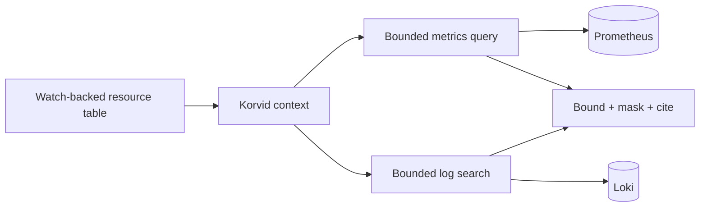

# Documentation Readability Implementation Plan

> **For agentic workers:** REQUIRED SUB-SKILL: Use superpowers:subagent-driven-development (recommended) or superpowers:executing-plans to implement this plan task-by-task. Steps use checkbox (`- [ ]`) syntax for tracking.

**Goal:** Re-edit Korvid's user-facing guides around core operational stories, preserving truthful visual assets and safety/evidence boundaries while removing exhaustive feature inventories.

**Architecture:** Keep the current MkDocs navigation and routes. Add one accessible contextual keyboard SVG and a small set of reusable CSS layout primitives, then rewrite the guides in four coherent editorial groups; each group owns its content and structural contract tests and is independently reviewable.

**Tech Stack:** MkDocs Material 9.7.7, Markdown, Mermaid 11.17.0, accessible SVG, CSS, pytest, Python 3.11+, `uv --frozen`

## Global Constraints

- Preserve and reuse existing diagrams, screenshots, images, and recordings whenever they remain accurate and informative.
- Do not preserve removed volume in cards, tabs, accordions, or newly split pages.
- Keep the current top-level navigation and published routes stable.
- Preserve installation-critical values, safety guarantees, evidence provenance/freshness boundaries, honest limitations, and benchmark methodology.
- Direct TUI, embedded Agent, and external MCP share operational context and safety contracts, but not necessarily an identical evidence snapshot.
- Resource tables are watch-backed; describe, events, and logs may be fresh independent reads.
- MCP evidence disclosure is tool-specific.
- Agent writes require a fresh user approval keystroke; audit append failure blocks the mutation.
- SSAR, dry-run, ownership, and impact previews are best-effort or operation-specific.
- Approval-dialog confirmation keys must not be presented as remappable.
- Reuse repository media before creating assets; new captures must be deterministic, reproducible, privacy-safe, and accurately disclosed.
- Add no JavaScript unless static HTML, CSS, SVG, and Mermaid cannot communicate the required information.
- Documentation stays outside `src/korvid` and outside the Python distribution.
- Run documentation commands with `uv run --frozen --group docs`; do not modify `uv.lock`.

---

## File Structure

- Create `docs/assets/keybindings-context-map.svg`: accessible spatial map of global, table, inspect, log, and write contexts.
- Modify `docs/stylesheets/extra.css`: add only the responsive key-map/reference layout used by the redesigned guides; reuse `.docs-visual` and `.docs-storyboard`.
- Create `tests/test_docs_readability.py`: structural editorial contracts, preserved-media markers, critical safety/evidence wording, route stability, and no-new-script guard.
- Modify `docs/keybindings.md`: contextual essentials and one remapping recipe.
- Modify `docs/tui.md`: annotated cockpit plus one navigation-to-evidence workflow.
- Modify `docs/ops.md`: guarded-write path, confirmation state, and representative operations.
- Modify `docs/resource-relationships.md`: relationship graph, compact semantics legend, and honest coverage limits.
- Modify `docs/helm-operators.md`: install-to-rollback storyboard and operator-specific safety.
- Modify `docs/observability.md`: watch-backed state versus independent metrics/log reads and minimum setup.
- Modify `docs/agent.md`: prompt-to-evidence/proposal flow, setup minimum, and provider boundary.
- Modify `docs/mcp.md`: external-client evidence/trust flow, connection minimum, follow behavior, and opt-in proposals.
- Modify `docs/airgap.md`: offline artifact/trust path and readiness checks.
- Modify `docs/performance.md`: executive envelope, representative results, methodology, and known limits.
- Modify `docs/threat-model.md`: trust-boundary diagram, implemented mitigations, residual risks, and inspector limits.
- Modify `docs/provider-plugins.md`: restrained heading/prose cleanup only; preserve the public API and event/options/lifecycle contracts.
- Modify repository-owned Markdown links only where a removed heading requires a new target.

### Task 1: Pin the Editorial and Asset Contracts

**Files:**
- Create: `tests/test_docs_readability.py`
- Test: `tests/test_docs_build_config.py`
- Test: `tests/test_docs_links.py`

**Interfaces:**
- Consumes: current documentation routes and canonical media under `docs/assets/scenes/`
- Produces: source-level contracts that every later page group must satisfy

- [ ] **Step 1: Write the failing readability contract tests**

Create `tests/test_docs_readability.py` with these exact contracts:

```python
from __future__ import annotations

import re
from pathlib import Path

ROOT = Path(__file__).parent.parent
DOCS = ROOT / "docs"

VISUAL_MARKERS = {
    "keybindings.md": ("keybindings-context-map.svg",),
    "tui.md": ("cockpit-poster.png", 'class="docs-visual docs-visual--annotated"'),
    "ops.md": ("```mermaid", "Fresh user keystroke", "Audit append"),
    "resource-relationships.md": ("relationship-graph.png", "Resolution", "Coverage"),
    "helm-operators.md": ('class="docs-storyboard"', "Install", "Rollback"),
    "observability.md": ("```mermaid", "Prometheus", "Loki"),
    "agent.md": ("agent-poster.png", "deterministic synthetic-cluster walkthrough"),
    "mcp.md": ("```mermaid", "External MCP client", "tool-specific"),
    "airgap.md": ("```mermaid", "Internal"),
    "performance.md": ("Supported envelope", "Known limits", "Raw artifacts"),
    "threat-model.md": ("```mermaid", "Residual risks"),
}


def _source(name: str) -> str:
    return (DOCS / name).read_text(encoding="utf-8")


def _table_rows(source: str) -> int:
    return sum(bool(re.match(r"^\|.*\|$", line)) for line in source.splitlines())


def test_redesigned_guides_keep_their_selected_visual_evidence() -> None:
    for page, markers in VISUAL_MARKERS.items():
        source = _source(page)
        for marker in markers:
            assert marker in source, f"{page} must retain {marker!r}"


def test_keybindings_is_a_compact_contextual_reference() -> None:
    source = _source("keybindings.md")
    assert _table_rows(source) <= 32
    assert "Action names:" not in source
    assert "approval dialogs' confirm keys are **not remappable**" in source
    assert source.count("```yaml") == 1


def test_core_guides_do_not_retain_catalog_scale_outlines() -> None:
    limits = {
        "tui.md": 8,
        "ops.md": 8,
        "resource-relationships.md": 9,
        "helm-operators.md": 7,
        "observability.md": 8,
        "agent.md": 9,
        "mcp.md": 7,
        "airgap.md": 7,
        "performance.md": 8,
        "threat-model.md": 8,
    }
    for page, maximum in limits.items():
        headings = re.findall(r"^#{2,3} ", _source(page), flags=re.MULTILINE)
        assert len(headings) <= maximum, f"{page} still has {len(headings)} subsections"


def test_safety_and_evidence_invariants_remain_explicit() -> None:
    ops = " ".join(_source("ops.md").split()).lower()
    assert "fresh user keystroke" in ops
    assert "audit" in ops and "blocked" in ops
    assert "best-effort" in ops or "operation-specific" in ops

    agent = " ".join(_source("agent.md").split()).lower()
    assert "approval" in agent and "write" in agent
    assert "provider" in agent and "payload" in agent

    mcp = " ".join(_source("mcp.md").split()).lower()
    assert "tool-specific" in mcp
    assert "opt-in" in mcp and "write proposal" in mcp


def test_redesign_does_not_add_a_script_bundle() -> None:
    source = (ROOT / "mkdocs.yml").read_text(encoding="utf-8")
    block = source.split("extra_javascript:", 1)[1].split("\nextra_", 1)[0]
    scripts = [
        line.removeprefix("  - ").strip()
        for line in block.splitlines()
        if line.startswith("  - ")
    ]
    assert scripts == ["assets/javascripts/visual-storytelling.js"]
```

- [ ] **Step 2: Run the new tests to verify they fail**

Run:

```bash
uv run --frozen pytest -p no:tach tests/test_docs_readability.py -q
```

Expected: FAIL because `keybindings-context-map.svg` and the new concise page markers/outlines do not yet exist.

- [ ] **Step 3: Confirm existing documentation tests are green before editing**

Run:

```bash
uv run --frozen pytest -p no:tach \
  tests/test_docs_build_config.py \
  tests/test_docs_links.py \
  tests/test_docs_landing_design.py \
  tests/test_docs_visual_assets.py -q
```

Expected: PASS. If an existing test fails, stop and distinguish a baseline failure from a redesign regression before changing any source.

- [ ] **Step 4: Commit the red tests**

```bash
git add tests/test_docs_readability.py
git commit -m "test: define readable guide contracts" \
  -m "Co-authored-by: Copilot <223556219+Copilot@users.noreply.github.com>"
```

### Task 2: Redesign Keybindings, TUI, and Operations

**Files:**
- Create: `docs/assets/keybindings-context-map.svg`
- Modify: `docs/stylesheets/extra.css`
- Modify: `docs/keybindings.md`
- Modify: `docs/tui.md`
- Modify: `docs/ops.md`
- Modify: `tests/test_docs_readability.py`

**Interfaces:**
- Consumes: `.docs-visual`, `.docs-storyboard`, `cockpit-poster.png`, existing guarded-write Mermaid contract
- Produces: contextual keyboard map, cockpit-to-evidence story, and universal write-gate explanation

- [ ] **Step 1: Add the accessible contextual keyboard map**

Create an SVG with `viewBox="0 0 1200 520"`, `role="img"`, `aria-labelledby="keymap-title keymap-desc"`, and these exact text groups:

```xml
<title id="keymap-title">Korvid keys change with operational context</title>
<desc id="keymap-desc">Global navigation leads to table inspection, logs, and guarded write actions. The help overlay always shows the effective keys.</desc>
<text>GLOBAL</text><text>:</text><text>?</text><text>0</text>
<text>TABLE</text><text>Enter</text><text>d</text><text>g</text><text>l</text><text>/</text>
<text>LOGS</text><text>/</text><text>f</text><text>w</text><text>p</text>
<text>WRITE</text><text>r</text><text>S</text><text>Ctrl-D</text>
<text>Fresh approval keystroke</text>
```

`/` is contextual, not global: `KorvidApp.action_open_filter` asks the view
first, so the chip is drawn in TABLE (filter bar) and LOGS (inline search)
rather than in GLOBAL. The shipped map's `desc` says so too, so a
screen-reader visitor gets the same correction the picture does.

Use the existing charcoal, amber, ink, and border colors already declared as CSS variables; do not embed fonts, scripts, raster data, or external URLs.

- [ ] **Step 2: Add only the layout CSS the map and compact references need**

Append:

```css
.md-typeset .docs-keymap {
  display: block;
  width: 100%;
  height: auto;
  margin: 1.5rem 0 2rem;
  border: 1px solid var(--korvid-charcoal-border);
  border-radius: var(--korvid-radius);
  background: var(--korvid-charcoal-raised);
}

.md-typeset .docs-reference-grid {
  display: grid;
  gap: 1rem;
  margin: 1.5rem 0;
}

.md-typeset .docs-reference-grid > section {
  min-width: 0;
  padding: 1rem;
  border: 1px solid var(--korvid-charcoal-border);
  border-radius: var(--korvid-radius);
}

@media (min-width: 720px) {
  .md-typeset .docs-reference-grid {
    grid-template-columns: repeat(2, minmax(0, 1fr));
  }
}
```

- [ ] **Step 3: Replace Keybindings with a contextual essentials page**

Use this exact outline and content boundaries:

```markdown
# Keybindings

Korvid shows only the keys that act on the current view. Press `?` for the complete effective set, including remaps; press `~` to expand the top-bar legend.


## Move and inspect

| Key | What it does |
|---|---|
| `:` | Open the command bar |
| `?` | Show the effective keys for every view |
| `~` | Expand or collapse the top-bar legend |
| `/` | Filter a table or search the log pane |
| `Enter` / `Esc` | Drill in / return one level |
| `0` / `1`–`9` | Change namespace scope |
| `d` | Describe the selected resource |
| `g` | Open operational relationships |
| `l` / `L` | Open selected or merged pod logs |
| `Ctrl-W v/w/q` | Split, focus, or close a workspace pane |
| `Ctrl-A` / `Ctrl-X` | Toggle the Agent / stop its current turn |
| `q` | Quit |

## Act in context

| Context | Keys |
| Pods | `l` logs · `s` shell · `Shift-F` port-forward |
| Workloads | `r` restart · `S` scale |
| Nodes | `c` cordon · `u` uncordon · `Shift-D` drain |
| Helm | `i` install · `u` upgrade · `r` rollback |

## Remap an app action

```yaml
keybindings:
  delete_resource: ctrl+k
  sort_by_age: z
```

Unknown, duplicate, or shadowing remaps warn and are skipped. Keys handled by drill-down, closing, and dialogs are not remappable. The approval dialogs' confirm keys are **not remappable**: every write still requires the fixed fresh keystroke.
```

Do not retain the `Action names:` inventory.

- [ ] **Step 4: Re-edit TUI around one evidence workflow**

Keep the current annotated `cockpit-poster.png` figure and its tested pin coordinates. Replace the catalog outline with:

1. `## Read the cockpit` — interpret context/namespace, selected watch-backed row, and effective keys.
2. `## Follow one signal` — filter a troubled workload, inspect description/events, open logs, and follow a relationship.
3. `## Work with logs` — merged logs, format/search, bounded buffer, reconnect behavior.
4. `## Change scope without losing context` — namespace, context, and split-workspace essentials.
5. `## Shape the table` — one compact custom-column example and metrics semantics.
6. `## Preview impact before a write` — link to Operations; retain the snapshot/UID limitation and one scale-down example.

Remove separate catalog sections for every hint, timeline control, node-maintenance detail, and repeated write subtype.

- [ ] **Step 5: Re-edit Operations around the universal guarded-write path**

Keep the existing Mermaid nodes and edges asserted by `test_ops_safety_diagram_shows_only_universal_write_gates`. Use:

1. `## One write path, three drivers`
2. The existing guarded-write Mermaid.
3. `## What approval proves` — fresh keystroke, preview scope, read-only mode, protected contexts.
4. `## What happens when audit fails` — explicitly state the action is blocked before mutation.
5. `## Representative operations` — compact comparison for restart/scale, node drain, Helm, and upload.
6. `## Operation-specific evidence` — SSAR, dry-run, ownership, and impact are best-effort or operation-specific.
7. `## Sessions that outlive the screen` — port-forward, Telepresence, debug shell, and crash cleanup in one bounded section.

Do not imply that every write has SSAR, dry-run, ownership, and impact preview.

- [ ] **Step 6: Run and fix the first group**

Run:

```bash
uv run --frozen pytest -p no:tach \
  tests/test_docs_readability.py \
  tests/test_docs_build_config.py::test_core_concept_pages_each_have_their_selected_visual_evidence \
  tests/test_docs_build_config.py::test_ops_safety_diagram_shows_only_universal_write_gates \
  tests/test_docs_build_config.py::test_tui_annotation_pins_match_the_poster_layout -q
uv run --frozen --group docs mkdocs build --strict
```

Expected: all selected tests PASS and the strict site build completes with no warnings.

- [ ] **Step 7: Commit the first editorial group**

```bash
git add docs/assets/keybindings-context-map.svg docs/stylesheets/extra.css \
  docs/keybindings.md docs/tui.md docs/ops.md tests/test_docs_readability.py
git commit -m "docs: focus the core operating guides" \
  -m "Co-authored-by: Copilot <223556219+Copilot@users.noreply.github.com>"
```

### Task 3: Redesign Relationships, Helm, and Observability

**Files:**
- Modify: `docs/resource-relationships.md`
- Modify: `docs/helm-operators.md`
- Modify: `docs/observability.md`
- Modify: `tests/test_docs_readability.py`

**Interfaces:**
- Consumes: `relationship-graph.png`, `.docs-visual`, `.docs-storyboard`, Mermaid
- Produces: graph semantics, release lifecycle, and independent observability evidence story

- [ ] **Step 1: Add group-specific failing assertions**

Extend the safety/evidence test:

```python
relationships = " ".join(_source("resource-relationships.md").split()).lower()
for term in ("direct", "bounded", "confidence", "unresolved", "incomplete"):
    assert term in relationships

observability = " ".join(_source("observability.md").split()).lower()
assert "watch-backed" in observability
assert "independent read" in observability
assert "mask" in observability
```

Run the single test and expect failure until the condensed wording is present.

- [ ] **Step 2: Re-edit Resource Relationships**

Keep `relationship-graph.png`. Use:

- `## Read the graph` with a four-column legend: direction, source, resolution, confidence.
- `## Direct edges and bounded expansion`.
- `## Coverage is evidence, not completeness` with the explicit statement that an incomplete graph cannot prove absence.
- `## Cases that need care`: stale owner references, `ReferenceGrant`, snapshot misses.
- `## Navigate or preview impact`: Enter navigation and write-preview blast radius.
- `## Deliberate limits`: no unrestricted cluster graph, secret values remain masked.

Remove the exhaustive per-resource relation inventory; retain representative examples only.

- [ ] **Step 3: Re-edit Helm and Operators**

Build a `.docs-storyboard` with four numbered phases: Install, Inspect, Upgrade, Rollback. Keep operator uninstall and OLM installation as two compact branches after the lifecycle, preserving approval and prerequisite distinctions. Do not list every wizard field or navigation key.

- [ ] **Step 4: Re-edit Observability**

Add one Mermaid flow with separate destinations:



Keep minimum install/configuration for endpoints, credentials, CA/TLS, bounds, masking, and errors. Replace the per-tool inventory with one metrics example and one logs example. State that observability calls are independent reads, not the resource table's watch snapshot.

- [ ] **Step 5: Verify and commit the second group**

Run:

```bash
uv run --frozen pytest -p no:tach \
  tests/test_docs_readability.py \
  tests/test_docs_build_config.py::test_core_concept_pages_each_have_their_selected_visual_evidence \
  tests/test_docs_visual_assets.py -q
uv run --frozen --group docs mkdocs build --strict
```

Expected: PASS with no strict-build warnings.

```bash
git add docs/resource-relationships.md docs/helm-operators.md \
  docs/observability.md tests/test_docs_readability.py
git commit -m "docs: clarify operational evidence flows" \
  -m "Co-authored-by: Copilot <223556219+Copilot@users.noreply.github.com>"
```

### Task 4: Redesign Embedded Agent and MCP

**Files:**
- Modify: `docs/agent.md`
- Modify: `docs/mcp.md`
- Modify: `tests/test_docs_readability.py`

**Interfaces:**
- Consumes: `agent-poster.png`, existing Agent storyboard, existing MCP Mermaid, tool-specific disclosure contracts
- Produces: distinct prompt/evidence/proposal and external-client trust flows

- [ ] **Step 1: Add failing truthfulness assertions**

Add:

```python
agent = _source("agent.md")
assert "deterministic synthetic-cluster walkthrough" in agent
assert "`AgentRuntime`" in agent
assert "`EvidenceLedger`" in agent
assert "fresh user keystroke" in agent

mcp = _source("mcp.md")
assert "not necessarily the same snapshot" in mcp
assert "activity note" in mcp
assert "does not make the read followable" in mcp
```

Run:

```bash
uv run --frozen pytest -p no:tach \
  tests/test_docs_readability.py::test_safety_and_evidence_invariants_remain_explicit -q
```

Expected: FAIL until the concise pages preserve these exact distinctions.

- [ ] **Step 2: Re-edit Embedded Agent**

Keep the current Agent storyboard and poster. Use:

- `## From prompt to cited answer` — screen context, bounded tool use, evidence markers, answer.
- `## From proposal to write` — proposal remains inert until fresh approval; audit remains fail-closed.
- `## What leaves the machine` — provider payload inspection and masking boundary.
- `## Connect a provider` — one minimal configuration table covering built-in providers, linking Provider Plugins for adapters.
- `## Stop, correct, or follow` — interrupt/replacement and follow behavior.
- `## What the recording demonstrates` — a deterministic synthetic-cluster walkthrough whose turn is real: the prompt is submitted through the real `AgentPanel`, the shipped `AgentRuntime` dispatches `diagnose_pod` then `get_logs` through the real `ToolExecutor`, and the real `EvidenceLedger` mints `[E1]`/`[E2]` and validates the answer's markers against them. State the limitation precisely — a deterministic offline provider answers, and every byte read comes from a synthetic fixture, so the clip is not evidence about a live provider, live-model answer quality, or a live cluster.

Remove the long provider-by-provider shell-command catalog, tuning guide, eval harness procedure, and conversational journey inventory from this introductory page.

- [ ] **Step 3: Re-edit MCP**

Preserve the existing Mermaid topology and its separate Prometheus/Loki backend route. Use:

- `## Evidence crosses a tool boundary` — disclosure is tool-specific and snapshots are not necessarily the same as Direct/Agent.
- `## Connect a client` — one host/configuration recipe.
- `## Read once or follow activity` — successful Kubernetes reads may emit an activity note; observability reads do not; an activity note does not make the read followable.
- `## Propose a write` — opt-in proposals only, then the same fresh-keystroke approval and audit gate.
- `## Representative tools` — compact read/observe/propose comparison, not a full schema inventory.

- [ ] **Step 4: Verify truthfulness and commit**

Run:

```bash
uv run --frozen pytest -p no:tach \
  tests/test_docs_readability.py \
  tests/test_docs_build_config.py::test_mcp_diagram_routes_observability_reads_to_their_own_backends \
  tests/test_docs_landing_design.py -q
uv run --frozen --group docs mkdocs build --strict
```

Expected: PASS; the scripted-agent overclaim scanner and MCP topology contracts remain green.

```bash
git add docs/agent.md docs/mcp.md tests/test_docs_readability.py
git commit -m "docs: separate agent and MCP evidence stories" \
  -m "Co-authored-by: Copilot <223556219+Copilot@users.noreply.github.com>"
```

### Task 5: Redesign Administration and Restrain Provider Reference Cleanup

**Files:**
- Modify: `docs/airgap.md`
- Modify: `docs/performance.md`
- Modify: `docs/threat-model.md`
- Modify: `docs/provider-plugins.md`
- Modify: `tests/test_docs_readability.py`

**Interfaces:**
- Consumes: existing benchmark figures/raw artifacts, current threat assumptions, Provider API-v1 contract
- Produces: decision-oriented administration guides while preserving empirical and implementer reference detail

- [ ] **Step 1: Add failing administration assertions**

Add:

```python
performance = _source("performance.md")
for marker in ("1,000", "environment", "methodology", "Raw artifacts"):
    assert marker.lower() in performance.lower()

threat = _source("threat-model.md")
for marker in ("Assets", "Trust boundaries", "Mitigations", "Residual risks", "does not prove"):
    assert marker in threat

provider = _source("provider-plugins.md")
for heading in (
    "## API-v1: exact public surface",
    "## Event contract and exact limits",
    "## Options contract, immutability, and secret policy",
    "## Lifecycle and compatibility",
):
    assert heading in provider
```

- [ ] **Step 2: Re-edit Air-gapped Operation**

Add a Mermaid artifact/trust path from connected build host to internal package index, image registry, chart repository, model endpoint, and cluster. Keep corporate CA setup, internal Helm sources, offline bundle construction, and the readiness checks that distinguish connectivity/auth failure from verified internal sources. Remove repeated dependency prose and sprawling inline commentary.

- [ ] **Step 3: Re-edit Performance and Scale**

Lead with a compact supported-envelope table and the live/corrected 1,000-pod result. Preserve the environment, methodology, before/after CPU and memory measurements, non-composability caveat, known limits, long-session guidance, and raw artifact links. Condense repeated narrative interpretations; do not change any empirical value.

- [ ] **Step 4: Re-edit Threat Model**

Lead with one Mermaid trust-boundary diagram. Keep assets, attackers/abuse scenarios, implemented mitigations, residual risks, and the inspector's proof limits. Merge repeated boundary prose, but preserve explicit statements about what the inspector does not prove.

- [ ] **Step 5: Clean Provider Plugins without productizing it**

Keep the exact public API, complete minimal adapter, event limits, options/secret policy, lifecycle/compatibility, and operator checklist. Shorten the introduction and “when not to write a plugin,” improve heading transitions, and remove duplicate explanation only. Do not apply subsection-count limits to this file and do not convert the contract into cards or a storyboard.

- [ ] **Step 6: Verify and commit the administration group**

Run:

```bash
uv run --frozen pytest -p no:tach \
  tests/test_docs_readability.py \
  tests/test_docs_links.py \
  tests/test_docs_build_config.py -q
uv run --frozen --group docs mkdocs build --strict
```

Expected: PASS with benchmark links, provider contract markers, and strict navigation intact.

```bash
git add docs/airgap.md docs/performance.md docs/threat-model.md \
  docs/provider-plugins.md tests/test_docs_readability.py
git commit -m "docs: turn administration guides into decisions" \
  -m "Co-authored-by: Copilot <223556219+Copilot@users.noreply.github.com>"
```

### Task 6: Validate the Published Experience

**Files:**
- Modify: repository-owned Markdown files only if strict link validation identifies a removed anchor
- Modify: redesigned docs or CSS only for verified responsive/accessibility defects
- Test: all documentation tests

**Interfaces:**
- Consumes: all redesigned page groups
- Produces: strict-build, link, accessibility, responsive, media, and packaging evidence

- [ ] **Step 1: Run focused lint and the complete documentation test set**

```bash
uv run --frozen ruff check tests/test_docs_readability.py
uv run --frozen ruff format --check tests/test_docs_readability.py
uv run --frozen pytest -p no:tach tests/test_docs_*.py -q
```

Expected: all commands PASS.

- [ ] **Step 2: Run the strict site build**

```bash
uv run --frozen --group docs mkdocs build --strict
```

Expected: `Documentation built` with no warnings. Update repository-owned links or retain meaningful compatibility anchors for any removed heading that fails validation.

- [ ] **Step 3: Serve and inspect representative routes**

```bash
uv run --frozen --group docs mkdocs serve -a 127.0.0.1:8940
```

Inspect `/korvid/keybindings/`, `/korvid/tui/`, `/korvid/ops/`, `/korvid/resource-relationships/`, `/korvid/agent/`, `/korvid/mcp/`, and one Administration route at desktop, tablet, and mobile widths. Verify no horizontal page scroll, legible SVG text, visible keyboard focus, meaningful alt text, no-JavaScript readability, and reduced-motion behavior.

- [ ] **Step 4: Verify packaging and lockfile boundaries**

```bash
git diff --exit-code -- uv.lock
uv build
python - <<'PY'
from pathlib import Path
from zipfile import ZipFile

wheel = max(Path("dist").glob("*.whl"), key=lambda path: path.stat().st_mtime)
with ZipFile(wheel) as archive:
    docs = [name for name in archive.namelist() if name.startswith("docs/")]
assert docs == [], docs
PY
```

Expected: `uv.lock` has no diff and the wheel contains no `docs/` paths.

- [ ] **Step 5: Review the final diff for accidental content or media loss**

```bash
git diff --stat origin/docs/visual-storytelling...HEAD
git diff --name-status origin/docs/visual-storytelling...HEAD
git status --short
```

Expected: only the design/plan, selected guides, one SVG, CSS, link fixes, and documentation tests are changed; canonical scene media is not deleted.

- [ ] **Step 6: Commit only verified follow-up fixes**

If Steps 1–5 required changes:

```bash
git add docs tests/test_docs_readability.py
git commit -m "docs: finalize the readable guide experience" \
  -m "Co-authored-by: Copilot <223556219+Copilot@users.noreply.github.com>"
```

If no files changed, do not create an empty commit.
