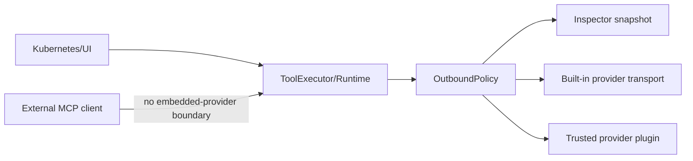

# Threat model: the external AI data boundary

What korvid sends to embedded AI providers, what it withholds, where the trust
boundaries are, and the residual risks that are **not** mitigated. Every claim
here exists in current code — chiefly `agent/outbound.py`, `core/redaction.py`
and `tools/structured.py`. It is not a general security overview:
[`docs/ops.md`](ops.md) has the cluster-write safety model.

`OutboundPolicy` is the one fail-closed choke point in front of an embedded
provider. An external MCP client never crosses it, and therefore owns its own
AI data boundary.

## Assets

- **kubeconfig**, and the credentials and contexts it grants access to.
- **Cluster reads**: manifests, logs, events, listings, and **`Secret` values**
  (`data` / `stringData`), decoded or raw.
- **Logs and events** — free-form text that may embed secrets no schema
  declares.
- **Credentials** and **audit records**
  (`~/.local/state/korvid/audit.jsonl`).
- **Exported payloads**: the sanitized request `:ai payload` exports, and any
  private log or text export.

## Trust boundaries

- **Kubernetes API** — everything korvid reads or writes crosses here first;
  RBAC on the active context is the only access control.
- **TUI and core** — in-process and trusted: the store, watch manager, audit
  log and write path hold cluster data in memory and execute approved
  mutations.
- **`OutboundPolicy`** — the fail-closed choke point every message, tool result
  and tool-call argument passes before an embedded provider request is built.
  It validates shape, redacts `Secret` data and credential-shaped text, strips
  control characters, enforces a character budget, and produces the immutable
  `OutboundSnapshot` that ships and that the inspector shows.
- **Model endpoints, remote or local** — receive the sanitized canonical
  payload over HTTPS; transport headers are built separately from the resolved
  credential and never enter the snapshot. For a local runtime korvid trusts
  the profile's configured `endpoint` to be the intended process. Dialect
  conversion runs *before* the policy and may only add — reordering history
  blocks the request instead of misfiling position-bound redaction records.
- **Special flows and provider plugins** — third-party `korvid.provider` entry
  points are trusted in-process code (see
  [`docs/provider-plugins.md`](provider-plugins.md)), built from a profile and
  never from conversation data. What they return receives the same sanitized
  payload; nothing past that handoff is policed.
- **MCP loopback and capability tokens** — the MCP server
  ([`docs/mcp.md`](mcp.md)) is a *separate* surface on `127.0.0.1` with its own
  read/write-proposal contract and token, reaching no embedded provider.
- **Observability connectors** — a second outbound boundary. Queries come from
  a closed catalogue: the model supplies label values and one log substring,
  never a query. TLS verification cannot be disabled, and a token is read at
  call time, used in one header, and appears in no result, error or log line.
  What comes *back* is untrusted text, masked in `ToolExecutor` before
  **either** consumer sees it (see
  [`docs/observability.md`](observability.md)).
- **Filesystem exports** — payload and log exports are written `0600` under
  `$XDG_DATA_HOME/korvid/`; `$XDG_STATE_HOME/korvid/` holds `audit.jsonl` and
  the MCP endpoint registry, which are not sanitized the way payloads are.

## Attackers and abuse scenarios

- **Malicious cluster content / prompt injection** — a compromised workload's
  logs or events carry text engineered to steer the model. `OutboundPolicy`
  treats tool-derived text as data and neutralizes control characters and
  credential-shaped substrings, but cannot detect semantic prompt injection.
- **Compromised provider, plugin or MCP client** — any could retain, log or
  re-transmit what it legitimately receives; korvid controls what crosses each
  boundary, not what the far side does next.
- **Local user or process** — another local account reading exported files or
  reaching the MCP loopback port, or a capture copied out without the exporter
  realizing what it holds.

## The agent extra: dependencies and lockdown

**Dependency surface.** `[agent]` pulls approximately **55 distributions**,
including `litellm`, `boto3`, `openai`, `tiktoken` and `tokenizers`. The extra
is optional, `tests/test_optional_extras.py` pins that import graph, and the
alternative — a hand-maintained vendor routing table — routes credentials to
the wrong host when it drifts.

**Lockdown at import.** `providers/litellm_runtime.py` sets eight attributes on
the `litellm` module before any completion call is possible. Each is a channel
that would otherwise carry prompts, tool arguments, usage records or debug text
to a third party or the terminal:

| Attribute | Value |
|---|---|
| `telemetry` | `False` |
| `turn_off_message_logging` | `True` |
| `success_callback` | `[]` |
| `failure_callback` | `[]` |
| `callbacks` | `[]` |
| `_async_success_callback` | `[]` |
| `_async_failure_callback` | `[]` |
| `suppress_debug_info` | `True` |

Two are private attributes, set deliberately because they are what the SDK
reads at call time. All eight are checked for *existence before* assignment, so
a rename upstream raises at import instead of leaving the real sink open; a
test asserts the same list. `providers/_litellm_import.py` also sets
`LITELLM_LOCAL_MODEL_COST_MAP=true` before the import, suppressing the SDK's
startup price-table fetch, and strips `StreamHandler`s from its loggers.

**The device-login routing hazard.** Given a reference under LiteLLM's own
`github_copilot` or `chatgpt` prefix, the SDK starts an **interactive
device-code sign-in and writes a credential file** (under
`~/.config/litellm/`) from inside its routing call, even if the intent was
only to resolve the reference — and it replaces the profile's credential,
`chatgpt` its endpoint too. `DEVICE_LOGIN_PREFIXES` in
`providers/litellm_settings.py` claims both ahead of routing, the underscore
spelling folds onto the same claim, and the claim holds whether or not
korvid's Copilot flow is installed. Such a reference is either served by a
flow korvid ships or refused. A test rediscovers the set from the installed
release, so a future one adding a third device-code provider fails there.

## models.dev

korvid makes at most one conditional GET of `https://models.dev/api.json` for
optional model metadata, under these bounds:

- **Never at startup**, on mount, on a keystroke, or during routing. Only
  <kbd>Ctrl</kbd>+<kbd>R</kbd> on the model search screen contacts it, forcing
  a revalidation; otherwise korvid serves its cache unchanged. No HTTP client
  exists until then.
- **No credentials, no korvid state** — no API key, cluster context or
  conversation data.
- **Verified TLS, one trust decision** — the client comes from the same builder
  as every other korvid-owned HTTPS client, so `network.ca_bundle` applies and
  verification can never be switched off. A bundle that will not load makes the
  refresh unavailable; it never retries unverified.
- **Bounded** — a 10-second deadline over the whole request, a 12 MiB streaming
  ceiling, `application/json` only, redirects refused, and a strict schema: a
  document that passes those checks but fails validation is discarded.
- **Cached `0600`**, revalidated conditionally on the stored `ETag`, so an
  unchanged document costs a round trip and no download. The cache is
  `$XDG_CACHE_HOME/korvid/models-dev.json` wherever that variable is set, and
  otherwise `~/Library/Caches/korvid/models-dev.json` on macOS,
  `%LOCALAPPDATA%\korvid\models-dev.json` on Windows,
  `~/.cache/korvid/models-dev.json` elsewhere.
- **Disableable** — `agent.model_search.models_dev: false` builds no source and
  no client, so there is no socket to open. Only `true` and `false` are read as
  themselves; anything else warns and fails **closed** to `false`, so a quoting
  slip cannot re-enable the fetch in an [air-gapped](airgap.md) deployment.

**Setup model discovery** is the one setup-time request carrying a credential,
and it goes to the operator's own endpoint on request only. Each attempt joins
a path onto the configured URL, keeping its scheme, host and port; anything
naming no `http(s)` origin is refused before a client exists, and redirects are
refused. The key is borrowed for the call, never stored or logged. One 5-second
deadline covers both attempts and the parse, under a 2 MiB, JSON-only,
500-entry ceiling; every failure is an empty listing.

**Residual risk.** A network observer can infer that a korvid instance
refreshed its model metadata from `models.dev`. No cluster payload, user
identity or credential crosses that channel; it is the only outbound connection
the agent component makes that carries no provider payload.

## Mitigations (implemented today)

- **Redaction before reduction** — one shared recursive redactor runs where a
  manifest is produced (`ToolExecutor`, and so the MCP server behind it) *and*
  again at the outbound boundary. The producer-side pass is not redundant: the
  size bound elides mapping entries, so a document reduced first can reach the
  boundary with its credentials intact. It replaces a `Secret`'s
  `data`/`stringData` at any depth and strips
  `kubectl.kubernetes.io/last-applied-configuration` from *every* object.
- **Credential-key redaction** — the key stays and its **value** goes, for
  exact names (`password`, `token`, …) and whole compounds that spell one
  (`AWS_SECRET_ACCESS_KEY`). Only a boolean survives; one bit cannot carry a
  credential.
- **Declared, single-reading parsing** — structural redaction or text masking
  is chosen by the tool registry, never defaulted, and an undeclared result is
  refused; `load_structured_document` then rejects a repeated mapping key or
  any anchor reference, so a second `kind:` cannot smuggle credentials past the
  classifier. Screen context and every string in a tool *definition* take the
  same text pass as a result.
- **Request caps** — results and retained history are bounded, and
  `OutboundPolicy` blocks an over-budget request rather than sending it.
- **Protected contexts and CA trust** — `agent.disable_in_protected` refuses
  prompts on [protected contexts](ops.md#protected-contexts), and
  `network.ca_bundle` makes internal TLS verify rather than be disabled
  ([`docs/airgap.md`](airgap.md)).
- **Write approval gate** — every cluster mutation waits for a user keystroke
  in a [confirmation dialog](ops.md#one-write-path-three-drivers); the agent
  and MCP write-proposal flows can only *request* a write. Private exports are
  created with `O_EXCL` and POSIX mode `0600`.
- **Fail-closed audit and redaction** — a write whose audit entry cannot be
  written is blocked, and a result that cannot be redacted stops the turn: the
  agent rolls it back and makes no further provider request, and an MCP client
  gets a safe error naming the shape rather than the document. The treatment is
  stated by the result's *producer*, so a document cannot skip the structural
  pass by opening with `ERROR:`.

## Residual risks (not mitigated)

Explicit, current limitations — not aspirational future work.

- **Stable identifiers are not anonymized.** Resource names, namespaces,
  labels, node names and image references cross unchanged; anyone who reads the
  payload can correlate it with your cluster.
- **Arbitrary secrets in free-form logs cannot be guaranteed detectable.** The
  policy masks known credential-shaped patterns and `Secret` fields, not an
  application-specific token in unstructured text. `--token=…` is masked;
  `--token` followed by the value as a separate `args` element is not.
- **Local endpoint trust is not verified.** For an `ollama/…` profile or a
  self-hosted `endpoint`, korvid sends the sanitized payload to whatever
  process is listening at that address.
- **Plugin post-handoff behavior is out of scope.** Trusted in-process code may
  mutate, retain, log or independently transmit what it received.
- **MCP callers own their own AI boundary.** The MCP server hands cluster reads
  (and, opt-in, write proposals) to external clients without routing them
  through `OutboundPolicy`. Structured manifests are still redacted
  producer-side; diagnoses, logs and events are credential-pattern masked
  before their result caps (see [`docs/mcp.md`](mcp.md#mcp-server)).
- **Raw logs and the audit trail** are not provider payloads and are not
  sanitized like one.
- **`0600` does not prove exclusive access on every platform.** On Windows the
  `os.open` mode argument does not map onto NTFS ACLs, so a private export's
  confidentiality depends on the enclosing directory's inherited permissions,
  not the mode korvid requested.

## What the inspector proves — and what it does not prove

`:ai payload` renders `OutboundSnapshot.export_json()`: the exact canonical
`messages` and `tools` JSON that `OutboundPolicy.prepare()` produced for the
most recent provider call, the `model` it was addressed to, and every redaction
applied along the way. The list spans the whole pipeline, because a redaction
that removed its own evidence earlier — a stripped control character, a mapping
elided to fit the size bound — leaves nothing for a later pass to rediscover. A
turn that was blocked or rolled back sent nothing, so it leaves the previous
handoff on display.

It does **not** show transport headers (`Authorization`, API keys, tenant
headers), attached separately from the resolved credential; non-message request
fields an adapter sets for itself (Ollama's `think`, `options.num_ctx`); or
anything a plugin or remote endpoint does with the payload afterwards. Report a
vulnerability through
[`SECURITY.md`](https://github.com/hellices/korvid/blob/main/SECURITY.md).
