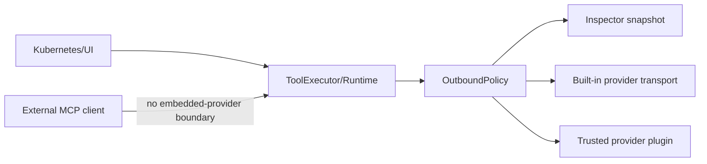

# Threat model: the external AI data boundary

What korvid sends to embedded AI providers, what it withholds, where the trust
boundaries are, and the residual risks that are **not** mitigated. Everything
here is a guarantee that exists in the current code — chiefly
`agent/outbound.py`, `core/redaction.py` and `tools/structured.py`. It is not a
general product security overview: [`docs/ops.md`](ops.md) has the cluster-write
safety model, and
[`SECURITY.md`](https://github.com/hellices/korvid/blob/main/SECURITY.md) is how
you report a vulnerability.

`OutboundPolicy` is the one fail-closed choke point in front of an embedded
provider. An external MCP client never crosses it, and therefore owns its own
AI data boundary.

## Assets

- **kubeconfig** and the credentials and contexts it grants access to.
- **Cluster reads**: manifests, logs, events, resource listings.
- **`Secret` values** (`data` / `stringData`), decoded or raw.
- **Logs and events**, free-form text that may embed application-specific
  secrets, tokens or identifiers no schema declares.
- **Credentials**: API keys, OAuth tokens, capability tokens, bearer tokens.
- **Audit records** (`~/.local/state/korvid/audit.jsonl`): who did what, to
  which target, in which namespace.
- **Exported payloads**: the sanitized provider request written by `:ai
  payload` → export, and any private log or text export.

## Trust boundaries

- **Kubernetes API** — everything korvid reads or writes crosses here first;
  RBAC on the active context is the only access control at this boundary.
- **TUI and core** — in-process and trusted: the store, watch manager, audit
  log and write path hold cluster data and credentials in memory and execute
  approved mutations.
- **`OutboundPolicy`** — the fail-closed choke point every message, tool
  result and tool-call argument passes before an embedded provider request is
  built. It validates shape, redacts `Secret` data and credential-shaped text,
  strips control characters, enforces a character budget, and produces the
  immutable `OutboundSnapshot` that is both what ships and what the inspector
  shows.
- **Built-in remote providers** (GitHub Copilot, Azure OpenAI, OpenAI,
  Anthropic-compatible, GitHub Models, vLLM/OpenAI-compatible) — receive the
  sanitized canonical payload over HTTPS. Transport headers are built
  separately by each provider's `CredentialSource` and are never part of the
  snapshot.
- **Local endpoints** (Ollama, a self-hosted OpenAI-compatible server) — the
  same sanitization applies; korvid trusts the configured `base_url` to be the
  intended process. Dialect conversion (`prepare_messages`) runs *before* the
  policy, so anything an adapter adds is redacted and shown like everything
  else — and a hook may only add: reordering history or rewriting a role or
  content blocks the request rather than misfiling redaction records that
  travel by position.
- **Trusted provider plugins** — third-party `korvid.provider` entry points run
  as trusted in-process code (see
  [`docs/provider-plugins.md`](provider-plugins.md)). `create()` receives only a
  `ProviderPluginConfig` and an optional `CredentialSource`, never conversation
  data; the provider it returns is then called with the same sanitized payload
  the built-ins receive. Nothing after that handoff is policed by korvid.
- **MCP loopback and capability tokens** — the MCP server
  ([`docs/mcp.md`](mcp.md)) is a *separate* surface bound to `127.0.0.1` with
  its own read/write-proposal contract and capability token. It does not call
  through `OutboundPolicy` or any embedded provider at all.
- **Observability connectors** — a second outbound boundary. Queries are
  composed from a closed catalogue: the model supplies label values and one log
  substring, never a query, and each value is escaped for the literal it lands
  in. TLS verification cannot be disabled; a plaintext `http://` endpoint is
  accepted, and configuring a credential for one warns at startup. Tokens are
  read at call time, used in one header, and appear in no result, error, audit
  record or log line. What comes *back* is untrusted text, masked in
  `ToolExecutor` — before **either** consumer sees it, because MCP never
  reaches `OutboundPolicy` (see [`docs/observability.md`](observability.md)).
- **Filesystem exports** — payload and log exports are written `0600` under
  `$XDG_DATA_HOME/korvid/`. `$XDG_STATE_HOME/korvid/` holds `audit.jsonl` and
  the MCP endpoint registry, which are *not* private exports and are not
  sanitized the way provider payloads are.

## Attackers and abuse scenarios

- **Malicious cluster content / prompt injection** — a compromised workload's
  logs, annotations or events carry text engineered to steer the model.
  `OutboundPolicy` treats all tool-derived text as data rather than
  instructions and neutralizes control characters and credential-shaped
  substrings, but it cannot detect semantic prompt injection.
- **Compromised provider, plugin or MCP client** — any of them could retain,
  log or re-transmit what they legitimately receive. korvid controls what
  crosses each boundary, not what the far side does afterward.
- **Local user or process** — another local account reading exported files, or
  a process able to reach the MCP loopback port or a local model endpoint.
- **Accidental export** — a payload or log capture copied, emailed or committed
  without the exporter realizing what it holds.

## Dependency surface (`[agent]` extra)

The `[agent]` extra currently pulls approximately **55 distributions**,
including `litellm`, `boto3`, `openai`, `tiktoken`, and `tokenizers`. This
is a real increase compared to a base install, which has no model transport
at all.

**The mitigation is scope.** The `[agent]` extra is optional. A base TUI
install — the default — reaches no AI distribution. A test in
`tests/test_optional_extras.py` proves that `import korvid` never reaches
`litellm` when the extra is absent: the import graph is pinned, not assumed.

**The counter-argument for accepting the cost.** The alternative to LiteLLM
is a hand-maintained vendor routing table. A hand-maintained table is a
correctness risk: provider endpoints, model identifiers, and auth conventions
change without notice, and a silently stale table routes credentials to the
wrong host. LiteLLM's bundled catalog is maintained by a team whose only job
is to track that surface, and every entry is checked at release time. A
55-distribution transitive set is the tradeoff for that correctness guarantee.

## LiteLLM lockdown

`providers/litellm_runtime.py` sets the following attributes on the `litellm`
module before any completion call is possible:

| Attribute | Value | Why |
|---|---|---|
| `litellm.telemetry` | `False` | disables usage reporting |
| `litellm.success_callback` | `[]` | clears any pre-configured success callbacks |
| `litellm.failure_callback` | `[]` | clears any failure callbacks |
| `litellm.callbacks` | `[]` | clears general-purpose hooks |
| `litellm._async_success_callback` | `[]` | disables async success callbacks |
| `litellm._async_failure_callback` | `[]` | disables async failure callbacks |

`_async_success_callback` is a private attribute. korvid sets it deliberately
because it is the attribute LiteLLM checks at call time. If LiteLLM renames
it, a test that checks `litellm._async_success_callback == []` fails
immediately, surfacing the change rather than silently reopening the channel.
All six attributes are also checked at startup: a version that removes one
fails with an explicit error naming the missing attribute, rather than
silently leaving it at its default.

`providers/_litellm_import.py` sets `LITELLM_LOCAL_MODEL_COST_MAP=true`
before `import litellm` (using `os.environ.setdefault`, so an operator's
explicit `false` wins). This suppresses LiteLLM's startup network fetch of
its own model price table and its associated stderr warning inside a Textual
application. It also strips all `StreamHandler`s from LiteLLM's own loggers
and sets `propagate=False`, so LiteLLM never writes onto korvid's terminal
canvas.

## models.dev

korvid makes at most one conditional GET of `https://models.dev/api.json`,
subject to the following constraints:

- **Never at startup** and **never during routing** — only when the operator
  presses <kbd>Ctrl</kbd>+<kbd>R</kbd> on the `:ai` wizard's model search
  screen. Opening that screen makes no request, and neither does building the
  HTTP client: none exists until an operator asks for a refresh.
- **No credentials, no korvid state** — the request carries no API key, no
  cluster context, and no conversation data. It carries no trust
  configuration either: `network.ca_bundle` is transport setup, never payload.
- **Verified TLS, one trust decision** — the client is built by the same
  builder as every other korvid-owned HTTPS client, so `network.ca_bundle`
  applies here too and verification can never be switched off. A bundle that
  will not load makes the refresh report itself unavailable; it never retries
  unverified.
- **10-second timeout** — a slow or unreachable endpoint times out silently.
- **12 MiB streaming ceiling** — a response larger than this is refused.
- **`application/json` only** — a non-JSON content type is refused.
- **Redirects refused** — korvid does not follow HTTP redirects.
- **Schema-validated** — the document is parsed against a strict schema;
  a response that passes size and content-type checks but fails validation is
  silently discarded.
- **Cached `0600`** — the result is written to the platform cache directory
  (`$XDG_CACHE_HOME/korvid/models-dev.json`; `~/Library/Caches/korvid/` on
  macOS) with mode `0600`. korvid revalidates it on its own initiative at most
  once a day; an explicit <kbd>Ctrl</kbd>+<kbd>R</kbd> revalidates regardless,
  conditionally on the stored `ETag`. Concurrent refreshes coalesce into one
  request.
- **Disableable** — `agent.model_search.models_dev: false` prevents the
  fetch permanently: korvid then constructs no models.dev source at all, so
  there is no socket to open. Only `true` and `false` parse; anything else
  warns and disables.

**Residual risk.** A network observer can infer that a korvid instance
refreshed its model metadata from `models.dev`. No cluster payload, user
identity, or credential crosses that channel. This is the only outbound
connection the agent component makes that does not carry a provider payload.

## Setup model discovery

Listing an endpoint's models from the `:ai` wizard is the one setup-time
request that carries a credential.

- **Operator's endpoint only, on request only.** Both attempts join a path
  onto the configured URL, keeping its scheme, host and port; anything naming
  no `http(s)` origin is refused before a client exists. Redirects are
  refused on the request, so a 3xx is a failed attempt, not a detour.
- **The key is borrowed, never kept.** Sent as `Authorization: Bearer <key>`
  for the call, never stored, never logged — korvid formats and scrubs its
  own failures, so not even a proxy quoting the request back writes the key
  into a debug log. No key, no header.
- **Same trust, one budget.** The client comes from the shared builder, so
  `network.ca_bundle` applies and verification cannot be switched off. One
  5-second deadline covers both attempts, their reads and the parse, under a
  2 MiB, JSON-only, 500-entry ceiling. Every failure is an empty listing.

## The GitHub Copilot routing hazard

LiteLLM's own `github_copilot` provider, if given a model reference under
that prefix, starts an **interactive device-code login and writes a credential
file** (`~/.config/litellm/github_copilot/api-key.json`) from inside its
routing call — before any korvid code can intercept the result. This happens
even if the intent was simply to discover what the reference resolves to.

korvid claims the `github-copilot` prefix **before** any routing call reaches
LiteLLM. The `SpecialFlowRegistry` asserts the claim unconditionally at
startup; `DEVICE_LOGIN_PREFIXES` in `providers/litellm_settings.py` names the
prefix so the claim survives even if the korvid-side Copilot flow is
uninstalled. A reference under `github-copilot/…` is either served by
korvid's own flow or refused with a clear error — it can never silently pass
through to LiteLLM's routing.

## Mitigations (implemented today)

- **Redaction before reduction** — one shared recursive redactor runs where a
  manifest is produced (`ToolExecutor`, and so the MCP server behind it) and
  again at the outbound boundary. The producer-side pass is not redundant: what
  marks a value secret is structure, and the size bound elides mapping entries,
  so a document reduced first can reach the boundary with its credentials
  intact and every classifier gone.
- **Secret masking** — every `Secret` object's `data`/`stringData` entries are
  replaced with `MASK_PLACEHOLDER` at any nesting depth, and the
  `kubectl.kubernetes.io/last-applied-configuration` annotation is stripped
  from *every* object, not only `Secret`s.
- **Credential-key redaction** — the key stays and its **value** is replaced,
  so the model can still reason about the object's shape. Exact names
  (`password`, `token`, `apikey`, `authorization`, …) and compound names whose
  words spell one (`dbPassword`, `AWS_SECRET_ACCESS_KEY`) lose their value
  whatever type it has; only a boolean is kept, because one bit cannot carry a
  credential. Only whole compounds count, which is what keeps `secretKeyRef`
  and `AWS_ACCESS_KEY_ID` readable. In free-form text, an `authorization:` header
  and a `<credential-word>: …` or `=…` assignment keep their key and lose their
  value.
- **Credential-named env values** — a container env entry whose `name` denotes
  a credential keeps its `name` and loses its `value`; non-credential values
  (`LOG_LEVEL`, `AWS_REGION`) and `valueFrom` references are preserved.
- **Untrusted-text treatment** — tool results, screen context, and every string
  in a tool *definition* (a plugin's `description`, `title` or `default` can
  carry a credential too) take the same text pass.
- **Declared result formats** — whether a result is parsed and recursively
  redacted (`structured_yaml`) or masked as text (`untrusted_text`) comes from
  the tool registry, and a tool the registry does not define must declare it.
  There is no default: an undeclared result is refused rather than guessed at,
  and a declaration cannot override a registry tool.
- **One reading per document** — structured results are parsed by
  `load_structured_document`, which refuses a mapping key repeated at any depth
  and any anchor reference. A repeated `kind:` would otherwise load as ordinary
  data with the credentials still in it, and a few hundred characters of nested
  aliases expand into millions of nodes before anything is sent.
- **Request caps** — structured results are bounded while staying parsable,
  text results are capped, retained history is bounded, and `OutboundPolicy`
  enforces a hard `max_request_chars` ceiling that blocks the request instead of
  sending an unbounded payload; an over-budget request first retries with the
  oldest retained turn dropped.
- **Protected contexts** — `protected_contexts` plus
  `agent.disable_in_protected` can refuse agent prompts entirely on
  production-labeled contexts (see
  [`docs/ops.md#protected-contexts`](ops.md#protected-contexts)).
- **Corporate CA trust** — `network.ca_bundle` lets outbound TLS verification
  succeed against internal endpoints without disabling it (see
  [`docs/airgap.md`](airgap.md)).
- **Private exports** — `write_private_text` creates exports with `O_EXCL`
  (never silently overwriting) and POSIX mode `0600`.
- **Write approval gate** — every cluster mutation waits for a user keystroke
  in a confirmation dialog (see
  [`docs/ops.md#one-write-path-three-drivers`](ops.md#one-write-path-three-drivers));
  the agent and MCP write-proposal flows can only *request* a write.
- **Fail-closed audit** — if the audit entry for an executed write cannot be
  written, the write itself is blocked.
- **Fail-closed redaction** — if a tool result cannot be redacted, the turn
  stops: the redactor refuses shapes it cannot reason about, the agent rolls
  the turn back and makes no further provider request, and an external MCP
  client gets a safe error naming the shape rather than the document. Which
  treatment a result gets is stated by its *producer*, so a document cannot
  skip the structural pass by opening with `ERROR:`.

## Residual risks (not mitigated)

These are explicit, current limitations — not aspirational future work.

- **Stable identifiers are not anonymized.** Resource names, namespaces,
  labels, node names and image references cross the boundary unchanged; anyone
  who can read the payload can correlate it with your cluster's naming.
- **Arbitrary secrets in free-form logs cannot be guaranteed detectable.** The
  policy masks known credential-shaped patterns and `Secret` fields; it cannot
  recognize an application-specific token in unstructured log or event text.
  The same limit applies to positional secrets in a manifest: `--token=…` is
  masked, `--token` followed by the value as a separate `args` element is not.
- **Local endpoint trust is not verified.** For `provider: ollama` or a
  self-hosted `base_url`, korvid sends the sanitized payload to whatever process
  is listening at that address.
- **Plugin post-handoff behavior is out of scope.** Trusted in-process plugin
  code may mutate, retain, log, cache or independently transmit the payload it
  received; korvid has no visibility past the handoff.
- **MCP callers own their own AI boundary.** korvid's MCP server hands cluster
  reads (and, opt-in, write proposals) to external clients without routing them
  through `OutboundPolicy`, and cannot constrain what model or data policy that
  client applies. Structured manifests are still redacted producer-side;
  compound workload diagnoses, logs, and events are credential-pattern masked
  before their result caps (see [`docs/mcp.md`](mcp.md#mcp-server)). Lists,
  single-pod diagnoses, and Helm status carry only their tool-specific shaping.
- **Raw logs and the audit trail are sensitive on their own terms.** Log
  captures, describe exports and `audit.jsonl` are not provider payloads and
  are not sanitized like one; treat them with the same care as kubeconfig
  access.
- **`0600` does not prove exclusive access on every platform.** On Windows the
  `os.open` mode argument does not map onto NTFS ACLs, so a private export's
  confidentiality there depends on the enclosing directory's inherited
  permissions, not on the mode korvid requested.

## What the inspector proves — and what it does not prove

`:ai payload` renders `OutboundSnapshot.export_json()`: the exact canonical
`messages` and `tools` JSON that `OutboundPolicy.prepare()` produced for the
most recent provider call, the `model` it was addressed to, and every redaction
applied along the way. The list spans the whole pipeline, because a redaction
that removed its own evidence earlier — a stripped control character, a deleted
last-applied annotation, a mapping elided to fit the size bound — leaves
nothing for a later pass to rediscover. Each record belongs to the message it
was taken from rather than to that message's text, and is dropped when that
message leaves history. This is the real payload, not a re-derived
approximation; a turn that was blocked or rolled back sent nothing, so it
leaves the previous handoff on display rather than clearing the view.

It does **not** show transport-level HTTP headers (`Authorization`, API keys,
tenant headers), which each provider's `CredentialSource` attaches separately;
non-message request fields an adapter sets for itself (Ollama's `think`,
`options.num_ctx`, `keep_alive`), which carry no conversation data; or anything
a plugin or remote endpoint does with the payload after receiving it.
