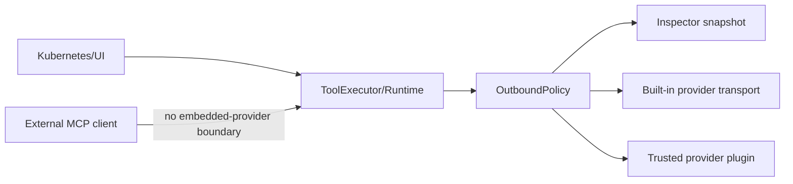

# Threat model: the external AI data boundary

This document describes what korvid sends to embedded AI providers, what it
withholds, where the trust boundaries are, and the residual risks that are
**not** mitigated. It documents only guarantees that exist in the current
code (`src/korvid/agent/outbound.py`, `src/korvid/agent/runtime.py`,
`src/korvid/ui/widgets/payload_inspector.py`, `src/korvid/core/private_export.py`).
It is not a general product security overview — see
[`docs/ops.md`](ops.md) for the cluster-write safety model and
[`SECURITY.md`](../SECURITY.md) for how to report a vulnerability.

## Assets

- **kubeconfig** and the credentials/contexts it grants access to.
- **Cluster reads**: manifests, logs, events, resource listings returned by
  read tools.
- **`Secret` values** (`data` / `stringData`), decoded or raw.
- **Logs and events**, which are free-form text that may embed
  application-specific secrets, tokens, or identifiers no schema declares.
- **Credentials**: API keys, OAuth tokens, capability tokens, kubeconfig
  bearer tokens.
- **Audit records** (`~/.local/state/korvid/audit.jsonl`): who did what,
  including target names and namespaces.
- **Exported payloads**: the sanitized provider request written to disk by
  `:ai payload` → export, and any private log/text export.

## Trust boundaries

- **Kubernetes API boundary** — everything korvid reads or writes crosses
  here first; RBAC on the active kubeconfig context is the only access
  control at this boundary.
- **TUI / `core`** — in-process, trusted: `ResourceStore`, `WatchManager`,
  `ActionExecutor`, `AuditLog` hold cluster data and credentials in memory.
- **`OutboundPolicy` (the embedded-provider boundary)** — the single
  fail-closed choke point in `src/korvid/agent/outbound.py` that every
  message, tool result, and tool-call argument must pass through before an
  embedded provider request is built. It validates shape, redacts
  `Secret` data and known credential-shaped text, strips control
  characters, enforces a character budget, and produces the immutable
  `OutboundSnapshot` that is both what ships and what the inspector shows.
- **Built-in remote providers** (GitHub Copilot, Azure OpenAI, OpenAI,
  Anthropic-compatible, GitHub Models, vLLM/OpenAI-compatible) — receive the
  sanitized canonical payload over HTTPS, plus transport headers built
  separately by each provider's `CredentialSource` (bearer tokens, API
  keys). Headers are never part of the canonical snapshot.
- **Local endpoints** (Ollama, a self-hosted OpenAI-compatible server) — the
  same `OutboundPolicy` sanitization applies; korvid trusts the configured
  `base_url` to be the intended local process and does not itself verify
  that nothing else is listening on it.
- **Trusted provider plugins** — third-party `korvid.provider` entry points
  run as **trusted in-process** Python code (see
  [`docs/provider-plugins.md`](provider-plugins.md)). They receive only the
  same sanitized canonical `messages`/`tools` the built-in providers
  receive, plus a `CredentialSource`. Nothing about the plugin's behavior
  after that handoff is policed by korvid.
- **MCP loopback and capability tokens** — the MCP server
  (`docs/mcp.md`) is a *separate* surface bound to `127.0.0.1` with its own
  read/write-proposal contract and capability token. It does not call
  through `OutboundPolicy` or any embedded provider at all.
- **Filesystem exports** — `:ai payload` → export and private log/text
  exports write owner-restricted (`0600`) files under
  `$XDG_DATA_HOME/korvid/` or `$XDG_STATE_HOME/korvid/`.

## Attackers and abuse scenarios

- **Malicious cluster content / prompt injection** — a compromised
  workload's logs, annotations, or events contain text engineered to
  manipulate the model or exfiltrate data through its next reply.
  `OutboundPolicy` treats all tool-derived text as untrusted data, not
  instructions, and neutralizes control characters and known
  credential-shaped substrings before it reaches a provider — but it
  cannot detect or block semantic prompt injection (text that reads as
  a plausible instruction to the model itself).
- **Compromised or malicious provider, plugin, or MCP client** — a
  built-in provider endpoint, a third-party plugin, or an external MCP
  client could retain, log, or re-transmit whatever they legitimately
  receive. korvid controls what crosses each boundary; it does not control
  what the far side does with it afterward.
- **Local user or process** — another local user or process reading
  world-readable files, or a process capable of connecting to the MCP
  loopback port or a local model endpoint.
- **Accidental export** — a user exporting a payload or log capture that
  contains sensitive cluster or log content, then copying, emailing, or
  committing that file without realizing what it holds.

## Mitigations (implemented today)

- **Secret masking** (`mask_secret_manifest`) — every `Secret` object's
  `data`/`stringData` entries are replaced with `MASK_PLACEHOLDER` before
  any manifest crosses the outbound boundary.
- **Universal last-applied removal** — the
  `kubectl.kubernetes.io/last-applied-configuration` annotation (which can
  hold an entire prior manifest, including secret material a client-side
  `kubectl apply` embedded) is stripped from every object, not only
  `Secret`s.
- **Credential-key redaction** — mapping keys that normalize to
  `password`, `token`, `apikey`, `authorization`, `clientsecret`,
  `accesstoken`, `refreshtoken`, or `credentials` are replaced with the
  mask placeholder; free-form text matching `authorization: ...` or a
  `password=`/`token=`/etc. assignment pattern is masked the same way.
- **Untrusted-text treatment** — all tool results and screen context are
  sanitized as data (control-character stripping, credential-pattern
  masking) rather than parsed as trusted instructions.
- **Request caps** — tool results are capped (`cap_result`/`compact_result`
  in `tools/executor.py`), retained history is bounded
  (`MAX_HISTORY_CHARS`), and `OutboundPolicy` enforces a hard
  `max_request_chars` ceiling that blocks the request instead of sending an
  unbounded payload.
- **Protected contexts** — `protected_contexts` plus
  `agent.disable_in_protected` can refuse agent prompts entirely on
  production-labeled kube contexts (see
  [`docs/ops.md#protected-contexts`](ops.md#protected-contexts)).
- **Corporate CA trust** (`network.ca_bundle`) — lets outbound TLS
  verification succeed against internal endpoints without disabling
  verification (see [`docs/airgap.md`](airgap.md)).
- **Private exports** — `write_private_text` creates payload and log
  exports with `O_EXCL` (never silently overwrites) and `0600`
  permissions, under a directory that is created if missing.
- **Write approval gate** — every cluster mutation, however requested,
  waits for a user keystroke in a confirmation dialog (see
  [`docs/ops.md#the-safety-model`](ops.md#the-safety-model)); the agent and
  MCP write-proposal flow can only *request* a write, never execute one.
- **Fail-closed audit** — if the audit entry for an executed write cannot
  be written, the write itself is blocked.

## Residual risks (not mitigated)

These are explicit, current limitations — not aspirational future work:

- **Stable identifiers are not anonymized.** Resource names, namespaces,
  labels, node names, image references, and similar cluster-derived
  identifiers cross the outbound boundary unchanged. Anyone who can read
  the exported/sent payload can correlate it with your cluster's naming.
- **Arbitrary secrets in free-form logs cannot be guaranteed detectable.**
  `OutboundPolicy` masks known credential-shaped key/value patterns and
  `Secret` object fields; it cannot recognize an application-specific
  token, key, or password embedded in unstructured log or event text that
  does not match those patterns. Treat any pod's logs as potentially
  containing secrets the policy will not catch.
- **Local endpoint trust is not verified.** For `provider: ollama` or a
  self-hosted OpenAI-compatible `base_url`, korvid sends the sanitized
  payload to whatever process is actually listening at that address; it
  does not authenticate the remote process's identity beyond the URL you
  configured.
- **Plugin post-handoff behavior is out of scope.** A trusted provider
  plugin receives only the sanitized canonical `messages`/`tools`, but
  once received, trusted in-process plugin code may mutate, retain, log,
  cache, or independently transmit that data anywhere it chooses — korvid
  has no further control or visibility after the handoff.
- **MCP callers own their own AI boundary.** korvid's MCP server exposes
  cluster read/UI-drive tools (and, opt-in, write proposals) directly to
  external MCP clients; it does not route those calls through
  `OutboundPolicy` or any embedded provider, and it has no way to know or
  constrain what model or data policy the external client applies to the
  tool results it receives.
- **Raw logs and the audit trail are sensitive on their own terms.** Log
  captures, describe/log exports, and `audit.jsonl` are not sanitized the
  way embedded-provider payloads are — they are not provider payloads at
  all, and retain full cluster content (names, namespaces, log lines,
  actor and target detail). Treat them with the same care as kubeconfig
  access.
- **`0600` file permissions do not prove exclusive access on every
  platform.** `write_private_text` creates payload and log exports with
  POSIX mode `0o600`. On Windows, the Python `os.open` mode argument does
  not map onto NTFS ACLs — the file's actual confidentiality there depends
  on the enclosing directory's ACLs and inherited permissions, not on the
  `0o600` argument. Owner-only access on Windows is not guaranteed by this
  code path alone.

## What the inspector proves — and what it does not

The `:ai payload` inspector (`PayloadInspectorScreen`) renders
`OutboundSnapshot.export_json()`: the exact canonical `messages` and
`tools` JSON that `OutboundPolicy.prepare()` produced for the most recent
provider call, plus the list of redactions applied. This is the real
payload — not a re-derived approximation — so what you read is what was
sent. It does **not** show:

- transport-level HTTP headers (`Authorization`, API keys, tenant headers),
  which are attached separately by each provider's `CredentialSource` and
  never enter the canonical snapshot;
- anything a plugin or remote endpoint does with the payload after
  receiving it.
